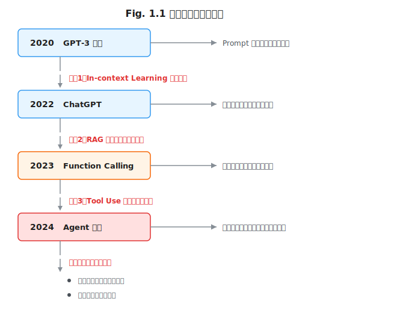
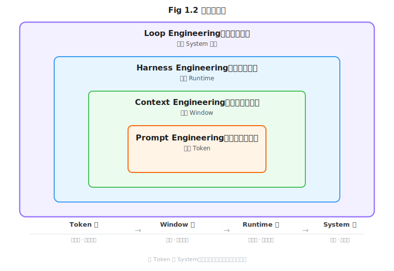
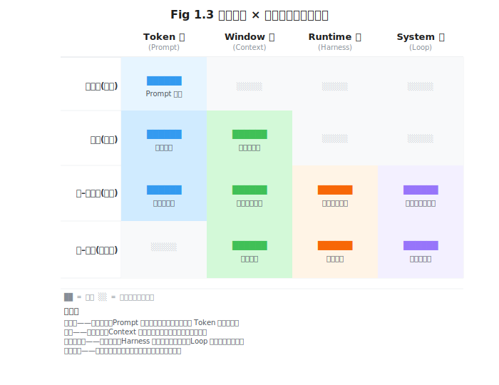

# 第1章 为什么我们需要"四种工程"

> **问题陈述**：大语言模型（LLM）从语言工具走向智能体系统的过程中，工程范式经历了多次迁移。本章回答一个元问题：为什么我们需要将智能体系统拆解为提示词工程（Prompt Engineering）、上下文工程（Context Engineering）、驾驭工程（Harness Engineering）、循环工程（Loop Engineering）四种工程范式来理解和构建？四种范式各自解决什么问题，又如何构成一个完整的智能体系统？

---

## 1.1 大模型应用的演化简史

要理解"四种工程"的由来，需要回顾大模型应用从实验室玩具走向生产系统的过程。这个演化不是线性的，而是经过三次清晰的范式拐点。

### 1.1.1 从 Few-shot 提示词到 Agent 协作

**GPT-3 时代：Prompt 即产品。** 2020 年 6 月 GPT-3 发布时 (Brown et al., 2020)，开发者发现，不需要微调模型，只需要精心构造一段文字（Prompt），模型就能完成任务。这在当时是革命性的——此前 NLP 应用的标准流程是"收集标注数据→微调模型→部署"，而现在写一段话就够了。"提示词工程"（Prompt Engineering）逐步形成，成为大模型应用的第一门手艺。那时的应用形态极其简单：一次 Prompt，一次生成，没有对话，没有工具，没有记忆。

**ChatGPT 时代：对话即接口。** 2022 年底 ChatGPT 发布，将单次 Prompt 升级为多轮对话。这不仅仅是 UI 的变化，更是交互范式的根本转变：模型开始"记得"刚才说过的话（对话历史作为上下文），用户可以像与人类助手一样迭代、追问、修正。同期，Chain-of-Thought Prompting (Wei et al., 2022) 展示了通过让模型分步推理来提升复杂任务准确率的方法，这标志着提示词从"指令"向"推理过程引导"的进化。此时，"上下文工程"（Context Engineering）的概念开始萌芽——你不再只是写好一段 Prompt，而是需要管理整段对话的上下文窗口，决定保留什么、丢弃什么。

**Function Calling 时代：模型即调度器。** 2023 年 6 月 13 日，OpenAI 推出 Function Calling 功能，模型不仅能理解自然语言，还能输出结构化工具调用指令。这意味着模型可以从"一个文本生成器"升级为"一个调度中枢"：收到用户请求→决定调用什么工具→解析工具返回结果→生成最终回答。"驾驭工程"（Harness Engineering）的核心问题浮出水面——如何把模型嵌入一个可执行代码、访问外部数据、调用 API 的运行时环境（Runtime）。

**Agent 时代：模型即操作系统内核。** 2024 年以来，以 Claude Code、Cursor、Devin 为代表的编码 Agent 展示了模型从"回答问题"到"自主完成任务"的跃迁。这些系统不再是简单的"你问我答"，而是持续运行、自我纠错、逐步推进的自主循环（Autonomous Loop）。ReAct (Yao et al., 2023) 提出的 Thought-Action-Observation 三元组奠定了自主循环的基本拓扑，而 Park et al. (2023) 的 Generative Agents 架构率先展示了多 Agent 在模拟环境中的持久行为循环；Reflexion (Shinn et al., 2023) 进一步把反思机制写入循环系统。"循环工程"（Loop Engineering）成为新的焦点——如何设计目标分解、反思纠正、终止判断、资源管理等控制机制，让 Agent 可靠地完成分钟甚至小时级的复杂任务。

> **"模型即操作系统内核"之所以成立**，是因为操作系统内核的核心职责是：① 管理硬件资源（对应 Harness 的工具系统和权限沙箱），② 调度进程（对应 Loop 的目标分解与多 Agent 协调），③ 提供系统调用接口（对应 Function Calling 的工具抽象）。模型在 Agent 系统中充当的正是这个"资源调度与指令分发"的中枢角色。

### 1.1.2 工程范式迁移的三次拐点

回顾上述演化，可以看到三次清晰的范式拐点：

**拐点 1：从微调走向推理时适配——In-context Learning 取代微调（2020–2022）。** 之前，任务适配的唯一路径是微调。GPT-3 证明，通过 Few-shot 示例就能让模型适应新任务，无需修改模型权重。这个拐点的工程意义在于：**任务配置从"训练时"移到了"推理时"**，Prompt 变成了任务描述的载体。

**拐点 2：从参数注入走向窗口构建——RAG 取代知识注入式微调（2023）。** 模型的知识在训练后就"冻结"了，无法自动更新。传统做法是定期微调注入新知识。RAG（Retrieval-Augmented Generation, Lewis et al., 2020）改变了这一局面：在推理时从外部知识库检索相关内容，拼入上下文。这个拐点的工程意义在于：**知识管理从"模型参数"移到了"上下文窗口"**，上下文变成了动态构建的信息容器。

**拐点 3：从生产走向协调——Tool Use 取代纯文本生成（2023–2024）。** 最初的 LLM 应用只有"输入文本→输出文本"一个通道。Function Calling 打开了第二通道：模型可以调用工具、执行代码、查询数据库。Toolformer (Schick et al., 2023) 展示了模型可以通过少量示例自主学习使用工具。这个拐点的工程意义在于：**模型从"信息生产者"变成了"行动协调者"**，工具结果成为上下文的新成员。



**下一个拐点的候选假设。** 推理模型展示了"在推理时消耗更多计算来提升输出质量"的能力，这模糊了 Prompt 工程中的 CoT 与模型内置推理的边界。另一个可能的拐点是"原生工具调用"——当模型本身内置了工具执行能力（而非外挂 Function Calling），Harness 的角色可能被重新定义。但这两个方向尚在演进中，我们将在第 20 章深入讨论。

---

## 1.2 四种工程的关系图谱

### 1.2.1 抽象层级：Token → Window → Runtime → System

四种工程并非简单的并列关系，而是构成了一个递进的抽象层级。每一层建立在前一层的基础之上，提供前者无法触及的新能力。



**为什么是四层而不是三或五层？** 这个四层结构不是随意划分的，而是对应智能体系统中四个不可归约的工程问题：① 如何表述意图（Token 层），② 如何供给信息（Window 层），③ 如何赋予能力（Runtime 层），④ 如何控制行为（System 层）。每一层提出一个下层无法独自回答的问题——Token 层可以优化"用什么措辞"，但无法回答"上下文窗口满了怎么办"（必须提升到 Window 层）；Window 层可以管理信息放置策略，但无法回答"模型如何执行代码"（必须提升到 Runtime 层）。三层的划分一定会遗漏 Token→Window 或 Runtime→System 之间的关键断层。(Liu et al., 2023) 关于"Lost in the Middle"的实验有力地证明了单靠 Prompt 设计（Token 层）无法解决上下文窗口中的信息布局问题，必须引入 Window 层的专门治理——这本身就是层级存在的实证论据。

**Prompt 工程操纵 Token 序列。** 提示词工程操作的是 Prompt 层。它关心的问题是：给定一组 Token，如何排列它们使得模型产生期望的输出？Prompt 工程师把每个 Token 看作一个可以操纵的基本粒子——调整措辞、改变顺序、添加示例，都是在 Token 序列上做文章。其形式化定义为：给定 LLM $M$ 和目标任务 $T$，寻找最优或最稳定的输入 Token 排列 $X^\ast$，使得 $M(X^\ast)$ 的输出尽可能满足 $T$ 的要求。

**Context 工程治理 Window 内容。** 上下文工程操作的是 Context 层。它关心的问题是：模型能看到的上下文窗口里应该装什么？这不仅包括 Prompt，还包括对话历史、检索结果、工具返回、系统状态。Context 工程师治理的是上下文的内容结构和生命周期——什么该放进去，什么该丢弃，如何防止"中间迷失"。其形式化定义为：上下文是以下五元组：
$$C = \langle P, H, R, O, S \rangle$$
其中 $P$ 为系统提示词（System Prompt）， $H$ 为对话历史， $R$ 为检索结果， $O$ 为工具调用结果（Tool Output）， $S$ 为系统内部状态。Context Engineering 的目标是最大化上下文的有效信息密度，同时最小化 Token 消耗和注意力稀释。[^sym1]

**Harness 工程封装 Runtime 能力。** 驾驭工程操作的是 Harness 层。它关心的问题是：模型所处的运行时环境应该提供哪些能力？Harness 是模型与物理世界之间的中间层。其形式化定义为：Harness 是一个四元组：
$$\mathcal{H} = \langle \mathcal{T}, \mathcal{P}, \mathcal{S}, \mathcal{O} \rangle$$
其中 $\mathcal{T}$ 为工具集（Tools）， $\mathcal{P}$ 为权限策略（Permissions）， $\mathcal{S}$ 为沙箱（Sandbox）， $\mathcal{O}$ 为可观测性通道（Observability）。驾驭工程的目标是设计一个最小化的运行时环境，使 LLM 能够安全、可观测地操纵外部系统。

**Loop 工程编排 System 行为。** 循环工程操作的是 Loop 层。它关心的问题是：如何让模型在自主循环中可靠地完成任务？目标分解、反思纠错、终止判断、资源管理——这些都是系统级控制问题，超越了单次推理或单轮对话的范畴。其形式化定义为：Loop 是一个三元组：
$$L = (s_0, \pi, \tau)$$
其中 $s_0$ 为初始系统状态， $\pi$ 为策略函数（通常由 LLM 调用 + Critic 模块共同实现）， $\tau$ 为终止判据（包括目标达成、预算耗尽、无进展检测等）。循环工程的目标是设计 $\pi$ 和 $\tau$，使 Agent 在可接受的成本和风险下完成目标。

四种工程之间的层间关系可以用类型签名来表达。对于遍历四种工程的**读者**，每一种都是下一层的一个函数，该函数的返回接口向下兼容：

```
Loop:   (Harness × Goal) → Result      # Loop 在 Harness 之上编排行为
Harness: (Context × Tools) → Runtime    # Harness 把 Context 和工具封装为运行时
Context: (Prompt × Knowledge) → Window  # Context 把 Prompt 和外部信息整合到窗口
Prompt:  (Task) → Token Sequence        # Prompt 把任务编码为 Token
```

这比函数复合更准确——每层不是"变换"下一层的输出，而是"构建"下一层的运行环境。

**也有学者主张只需 Prompt + Agent 两层划分**（例如某些 LLM 框架将 Context 和 Loop 视为 Prompt 的子问题），但这种划分掩盖了 Context 与 Harness 的根本差异：前者治理**信息**（什么该放进窗口），后者治理**能力**（模型能做什么）。同样，将 Loop 简单地视为"多轮对话"则会忽略目标分解、反思纠错、资源预算等系统级控制问题。四层划分更准确地反映了工程实践中各领域的独立性——专门做 RAG 的团队不会认为自己是在"写 Prompt"，构建 Agent 沙箱的 Infra 团队也不会认为自己是在"做 Context 工程"。

### 1.2.2 时间维度：从一次调用到一个生命周期

如果将时间维度叠加到抽象层级上，可以看到四种工程覆盖了完全不同的时间尺度。下表展示了各个层级在不同时间维度上的活跃程度：



这张矩阵说明了一个重要事实：越是复杂的系统，越需要多层工程同时协作。一个简单的聊天机器人可能只需要 Prompt + Context；一个自主编码 Agent 则需要四层全部到位。这个二维矩阵也揭示了四种工程之间的依赖关系：上层不能脱离下层独立存在。一个自主循环（Loop）必须运行在 Harness 的运行时之上，Harness 必须管理上下文窗口（Context），而上下文中必须包含有效的 Prompt（Token）。这恰恰是我们在本书中遵循的叙述顺序——从内向外，从 Token 到 System。

---

## 1.3 如何阅读本书

### 1.3.1 四类读者画像与路径

本书不是线性读本。不同的读者可以根据自己的角色和兴趣选择阅读路径。

**应用开发者**（搭建 LLM 应用的工程师）：主路径为第 2–6 章（Prompt + Context 基础）。扩展阅读为第 8 章（工具作为上下文）、第 10 章（工具系统设计）。重点实践为第 4 章的 PromptOps、第 6 章的 RAG 工程化。
> **跳读代价**：如果跳过第 9–12 章（Harness），你将无法理解为什么同一条 Prompt 在不同运行时环境中表现迥异——这不是 Prompt 的问题，是 Harness 的工具集和权限模型在**起作用**。

**Agent 架构师**（设计 Agent 系统的核心开发者）：主路径为第 9–14 章（Harness + Loop 核心）。前置阅读为第 2 章（Prompt 物理学）、第 5 章（重新定义上下文）。重点实践为第 10 章的权限与沙箱、第 14 章的自评与互评。
> **跳读代价**：如果跳过第 2 章，你可能会在设计工具函数签名时忽略 Token 层的分词损耗——一个名为 `search_company_financial_records` 的长函数名可能在一次调用中消耗数百 Token。

**Infra 工程师**（构建 Agent 基础设施的平台团队）：主路径为第 10 章（工具系统设计）、第 12 章（可观测性）、第 15 章（长程任务）。扩展阅读为第 19 章（安全、伦理与治理）。重点实践为第 12 章的 Trace 与 Token 账本、第 15 章的失败模式恢复。
> **跳读代价**：如果跳过第 5–7 章，你将无法理解为什么记忆系统的设计会直接影响 Token 账本的形状——用户在长会话中的每一条历史都是 Token，而这个成本属于 Context 层的治理范围。

**研究者**（NLP / Agent 方向的研究人员）：主路径为第 16 章（学习型循环）、第 20 章（展望）。扩展阅读为各章的"开放问题"小节。重点实践为第 18 章的评估与基准方法论。
> **跳读代价**：如果跳过第 3–4 章，你在设计新 Prompt 模式时将缺乏系统的分类学工具——本书的 Prompt 物理学框架是定位任何新模式的坐标系。

### 1.3.2 配套代码与基准集

本书的配套代码仓库按照章节组织。每个包含代码的章节都有对应的目录，其中的代码可以独立运行。

> **代码仓库地址**：https://github.com/LiuZhen515/agent-engineering-code
>
> 完整的使用指南、环境变量配置方法和各章代码的运行说明，见代码仓根目录的 `README.md`。

```
agent-engineering-code/
├── part1-prompt/          # 第2-4章 · 提示词工程
│   ├── ch2-logprobs-demo/
│   ├── ch3-cot-examples/
│   └── ch4-prompt-eval/
├── part2-context/         # 第5-8章 · 上下文工程
│   ├── ch6-rag-pipeline/
│   ├── ch7-memory-system/
│   └── ch8-tool-context/
├── part3-harness/         # 第9-12章 · 驾驭工程
│   └── mini-harness/
├── part4-loop/            # 第13-16章 · 循环工程
│   ├── ch13-react-loop/
│   ├── ch14-critic-agent/
│   └── ch16-learning-loop/
└── benchmarks/            # 第18章 · 评估与基准
    └── eval-scripts/
```

---

## 附：四种工程能力自评表

> 以下自评表帮助读者快速评估自己在四种工程维度的当前水平，每个维度分三个等级。请在阅读后续章节前完成自我评估。

| 工程维度 | 入门级 | 进阶级 | 专家级 |
|---------|--------|--------|--------|
| **提示词工程（Prompt Engineering）** | 能写出格式规范的 RTF 提示词 | 能系统性地调试 Prompt 性能（logprobs 分析、A/B 测试） | 能设计 Prompt 自动评估流水线、构建对抗样本、管理 Prompt 版本 |
| **上下文工程（Context Engineering）** | 了解 RAG 的基本流程 | 能调优切分策略、多路召回和 Re-ranker 延迟预算 | 能设计层级记忆系统、实时上下文压缩、跨会话持久记忆 |
| **驾驭工程（Harness Engineering）** | 知道模型需要工具才能执行操作 | 能设计工具集、实现基本的权限模型 | 能构建完整的沙箱方案、可观测性系统和人机交互层 |
| **循环工程（Loop Engineering）** | 理解 ReAct 循环的基本概念 | 能实现 Plan-Execute 范式和简单的反思机制 | 能设计长程任务恢复、学习型循环和 Multi-Agent 协调 |

---

## 开放问题

1. **四层洋葱图是否完备？** 是否存在第五层——例如，专门处理 Multi-Agent 社会的"生态层"？如果有，它与现有四层的关系是什么？

2. **层级间的接口标准化。** 目前的四种工程之间缺乏标准化的接口定义——Context 层的输出如何形式化地传给 Harness 层？是否存在像 OSI 七层模型那样清晰的层间协议？

3. **推理模型是否会吞噬 Prompt Engineering？** 当 o1 等推理模型内置了 CoT 能力，显式的 Chain-of-Thought 提示词还需要写吗？这究竟是 Prompt 工程责任的缩小，还是它向上转移到了 Context 工程（为推理模型供给更精炼的背景信息）？

4. **技能的形成与固化。** 人类工程师在掌握四种工程时，是学习"四门独立学科"还是"一门系统科学"？当前的教育和培训体系是否阻碍了跨层理解？

5. **测量与基准的缺失。** 目前缺乏统一的、覆盖所有四层的 Agent 系统基准。现有基准（如 SWE-bench、GAIA、AgentBench）主要测试 Loop 层的端到端性能，而忽略了下层（Prompt、Context、Harness）的孤立评估。如何构建从 Token 到 System 的多层评估体系？

---

## 练习

### 思考题

1. 回顾你最近参与的一个 LLM 应用项目，用 1.2 节提出的四层洋葱图分析它覆盖了哪些层级。有没有哪个层级完全没有被覆盖？未被覆盖的层级是否导致了某种系统性的问题？

2. 2024 年下半年，多家厂商推出了"AI 程序员"产品（如 GitHub Copilot Workspace、Devin）。这些产品在四层洋葱图中各自在哪一层发力最多，哪一层投入不足？选择一个产品，用本章框架给出你的判断。

3. 假如你要为一个远程科研协作平台设计 Agent 系统，系统需要：阅读论文、设计实验、执行代码、整理结果、生成报告。使用 1.2.2 节的二维矩阵，分析这个系统在四个时间尺度上分别需要哪些工程能力。

### 动手题

1. 找一个公开的 Agent 系统（如 Claude Code、OpenHands 或 Cursor），下载它的架构文档或技术博客，用本章的四层洋葱图框架标注它的每个组件分别属于哪个层级，给出一个表格（验收标准：每层至少列出 2 个具名组件）。

2. 将下面这个模糊的需求拆解为四层工程的具体问题："一个能自动回复 GitHub Issues 的智能体。"验收标准：每层至少列出 2 个具体子问题（例如 Prompt 层——"如何构造 Issue 回复的 Tone 指令？"）。

3. 使用本章的四种工程能力自评表，为你自己或你的团队做一次评估。写出你在每个维度的当前等级和下一步的提升目标。

---

[^sym1]: 符号说明：本章中各工程的形式化定义使用独立符号空间。Prompt 定义中的 $T$ 表示"目标任务"（Task），Context 五元组中的 $O$ 表示"工具输出"（Tool Output），Harness 四元组中的 $\mathcal{T}$ 表示"工具集"（Tools），Loop 三元组中的 $\tau$ 表示"终止判据"（Termination Criterion）。后续章节在各自上下文内复用这些符号时，将以明确的前缀或下标注区分。

## 参考文献

- Brown, T. B., Mann, B., Ryder, N., et al. (2020). Language Models are Few-Shot Learners. *NeurIPS 2020*.
- Lewis, P., Perez, E., Piktus, A., et al. (2020). Retrieval-Augmented Generation for Knowledge-Intensive NLP Tasks. *NeurIPS 2020*.
- Liu, N. F., Lin, K., Hewitt, J., et al. (2023). Lost in the Middle: How Language Models Use Long Contexts. *ArXiv:2307.03172*.
- Park, J. S., O'Brien, J. C., et al. (2023). Generative Agents: Interactive Simulacra of Human Behavior. *UIST 2023*.
- Schick, T., Dwivedi-Yu, J., Dessì, R., et al. (2023). Toolformer: Language Models Can Teach Themselves to Use Tools. *ArXiv:2302.04761*.
- Shinn, N., Cassano, F., Gopinath, A., et al. (2023). Reflexion: Language Agents with Verbal Reinforcement Learning. *NeurIPS 2023*.
- Wei, J., Wang, X., Schuurmans, D., et al. (2022). Chain-of-Thought Prompting Elicits Reasoning in Large Language Models. *NeurIPS 2022*.
- Yao, S., Zhao, J., Yu, D., et al. (2023). ReAct: Synergizing Reasoning and Acting in Language Models. *ICLR 2023*.

> **本书叙述方向**：从内向外逐层展开——第 2–4 章（Token 层，Prompt），第 5–8 章（Window 层，Context），第 9–12 章（Runtime 层，Harness），第 13–16 章（System 层，Loop），第 17–20 章（综合案例、评估、安全与展望）。每一章都建立在前一层的基础上，每个新概念都可以在四层洋葱图中找到它的位置。下一章，我们将潜入最内层——第 2 章"Prompt 的物理学"将揭示 Token 作为大模型世界"基本粒子"的特性。
