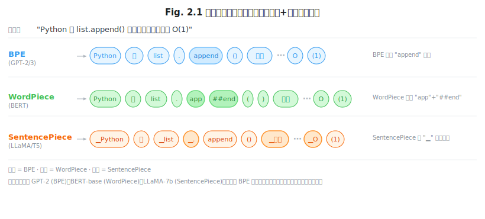
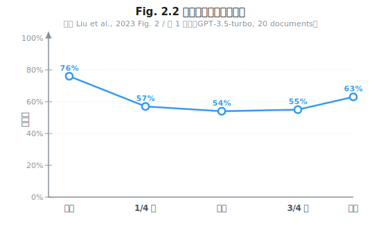

# 第 2 章 Prompt 的物理学

> **问题陈述**：Prompt 通常被当作"自然语言指令"来书写，但它在底层是一个 Token 序列——这个序列的组成方式直接决定了模型输出的质量、稳定性和可预测性。本章从 Token 的物理特性出发，揭示分词器的隐藏成本、注意力机制的结构偏好，以及如何用 logprobs 等定量手段把 Prompt 从"手艺"变成"可计算"的工程产物。

**第一部分导读：** 第 2–4 章构成提示词工程（Prompt Engineering）的完整体系。第 2 章奠定 Token 层的物理基础——不理解 Token 的"基本粒子"性质，后续的模式设计就是空中楼阁。第 3 章在此基础上搭建经典模式框架（RTF、CoT、结构化输出），第 4 章完成工程化闭环（版本管理、评测、CI）。如果你是应用开发者，这三章是你最优先投入的部分。如果你主要关注 Harness 或 Loop 层，也建议至少读完本章——因为 Token 层的选择会影响所有上层工程，正如指令集架构影响操作系统设计。

> **跳读代价**：如果跳过本章，你将无法理解为什么同一个 Prompt 在不同模型中的 Token 计数可能相差 50%——这不是模型的"Bug"，而是分词器差异的物理效应。

---

## 2.1 Token 是大模型世界的基本粒子

像物理学中的基本粒子一样，Token 是 LLM 处理信息的最小不可分单元。模型的全部能力——理解、推理、生成——都在 Token 序列上操作。然而，Token 并不是"字"或"词"的自然映射，它的边界由分词器（Tokenizer）决定，而这种人为划分带来了大量工程中容易被忽视的影响。

**定义 2.1（Token 序列）**：给定文本 $\mathcal{T}$ 和分词器 $\phi $，Token 序列为
$$X = \langle x_1, x_2, \ldots, x_n \rangle = \phi(\mathcal{T})$$
其中每个 $ x_i$ 是词表 $\mathcal{V}$ 中的一个词条，$ n = |X|$ 为 Token 计数。分词器 $\phi$ 将连续的文本字符串映射为离散的 Token ID 序列，该映射不可逆且因模型而异。

### 2.1.1 分词器差异与隐藏成本

**BPE / WordPiece / SentencePiece 对比。** 当前主流分词器有三种：GPT 系列使用的 BPE (Byte-Pair Encoding, Sennrich et al., 2016)、BERT 系列使用的 WordPiece (Schuster & Nakajima, 2012) 和 T5 / LLama 系列使用的 SentencePiece (Kudo & Richardson, 2018)。三者的核心差异在于基本单元的选择和合并策略。BPE 从字符级开始迭代合并最频繁的相邻对，直到达到预设词表大小；WordPiece 则基于概率增量（合并后提升似然最大的对）决定合并顺序；SentencePiece 将输入视为 Unicode 字符序列，通过预处理将所有字符编码为字节级别，天然支持跨语言无词表扩展。

从工程角度看，最重要的区别是对**空格和标点的处理**：BPE 不预处理空格，将空格视为普通字节参与合并（导致 "hello" 和 " hello" 编码不同）；SentencePiece 显式编码空格（"▁"标记），因此同一个词在不同位置的编码一致。这对中文影响较小（中文不分词），但对代码和英文提示词影响显著——一个在字符串开头和中间出现的函数名可能被编码为完全不同的 Token 序列，导致模型对它们的"理解"不一致。

> **工程原则 1（分词器对齐原则）**：以目标模型的原生分词器为准，不做迁移。切换模型提供商时，务必使用目标模型的分词器重新计算 Token 预算，而非直接复用上一家模型的计数。
>
> **反方观点**：也有团队坚持使用 BPE（如 GPT 系列），理由是预训练模型已经适配了 BPE 的"不一致性"——权重的分布本身已经吸收了这种不一致，强行换成 SentencePiece 反而会降低效果。正确的做法是以目标模型的原生分词器为准，不做迁移，但需要理解其分词特性以正确写提示词。



**中文 / 代码 / 数字的分词陷阱。** 中文在 LLM 分词中是一个特殊场景：训练词表通常以英文和代码为主，中文汉字的覆盖取决于训练数据的语言配比。据作者在多个模型上的实测，许多中文单字在 BPE 词表中被拆分为 Unicode 字节级别的子 Token——一个中文字可能被切分成 2–4 个 Token。这意味着写中文提示词时，Token 计数可能比肉眼看到的"字数"高出 2–4 倍，直接推高推理成本。**代码场景**的陷阱更为隐蔽：大括号、分号、缩进空格等语法符号如果被分词器"吞掉"（合并为稀有 Token），模型在代码生成时可能漏掉这些符号。**数字**的陷阱在于：大数字（如 123456789）如果不在训练词表中，会被拆分为多个 Token，导致模型对数值的大小关系失去感知——"123456789"和"123456788"在 Token 序列层面可能完全没有相似性。

> **真实失败案例**：某团队在 2024 年初将一套基于 Claude-3 构建的中文客服系统迁移到 GPT-4，发现日均 Token 消耗从 800 万飙升至 1200 万，成本增加近 50%。排查后发现根源在于 GPT-4 的 BPE 分词器对中文的压缩率低于 Claude-3 的 SentencePiece——同一段中文在 BPE 下消耗更多 Token，而团队在迁移前未用 GPT-4 的分词器重新估算 Token 预算，导致预算严重超支。

**跨模型 Token 计费的等价换算。** 不同模型的分词器词表大小和合并策略不同，因此同一个句子在不同模型中的 Token 计数可能相差 20–50%。这在成本管理和上下文窗口规划中是一个容易被忽略的"隐藏税"。经验法则：对于中文提示词，Claude 系列（SentencePiece）的 Token 计数通常比 GPT 系列（BPE）低 10–20%；对于英文代码提示词，GPT 系列的 BPE 分词器对常见代码 Token 的压缩率更高。

### 2.1.2 注意力机制对 Prompt 结构的偏好

Transformer 的核心是注意力机制——模型在生成每个 Token 时，会计算对输入序列中所有 Token 的"注意力权重"。这个机制对提示词结构有系统性的偏好，理解这些偏好是设计有效提示词的前提。

**首尾偏置（Primacy & Recency）。** 大量实验表明，LLM 对输入序列的开头和结尾部分的关注度显著高于中间部分 (Liu et al., 2023)。这种现象被称为"Lost in the Middle"——当关键信息被放置在输入序列的中段时，模型提取它的准确率明显低于放在开头或末尾。后续研究进一步量化了这一偏置在不同模型和上下文长度下的差异。工程含义：系统提示词（System Prompt）和最终用户指令应分别放置在上下文窗口的**开头**和**末尾**；中间位置只放置支撑性材料（如检索文档、历史对话），并对其质量持保留态度。



> **工程原则 2（注意力位置原则）**：系统提示词和最终指令分别置于上下文的开头和末尾；支撑材料居中放置，并自动压缩或摘要以减少注意力稀释。

**位置编码外推的边界。** 大多数 LLM 在训练时使用了固定的最大位置编码（如 RoPE 2048 或 4096），超出这个范围的推理叫做"外推"（Extrapolation）。虽然很多模型声称支持长上下文（如 128K、1M Token），但外推区域的注意力分布质量显著下降。Press et al. (2022) 在"Train Short, Test Long"中系统性地证明了 RoPE 外推时远端 Token 注意力权重的退化现象。具体表现为：远距离 Token 之间的注意力权重变得均匀（"注意力稀释"），模型对远端信息的提取能力退化。工程含义：对于超长上下文场景，不要假设模型会"看到"所有内容。验证方法是查询模型的**有效上下文窗口长度**（Effective Context Length, ECL）。

**定义 2.3（有效上下文长度，ECL）**：对于模型 $ M$ 和准确率阈值 $\theta $（$ 0 < \theta < 1 $），有效上下文长度 $\text{ECL}(M, \theta)$ 为最大序列长度 $ L $，使得任意长度 $\leq L$ 的输入中，关键信息出现在末尾时的提取准确率 $\geq \theta \times$ 出现在开头时的提取准确率。ECL 通常远小于模型声称的最大上下文长度，代码仓中的 `agent-engineering-code/benchmarks/eval-scripts/eval_helpers.py` 给出了一个 ECL 测试脚本。

**长文本下的注意力稀释。** 随着上下文长度的增长，注意力权重在更多 Token 之间"摊薄"，导致模型对每一个具体信息的关注度下降 (Liu et al., 2023)。这种稀释效应在中间位置最为严重，在开头和末尾相对较轻。一个直接的工程后果是：给 Agent 提供大量检索片段时，并非"越多越好"——超过某个阈值后，新增的信息不仅不提升质量，反而会稀释已有信息。经验阈值参考：当上下文超过 32K Token 时，注意力稀释效应开始显著影响关键信息的提取率。

---

## 2.2 提示词的可计算性

如果将提示词视为"输入分布整形器"，那么它的效果应该是可以量化的。本节介绍两种计量工具：logprobs 和采样参数。

**定义 2.2（提示词的可计算性）**：提示词 $ P$ 的可计算性体现为生成输出的 logprobs 集合：
$$\mathcal{L}(P) = \{ \log p(y_1 \mid P), \log p(y_2 \mid P, y_1), \ldots, \log p(y_m \mid P, y_1 \ldots y_{m-1}) \}$$
其中 $ y_i$ 为第 $ i$ 个生成 Token。提示词熵定义为：
$$H(P) = -\sum_{i=1}^m \sum_{v \in \mathcal{V}} p(v \mid P, y_{<i}) \log p(v \mid P, y_{<i})$$
实际计算时，由于 API 仅返回 Top-$ k$ logprobs，使用截断近似：
$$\hat{H}(P) = -\sum_{v \in \mathcal{V}^{(k)}} \hat{p}(v) \log \hat{p}(v)$$
其中 $\mathcal{V}^{(k)}$ 为 Top-$ k$ 词条集，$\hat{p}$ 为 softmax 重归一化后的概率。高熵 $ H(P)$ 意味着模型对输出的不确定性大——提示词可能存在歧义；低熵 $ H(P)$ 意味着输出高度确定——模型清楚要输出什么。

### 2.2.1 困惑度、对数概率与"提示词熵"

**用 logprobs 诊断歧义提示词。** 每一次 LLM 生成 Token 时，模型会输出所有候选 Token 的对数概率（log probabilities, logprobs）。这个数值反映了模型对当前生成的"自信程度"——高 logprobs 意味着模型确信这个 Token 是正确的，低 logprobs 意味着它在多个选项中摇摆。

```python
# Listing 2.1  logprobs 诊断脚本：检测提示词歧义
# 完整代码见 agent-engineering-code/part1-prompt/ch2-logprobs-demo/logprobs_demo.py
import openai


def diagnose_prompt(prompt: str, client, model: str) -> dict:
    """通过 logprobs 诊断提示词的歧义程度。

    返回：平均 logprobs、标准差、最低 Token、最高 Token。
    """
    response = client.chat.completions.create(
        model=model,
        messages=[{"role": "user", "content": prompt}],
        max_tokens=50,
        logprobs=True,
        top_logprobs=5,
        seed=42,
    )
    lp_content = response.choices[0].logprobs
    if lp_content is None or lp_content.content is None:
        # 当前模型不支持 logprobs（如 DeepSeek）时返回空数据
        return {"mean_logprob": 0.0, "std_logprob": 0.0, "total_tokens": 0}

    import statistics
    logprobs_list = [t.logprob for t in lp_content.content]
    mean = statistics.mean(logprobs_list)
    std = statistics.stdev(logprobs_list) if len(logprobs_list) > 1 else 0.0
    min_lp = min(logprobs_list)
    min_idx = logprobs_list.index(min_lp)
    return {
        "mean_logprob": round(mean, 3),
        "std_logprob": round(std, 3),
        "min_token": lp_content.content[min_idx].token,
        "min_logprob": round(min_lp, 3),
        "total_tokens": len(logprobs_list),
    }
```

这个脚本的核心逻辑是对生成 Token 的 logprobs 做统计聚合。`mean_logprob` 反映模型的整体自信度——清晰指令通常产生更高的均值；`std_logprob` 反映 Token 之间的确定度方差——如果存在某个 Token 的 logprobs 显著低于其他（即模型在该位置非常不确定），提示词可能在此处存在歧义。

**提示词熵作为版本对比指标。** 基于 logprobs 可以计算"提示词熵"：对生成的 Top-5 logprobs 做 softmax 归一化后计算信息熵（见定义 2.2）。低熵意味着模型输出高度确定（好迹象——模型清楚要输出什么），高熵意味着输出不确定（需要审视提示词是否存在歧义）。这个指标有两个实用场景：一是**版本对比**——当修改提示词后，熵值升高说明新版本引入了不确定性，需要进一步优化；二是**回归检测**——在切换模型版本后，同样的提示词熵值是否发生显著变化（如果熵值暴增，说明新模型对此提示词的"理解"出现了偏差）。注意：熵值不能单独使用，必须结合任务准确率等端到端指标一起评估。

### 2.2.2 采样参数的工程含义

模型输出的随机性由采样参数控制。这些参数的物理本质是对概率分布 $\mathcal{P}(y \mid x)$ 的整形，理解这个本质才能正确选型。

**Temperature 与任务确定性。** Temperature 控制输出概率分布 $\mathcal{P}(y \mid x)$ 的"尖锐度"。其物理原理是 softmax 的温度缩放：
$$p_i = \frac{\exp(z_i / T)}{\sum_j \exp(z_j / T)}$$
其中 $ z_i$ 为 logits，$ T$ 为 Temperature。$ T$ 越小，softmax 输出的分布越尖锐（高概率 Token 更突出）；$ T$ 越大，分布越平坦（各 Token 概率趋同）。工程选型原则：**任务类型决定 $ T $**——生成代码、提取结构化信息、执行工具调用等"高确定性任务"，使用 $ T \in [0, 0.3]$（甚至 greedy decoding，即 $ T=0 $）；创意写作、头脑风暴等"低确定性任务"，使用 $ T \in [0.7, 1.0]$。当 $ T=0$ 时，模型总是选择 logits 最大的 Token，此时输出完全确定（即 argmax 解码）。一个常见的工程错误是将 Temperature 简化为"创造力旋钮"，然后无差别地应用于所有场景。

> **工程原则 3（确定性匹配原则）**：任务确定性决定采样参数选型——代码/结构化输出用 $ T \in [0, 0.3]$，创意任务用 $ T \in [0.7, 1.0]$，二者中间值适用于混合场景（如代码注释生成）。

**Top-p / Top-k 的协同与冲突。** Top-p (Nucleus Sampling, Holtzman et al., 2020) 和 Top-k 都是对概率分布的截断策略，但截断方式不同。Top-k 固定保留概率最高的 $ k$ 个 Token；Top-p 保留概率累积和达到 $ p$ 的最小 Token 集。当两者同时设置时，模型先按 Top-k 截断，再按 Top-p 截断。物理含义：如果 $ k$ 很小且 $ p$ 很小，两个截断的交集可能为空，此时模型的回退行为因实现而异（多数实现降级为 Top-k 优先）。工程建议：**二者选一，不同时使用**。需要精确控制输出空间时用 Top-k（如指定必须从 N 个选项中选），需要动态调节随机性时用 Top-p。

> **反方观点**：部分研究认为 Top-p 和 Top-k 联合使用可以提供更稳定的输出质量，但前提是参数经过仔细调优（如 $ k=50, p=0.9 $），且在模型这方面有足够的批量测试验证。对于大多数工程场景，单一参数策略更简单且可预测性更好。

**Logit Bias 与硬约束输出。** Logit Bias 允许对候选 Token 的 logits 做加性调整：$ z_i' = z_i + b_i $，其中 $ b_i$ 为正时增加该 Token 被选中的概率，为负时降低它。这是一个强大的"硬约束"工具。其物理原理是在 softmax 之前对概率分布做偏移，类似在概率空间施加一个"势场"。典型工程用法：在结构化输出任务中，对可能破坏 JSON 格式的 Token（如未闭合的 "```"、未配对引号）施加负 Bias；在代码生成中，对不安全的函数名（如 `eval`、`exec`）施加负 Bias。注意 Logit Bias 是**加法**而非乘法——在 logit 尺度上的一个小数值（如 ±5）已经足以产生显著影响。以下是一个 Logit Bias 的使用示例（对应动手题 3）：

```python
# Logit Bias 语法示例：强制模型在 {"status": "ok"} 和 {"status": "error"} 之间选择
# 注意：以下 Token ID 基于 gpt-4o-mini 词表，其他模型需用对应分词器查询
import openai

# 如需查询其他模型的 Token ID，可用 tiktoken：
# encoding = tiktoken.encoding_for_model("gpt-4")
# token_ids = encoding.encode("\n")  # 返回换行符的 ID
response = openai.chat.completions.create(
    model="gpt-4o-mini",
    messages=[{"role": "user", "content": "返回操作结果"}],
    logit_bias={
        198: -100,  # 换行符 (gpt-4o-mini 词表, 强制不换行)
        390: -100,  # 反引号 (gpt-4o-mini 词表, 防止 Markdown 包裹)
    }
)
```

**Seed 与可复现性。** 设置 seed 参数可以（在理论上）使输出可复现。其物理原理是固定采样过程中的随机数生成器种子。实际中需要注意三个限制：第一，seed 只在相同模型版本下有效——模型更新后同样的 seed 会产生完全不同的输出；第二，seed 不保证跨硬件平台的一致性（GPU 浮点运算的非确定性）；第三，设置了 seed 后，Temperature 仍控制输出的确定度——seed 只保证"随机数序列"固定，如果 Temperature > 0，输出仍是"伪随机"的，但每次运行结果一致。工程建议：在调试和测试环境中固定 seed，在生产环境中不设置 seed（保留多样性）。

---

## 附：提示词工程评估指标表

以下指标覆盖本章讨论的 Token 层质量度量维度：

| 指标名称 | 定义 | 度量方法 |
|---------|------|---------|
| Token 计数差异率 | 不同分词器对同段文本的 Token 计数偏差 | $\delta = \lvert n_A - n_B \rvert / ((n_A + n_B) / 2) \times 100\%$（对称百分比差），或直接用比率 $ n_A / n_B$ |
| 有效上下文长度 (ECL) | 模型在给定阈值下可靠利用的最长上下文（定义 2.3） | 将关键指令置于不同位置，测量准确率衰减曲线 |
| Mean logprob | 生成 Token 对数概率的算术均值 | 用 API 的 logprobs 参数获取后平均（见 Listing 2.1） |
| 提示词熵 $ H(P)$ | 生成概率分布的信息熵（定义 2.2） | 对 Top-$ k$ logprobs 做 softmax 后计算熵 |
| Temperature 有效区间 | 给定任务下，输出质量不显著下降的 Temperature 范围 | 在固定 seed 下对不同 $ T$ 值进行 A/B 测试 |

---

## 开放问题

1. **分词器是否会成为模型能力的天花板？** 当前分词器的词表大小通常在 32K–256K 之间，但人类语言（加代码、加数学符号）的 Token 空间远大于此。未来的无分词模型（如基于字节的模型）是否会消除这一层？若消除，提示词工程的第一性原理会如何改变？

2. **注意力首尾偏置是模型缺陷还是特征？** 如果首尾偏置是 Transformer 架构的固有不完美，那么工程上只能"适应"而非"消除"。但是否有架构层面的改进（如注意力掩膜调节、位置编码重排序）能够缓解这一偏置？这对于长上下文 Agent 尤其关键。

3. **logprobs 能否作为提示词质量的通用度量？** logprobs 聚合指标（均值、标准差、熵）与任务准确率之间是否存在稳定的相关性？如果可以建立这种对应关系，就可以用 logprobs 替代昂贵的端到端评测，大幅降低提示词优化成本。

4. **采样参数生态的碎片化。** 不同模型提供商对采样参数的实现有细微差异（例如 Top-p 的默认回退行为、Temperature 的缩放曲线）。这种碎片化是否可以通过一个统一的"采样语义层"来解决？

---

## 练习

### 思考题

1. 选一个你常用的 LLM 应用（如 Claude Code、Cody、GitHub Copilot），比较它处理中文和英文提示词时的 Token 计数差异。用对应模型的分词器（如 tiktoken、tokenizers 库）验证你的猜测。

2. 假设你要为一个客服 Agent 设计系统提示词，内容包括：角色定义（开头）、知识库摘要（中间）、输出格式要求（末尾）。基于 2.1.2 节的首尾偏置发现，你会如何重新安排这三个板块的顺序？为什么？

3. 如果你的 Agent 在 $ T=0$ 下运行一个多步任务，某一步的 LLM 输出出现了随机波动（与预期不符），你会从哪几个维度排查？采样参数、提示词确定性、注意力稀释，各自的可能性有多大？

### 动手题

1. 运行 Listing 2.1 的 logprobs 诊断脚本，至少构造 3 对"清晰 vs 模糊"的 Prompt 并对比它们的 mean_logprob 和 std_logprob 差异。验收标准：每对 Prompt 的差异达到一个数量级（均值差 $\geq 0.5$ logprob）。

2. 使用你熟悉的 LLM 提供商 SDK，写一个函数 `measure_effective_context_length(model, threshold=0.8)`，该函数将一条关键指令放在不同位置（开头、1/4 处、中间、3/4 处、末尾），测量模型的指令遵守率，并输出该模型的有效上下文长度。验收标准：至少测 3 个不同长度（4K、16K、32K）。

3. 为一个强制 JSON 输出的场景设计 Logit Bias 配置：假设模型必须在 `{"status": "ok"}` 和 `{"status": "error"}` 之间选择，你需要确保输出严格是这两个 JSON 之一。参考 2.2.2 节的语法示例，写出你需要对哪些 Token 施加 Bias 以及 Bias 值是多少。验收标准：输出的 Logit Bias 配置应覆盖所有可能破坏 JSON 格式的 Token，并在代码中包含 `logit_bias` 参数。

---

## 参考文献

- Holtzman, A., Buys, J., Du, L., et al. (2020). The Curious Case of Neural Text Degeneration. *ICLR 2020*.
- Kudo, T., & Richardson, J. (2018). SentencePiece: A simple and language independent subword tokenizer and detokenizer for Neural Text Processing. *EMNLP 2018*.
- Liu, N. F., Lin, K., Hewitt, J., et al. (2023). Lost in the Middle: How Language Models Use Long Contexts. *ArXiv:2307.03172*.
- Press, O., Smith, N. A., & Lewis, M. (2022). Train Short, Test Long: Attention with Linear Biases Enables Input Length Extrapolation. *ICLR 2022*.
- Schuster, M., & Nakajima, K. (2012). Japanese and Korean Voice Search. *ICASSP 2012*.
- Sennrich, R., Haddow, B., & Birch, A. (2016). Neural Machine Translation of Rare Words with Subword Units. *ACL 2016*.

> **本书叙述方向**：本章从 Token 的物理特性出发，揭示了分词器差异、注意力偏置和提示词可计算性的工程内涵。下一章将在此基础上进入更上层的 Prompt 设计模式——第 3 章"经典提示词模式"将系统介绍 RTF 三段式、CoT 家族和结构化输出等方法论，并给出每种模式的核心适用条件与失效场景。
