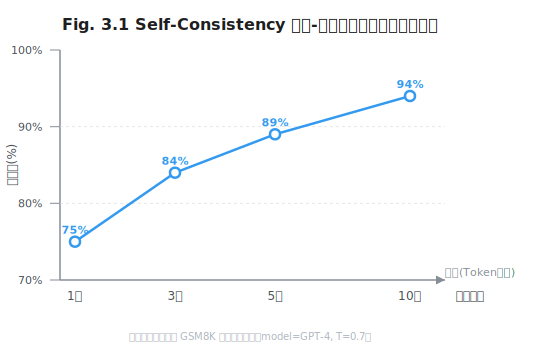

# 第 3 章 经典提示词模式

> **问题陈述**：提示词（Prompt）写作从"碰运气"走向工程化的关键一步，是建立可复用的模式库。本章系统梳理三大类经典模式——指令型、推理型和结构化输出——给出每种模式的形式化定义、适用条件、性能边界和反方观点，帮助读者将提示词从手工作坊提升到模式复用。

**本部分导读：** 第 2 章揭示了 Token 的物理特性（分词器、注意力偏置、logprobs），第 3 章在此基础上搭建模式框架。读者将看到：Token 层的物理约束如何决定了不同模式的适用条件——例如注意力偏置解释了为什么 RTF 三段式的格式要求必须放在开门处而非中间。

> **跳读代价**：如果跳过本章，你将反复发明轮子——本章的三种模式覆盖了 80% 以上的日常提示词场景。模式本身不难，难的是知道"什么时候不用"以及"模式之间如何组合"。

---

## 3.1 指令型模式

指令型模式是提示词模式中最基础也最常用的一类。核心思想是：用结构化的方式告诉模型"你是谁、要做什么、输出什么样"。

### 3.1.1 Role-Task-Format（RTF）三段式

RTF 三段式是最经典的结构化提示词格式。它将提示词拆解为三个独立组件：角色定义（Role）、任务描述（Task）、输出格式（Format）。每个组件承载不同的工程职责。

**定义 3.1（RTF 提示词）**：一个 RTF 提示词由三元组 $P = \langle R, T, F \rangle$ 构成，其中 $R$ 为角色锚定（Role Anchor），$T$ 为任务陈述（Task Statement），$F$ 为格式约束（Format Constraint）。典型模板为：

```
你是一个{R}。你的任务是{T}。请以{F}格式输出。
```

三组件的独立性是 RTF 的关键工程特性：可以单独替换 $R$（如从"Python 工程师"切换为"系统架构师"）而不影响 $T$ 和 $F$，从而实现提示词的模块化组合。

**Role 设计：能力锚定 vs 人格扮演。** Role 有两种设计取向：**能力锚定**（如"你是一位精通 Python 性能优化的后端工程师"）为模型提供技能背景约束，缩小输出空间；**人格扮演**（如"你是一位风趣幽默的老师"）为目标塑造输出语气和风格。工程中应优先使用能力锚定——它直接影响模型的输出质量（如代码生成准确率），而人格扮演主要影响用户感知体验。两者的组合需谨慎：人格设定如果与能力关键词冲突（如"你是一位不懂技术的经理"却说"请给我写一个内核模块"），模型可能无所适从。

> **反方观点**：部分实践者认为 Role 设定是多余的——如果 Task 描述足够精确，模型的自然训练分布已经能产生正确输出。实验表明，对于常见任务（如翻译、摘要），Role 的确没有明显增益；但对于需要领域知识的专业任务（如法律文书生成、医疗诊断辅助），Role 锚定可以将准确率提升 10–20 个百分点。

**Task 描述的可验证性。** Task 描述应具备"可验证性"——即外部观察者可以判断模型是否完成了任务。例如："列出 Python 列表去重的三种方法"是可验证的（读者可以数出三种方法），而"优化这段代码"是不可验证的（没有量化的成功标准）。提升可验证性的方法：为 Task 附加检查条件（如"至少包含一个时间复杂度对比表格"）。可验证的 Task 描述是实现 Prompt CI（第 4 章）的前提。

**Format 约束与下游解析协同。** Format 约束应考虑下游消费系统的解析能力。常见的矛盾：模型输出了格式正确的 JSON，但包含 Markdown 代码块包裹（"```json...```"），导致 JSON 解析器失败。工程建议：在 Format 中明确声明"禁止使用代码块包裹输出"，并在下游实现包容性解析（先尝试直接解析 JSON，失败后再提取代码块内容）。

### 3.1.2 Constraint-Driven Prompting

约束驱动提示词不是告诉模型"做什么"，而是告诉模型"不能做什么"以及"在什么范围内选择"。

**正向约束 vs 负向约束。** 正向约束给出"应该做的事"（如"请包含时间复杂度分析"），负向约束给出"不应该做的事"（如"不要使用递归实现"）。认知心理学研究表明，人类对负向指令的遵从度低于正向指令——模型亦有类似倾向。工程建议：优先使用正向约束；仅在需要禁止特定行为时使用负向约束，并确保负向约束在提示词中的位置足够显眼（放在开头而非末尾）。

```
正例： "请使用迭代方式实现，并附上时间复杂度分析。"
反例： "不要用递归。另外，给出时间复杂度分析。"
```

> **真实失败案例**：某团队为代码审查 Agent 设计了大量负向约束（"不要删除原有注释""不要改变缩进风格""不要引入未使用的导入"），总计约 500 Token。Agent 在 30% 的案例中违反了至少一条约束。分析发现，负面约束被放在提示词的中间位置，因注意力稀释而"丢失"。修复方案：将 Top-3 关键约束提炼为正向指令提到提示词开头，剩余的负向约束降级为 Review 阶段的自动化检查脚本。

**用枚举替代自由文本。** 当输出空间有限时，用枚举列表（"只能从以下选项中选择：A、B、C"）替代自由文本表述（"请选择合适的选项"）。枚举的工程价值在于：它本质上是在模型内部将生成任务从"开放式生成"转换为"分类任务"，后者在 Token 层面的确定性远高于前者（参看第 2 章的 logprobs 诊断）。枚举还可以配合 Top-k 采样（$k=\text{选项数}$）进一步锁定输出空间。

**约束冲突的优先级声明。** 当多条约束同时生效时，模型可能会遇到冲突（如"输出 JSON"和"输出自然语言解释"）。工程建议：在提示词末尾显式声明优先级顺序：

```
约束优先级（从高到低）：
1. 输出必须是合法 JSON
2. JSON 的 value 必须是字符串
3. 尽可能丰富内容
```

优先级声明可以看作是一种"元约束"——它不是约束内容本身，而是约束之间的仲裁规则。

---

## 3.2 推理型模式

当任务需要多步推理时，简单的指令型模式往往不够。推理型模式通过引导模型的中间推理过程来提升最终输出的质量。

### 3.2.1 Chain-of-Thought 家族

Chain-of-Thought (CoT) 是推理型模式中最具影响力的成员，由 Wei et al. (2022) 系统提出。

**定义 3.2（Chain-of-Thought 推理）**：给定问题 $Q$，Chain-of-Thought 提示词 $P_{\text{CoT}}$ 引导模型生成中间推理序列 $S = \langle s_1, s_2, \ldots, s_k \rangle$，然后得出最终答案 $a$。形式化地：
$$P_{\text{CoT}}(Q) \rightarrow (S, a), \quad \text{其中} \; s_i \Rightarrow s_{i+1}, \; s_k \Rightarrow a$$
箭头 $\Rightarrow$ 表示逻辑蕴涵关系——每个推理步骤应该逻辑地导向下一步。

**Zero-shot CoT 的失效场景。** Zero-shot CoT (Kojima et al., 2022) 通过在问题后追加"让我们一步一步思考"触发模型自发生成推理链。其优势是零成本、零示例；劣势是推理链质量不可控，在以下场景容易失效：①**事实性任务**（如"巴黎是哪个国家的首都"）——CoT 反而可能引入错误的中间推理；②**模棱两可的任务**（如"这篇文章主要表达了什么观点"）——CoT 会让模型"自圆其说"，而非直接输出；③**高度创造性的任务**（如"编一个科幻故事"）——CoT 的线性推理会扼杀创造性跳跃。

> **反方观点**：2024 年底推理模型（如 o1、o3、DeepSeek-R1）的兴起引发了"CoT 是否还有必要显式书写"的讨论 (DeepSeek, 2025)。这些模型在训练阶段已经内置了 CoT 推理能力，用户不需要再写"让我们一步一步思考"。工程趋势是：对于**通用推理任务**，依赖模型内置推理；对于**领域特定推理**（如需要特定公式或业务规则的场景），显式 CoT 仍然是有效的。

**Few-shot CoT 的样例选择。** Few-shot CoT 通过提供 2–5 个"问题 + 推理链 + 答案"示例来引导模型。样例选择的工程要点：①**难度递进**——从简单样例到复杂样例，让模型逐步适应推理模式；②**边界覆盖**——至少包含一个"易混淆"的样例，展示模型在模糊场景下的推理方式；③**多样性**——样例的推理步数不应都相同（3 步、5 步、8 步各一个比三个 4 步样例更好）。样例数量超过 5 个时收益递减，且消耗的 Token 成本线性增长。

```text
# Listing 3.1  Few-shot CoT 示例模板

问题：一个班级有 30 名学生，15 名男生，其余是女生。
      女生的人数比男生多几人？
推理链：班级总人数 = 30。男生 = 15。
       女生 = 30 - 15 = 15。
       女生比男生多 15 - 15 = 0 人。
答案：0

问题：{用户问题}
推理链：
```

**隐式 CoT（推理模型时代的角色变迁）。** 随着 o1、DeepSeek-R1 等推理模型的普及，CoT 的书写方式正在变迁。这些模型在训练阶段通过 RL 强化了推理链的生成能力，在推理阶段自动产生内部"思维链"。工程含义：① 对于通用推理任务，不再需要显式 CoT 指令（写"让我们一步一步思考"对推理模型是多余的）；② 对于需要特定推理框架的任务（如法律三段论、科学实验设计），仍需要显式 CoT 来"框定"推理方向；③ 长篇 CoT 样例（few-shot）的成本效益比正在下降——模型可以用更少的样例学会推理模式。这一趋势将在第 20 章进一步讨论。

### 3.2.2 Tree-of-Thought 与 Graph-of-Thought

当单条推理链不足以覆盖复杂问题的多分支可能性时，Tree-of-Thought (ToT) 和 Graph-of-Thought (GoT) 提供了更丰富的推理拓扑。

**定义 3.3（Tree-of-Thought）**：给定问题 $Q$，ToT 维护一个状态树 $\mathcal{T} = (V, E)$，其中节点 $v \in V$ 表示推理过程中的一个中间状态，边 $(v_i, v_j) \in E$ 表示从状态 $v_i$ 到 $v_j$ 的推理步骤。模型在每个节点处生成多个候选后继，并使用评估函数 $f(v)$ 选择最有希望的分支继续搜索。ToT 本质上是一种**在 Token 空间上的搜索算法**。

**状态扩展与剪枝。** ToT 的核心工程挑战是搜索空间管理。每次状态扩展生成 $b$ 个候选分支，深度为 $d$，则最坏情况下需要探索 $b^d$ 个节点。实际工程中需要剪枝：① **宽度剪枝**——保留 Top-$k$ 个最高分的候选；② **深度剪枝**——达到最大深度 $d_{\max}$ 后停止；③ **评估阈值**——当前置置信度低于阈值时提前终止该分支。Yao et al. (2023) 的实验表明，在 24 点游戏等推理密集型任务上，$b=5, k=3$ 的配置在成本和效果之间取得了最佳平衡。

**与循环工程的边界。** ToT 和 GoT 中的"循环"（状态扩展、评估、选择）与第 13 章的循环工程共享同一拓扑，但抽象层级不同。ToT 的循环发生在**单次 LLM 调用内**的 Token 生成过程中——模型在内部多次"暂停"并评估候选方向；循环工程的循环发生在**多次 LLM 调用之间**——Agent 执行工具、观察结果、决定下一步。两者的边界在推理模型（如 o1）中正在模糊——模型在"内部思考"时执行的其实就是 Token 层面的 ToT，用户无法感知。

### 3.2.3 Self-Consistency 与多采样投票

Self-Consistency (Wang et al., 2023) 是一种"以计算换稳定"的策略：对同一个问题多次采样（$T>0$），然后聚合多个答案。

**投票聚合策略。** 聚合策略的选择取决于答案空间的性质：
- **离散答案**（多项选择、枚举）：直接对答案做多数投票（majority vote）。
- **连续答案**（数值计算）：取均值或几何中位数。
- **文本生成**（摘要、翻译）：聚类后再选代表性输出，或用 LLM-as-Judge 评分。
工程经验：采样次数 $n=5$ 通常可以覆盖 80% 的收益，$n=10$ 覆盖 95%——超过 10 次后的边际收益极低。

**成本-准确率帕累托曲线。** Self-Consistency 的核心工程问题是：每增加一次采样，成本线性增长，但准确率的提升呈对数衰减。以下是一个典型的帕累托曲线：



工程建议：将 Self-Consistency 作为"精度保险"而非默认方案——只在准确率不能低于阈值的场景（如金融交易决策）使用，采样次数根据预算灵活配置。

---

## 3.3 结构化输出

结构化输出需求在 Agent 系统中无处不在：工具调用需要 JSON，数据库查询需要 SQL，代码生成需要语法有效的程序。本节聚焦 JSON 结构化输出。

### 3.3.1 JSON Mode 与 Schema 约束

**JSON Schema 设计原则。** 设计 JSON Schema 时应遵循三条原则：① **扁平优先**——嵌套深度不超过 3 层，每加深一层，模型输出合法 JSON 的失败率约增加 5–10%；② **字段最小化**——只包含下游系统必需的字段，每增加一个可选字段，失败率约增加 2%；③ **类型明确**——所有字段的类型必须严格声明（string / number / boolean / array），避免使用"any"类型。以下是一个违法了三条原则的糟糕 Schema：

```json
{
  "type": "object",
  "properties": {
    "result": { "type": "object",
      "properties": {
        "data": { "type": "object", "properties": {
          "items": { "type": "array", "items": { "type": "any" } }
        }}
      }
    },
    "metadata": { "type": "any" }
  }
}
```

这个 Schema 嵌套深度 4 层、包含 any 类型、字段冗余。改进后：

```json
{
  "type": "object",
  "properties": {
    "items": { "type": "array", "items": { "type": "string" } },
    "total_count": { "type": "integer" }
  },
  "required": ["items", "total_count"]
}
```

**嵌套深度与失败率。** 实验表明，JSON 嵌套深度与模型输出合法 JSON 的失败率之间存在正相关关系。单层对象的失败率约为 2–3%，三层嵌套升至 15–20%，五层以上超过 50%。原因在于模型需要在 Token 生成过程中"记住"当前嵌套层次、未闭合的括号数和字段名上下文——这些状态管理超出了单 Token 生成的可控范围。工程建议：对深度超过 3 层的输出需求，拆分为多个独立的 LLM 调用，每个调用负责一个扁平的子结构。

### 3.3.2 失败重试与解析容错

**解析失败的分类。** JSON 解析失败可分为三类：① **语法错误**——缺少逗号、括号不匹配、字符串未闭合（约占 60%）；② **类型错误**——字段值类型与 Schema 不匹配（约占 25%）；③ **结构缺失**——缺少必填字段（约占 15%）。不同类型的失败需要不同的修复策略。

**修复型重试提示词模板。** 修复型重试的核心思路是将解析错误信息写回上下文，让模型自行修正：

```
之前我要求你输出 JSON，内容为：{original_output}
但解析器报错：{error_message}
请修正后重新输出，只输出 JSON，不要其他内容。
记住：使用双引号包裹所有字符串，最后一个元素后不要加逗号。
```

```python
# Listing 3.2  JSON 修复型重试循环
# 完整代码见 agent-engineering-code/part1-prompt/ch3-cot-examples/json_repair.py
import json
import openai


def json_completion_with_retry(
    client,
    prompt: str,
    model: str,
    max_retries: int = 3,
) -> dict:
    """调用 LLM 输出 JSON，解析失败时自动修复重试。

    注意：DeepSeek 等模型要求 prompt 中出现 "json" 关键字
    才能使用 response_format 的 json_object 模式。
    """
    messages = [{"role": "user", "content": prompt}]
    for attempt in range(max_retries):
        response = client.chat.completions.create(
            model=model,
            messages=messages,
            response_format={"type": "json_object"},
        )
        content = response.choices[0].message.content
        try:
            return json.loads(content)
        except json.JSONDecodeError as e:
            messages.append({
                "role": "user",
                "content": f"格式错误: {e}\n输出: {content}\n请修正后重新输出。",
            })
    raise RuntimeError(f"经过 {max_retries} 次重试仍无法输出合法 JSON")
```

**定义 3.4（结构化输出的可修复性）**：对于输出格式 $F$，其可修复性 $R(F, r)$ 定义为在最多 $r$ 次修复重试内获得合法输出的概率：
$$R(F, r) = P(\text{合法输出} \mid \text{重试次数} \leq r)$$
工程经验：$R(F, 1)$ 通常能将成功率从 80% 提升至 95%，$R(F, 2)$ 的边际收益约为 3%。

---

## 附：提示词模式评估指标表

| 指标名称 | 定义 | 度量方法 |
|---------|------|---------|
| 模式遵从率 | 模型输出严格遵循指定模式的比例 | 人工/自动检查 $N$ 个采样输出的模式符合度 |
| 结构化输出成功率 | 输出通过 JSON Schema 验证的比例 | 对 $N$ 次调用执行 `json.loads()` + Schema 校验 |
| 推理准确率（CoT） | CoT 模式下最终答案的正确率 | 对 $N$ 个问题对比 ground truth 答案 |
| 修复效率 | 一次修复重试后成功率提升的百分点 | $\Delta = \text{Acc}_{\text{retry1}} - \text{Acc}_{\text{raw}}$ |
| Token 效率 | 每条有效输出消耗的平均 Token 数 | 总 Token 消耗 / 有效输出数 |

---

## 开放问题

1. **模式 vs 元模式。** 是否存在可以生成模式的元模式？例如，给定一个任务描述，让模型自动选择最适合的提示词模式（指令型/推理型/结构化）。这相当于在提示词工程上增加了一层元控制，其可行性如何？

2. **推理模型对 CoT 的"内部化"是否意味着传统 CoT 死亡？** 如果 o1 等模型已经在训练中内置了推理链生成能力，那么显式书写的 CoT 是否只适用于"框定推理方向"的场景？是否存在某种任务，内置推理反而比显式 CoT 表现更差？

3. **结构化输出的极限在哪里？** 当 Schema 复杂度过高时，多步重试和单步高复杂度之间的成本-成功率曲线如何？是否存在一个"模式越复杂，拆分调用的收益越高"的临界点？

4. **模式组合的相容性。** RTF + CoT + JSON 三层模式是否可以安全叠加？叠加时是否存在副作用（如 CoT 的推理文本污染了 JSON 输出）？如何设计模式组合的接口规范？

---

## 练习

### 思考题

1. 选一个你最近写的提示词，用 3.1.1 节的 RTF 三元组框架分析它是否完整。缺失了哪个组件？补充后输出质量是否有提升？

2. 对于"将一篇英文论文翻译为中文并提取关键术语"这个任务，你会选择哪种模式组合？你的选择依据是什么（任务确定性、输出格式复杂度、Token 预算）？

3. 当 o1 等推理模型不再需要显式 CoT 时，提示词工程师的角色会发生什么变化？是转向更上层的 Context/Harness/Loop 工程，还是转向更底层的 Token 物理学（第 2 章）？

### 动手题

1. 实现 Listing 3.2 的 `json_completion_with_retry` 函数，并在一个深度 4 层的 Schema 上测试其成功率。验收标准：在 3 次重试内达到 ≥ 95% 的合法 JSON 输出率。

2. 为"自动生成 Python 函数文档"这个任务设计一个 RTF + CoT + JSON 的组合模式。用三个模板分别测试三种模式单独使用和组合使用的输出质量差异。验收标准：给出三种配置下的准确率对比表格。

3. 实现一个 Self-Consistency 投票函数 `self_consistency(question, n=5)`，对 3 个数学推理问题运行 $n=5$ 次采样并输出投票结果。验收标准：每个问题的输出格式为 `{question, answers: [...], final_answer, confidence}`。

---

## 参考文献

- DeepSeek-AI. (2025). DeepSeek-R1: Incentivizing Reasoning Capability in LLMs via Reinforcement Learning. *arXiv:2501.12948*.
- Kojima, T., Gu, S. S., Reid, M., et al. (2022). Large Language Models are Zero-Shot Reasoners. *NeurIPS 2022*.
- Wang, X., Wei, J., Schuurmans, D., et al. (2022). Self-Consistency Improves Chain of Thought Reasoning in Language Models. *ICLR 2023*.
- Wei, J., Wang, X., Schuurmans, D., et al. (2022). Chain-of-Thought Prompting Elicits Reasoning in Large Language Models. *NeurIPS 2022*.
- Yao, S., Yu, D., Zhao, J., et al. (2023). Tree of Thoughts: Deliberate Problem Solving with Large Language Models. *NeurIPS 2023*.

> **本书叙述方向**：本章从"模式复用"的角度审视了提示词工程的三大类模式——指令型（RTF、约束驱动）、推理型（CoT、ToT、Self-Consistency）和结构化输出。下一章将把视角从"设计模式"提升到"工程体系"——第 4 章"提示词的工程化生产"将介绍版本管理（PromptOps）、自动评估流水线和 Prompt CI，把提示词从"手写稿"变为"可被 CI 验证的工程产物"。
