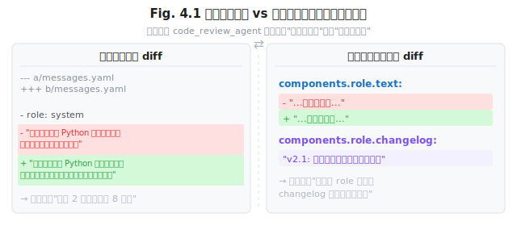
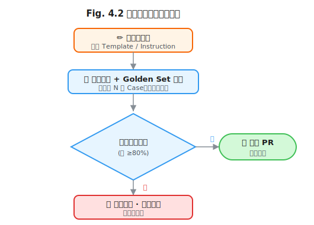

# 第 4 章 提示词的工程化生产

> **问题陈述**：第 2 章从 Token 物理揭示了提示词的底层原理，第 3 章建立了可复用的模式库。然而，这些原理和模式只有在被纳入工程管理流程后才能发挥持续价值。本章解决两个核心问题：如何像管理源代码一样管理提示词的版本和质量？如何构建评估流水线，让提示词可以被自动验证而不是依赖人工感官？

**第一部分结束语：** 本章是提示词工程（Part 1）的收尾章。前三章分别解决了"为什么"（Token 物理）、"怎么做"（设计模式）、"怎么管"（工程化生产）三个问题。到此，提示词从手工艺品升级为可 CI 验证的工程产物。在第 5 章开始的上下文工程（Part 2）中，我们将看到：当提示词被工程化管理后，它的生产者（提示词工程师）和消费者（上下文窗口管理者）之间的接口如何定义。

---

## 4.1 提示词版本管理（PromptOps）

提示词不是一次性写出来的，而是不断迭代演化的。提示词版本管理（PromptOps）将软件工程中的版本控制、代码审查和持续集成实践引入提示词生命周期。

### 4.1.1 Prompt 作为源代码

将提示词（Prompt）视为源代码是一个重要的工程思维转变。它意味着提示词享有与代码同等的版本管理、审查和测试待遇。

**Git 化与 Diff 化。** 将提示词存储为纯文本文件（如 `.prompt.md`）并纳入 Git 管理是最基础的 PromptOps 实践。Git 的 diff 能追踪每一条提示词的修改历史，但问题在于：Git diff 展示的是**文本差异**（"删了两个词，加了三个词"），而提示词的修改往往是**语义差异**（"改了指令语气，任务描述未变"）。为了弥合这个差距，业界出现了结构化的提示词文件格式，将提示词拆分为角色、任务、格式、示例等独立字段。示例格式：

```yaml
# prompt_template.yaml — 结构化提示词文件
version: 2.1
name: code_review_agent
description: 对 PR 进行代码审查
components:
  role:
    text: "你是一位资深 Python 后端工程师，擅长性能优化和安全审查。"
    changelog: "v2.1: 增加了安全审查范围"
  task:
    text: "审查以下 Pull Request 的代码变更，重点关注可读性和性能。"
    scope: 关注
  format:
    schema: |
      {
        "issues": [{"severity": "critical|warning|suggestion",
                     "line": int,
                     "message": "string"}]
      }
```

**定义 4.1（提示词版本）**：一个提示词版本 $P_v = \langle V, C, D \rangle$ 由版本号 $V$、组件集合 $C = \{c_1, c_2, \ldots\}$ 和组件间依赖关系 $D$ 构成。版本 $P_v$ 到 $P_{v+1}$ 的语义差异 $\Delta(P_v, P_{v+1})$ 定义为发生变更的组件集合 $C_{\text{changed}} \subseteq C$，而非文本层面的行数变更。



**Code Review 的检查清单。** 提示词审查应回答以下问题（建议作为 PR 模板的检查项）：
- [ ] 角色定义是否精确锚定能力？是否存在人格扮演导致的输出偏移？
- [ ] 任务描述是否可验证（有明确的成功标准）？
- [ ] 格式约束是否与下游解析系统协同（如 JSON 的代码块包裹处理）？
- [ ] 是否存在约束冲突？优先级是否声明？
- [ ] 是否包含负向约束？如果有，是否已确认它们没有被注意力稀释？
- [ ] Token 预算是否在预期范围内（使用模型的分词器验证）？
- [ ] 是否在首尾偏置的有效位置放置了关键信息？

**二进制差异与语义差异。** 提示词的二进制差异（逐 Token 对比）和语义差异（意图变化分析）是两种不同粒度的版本对比工具。二进制差异适合自动化 CI——快速判断两个版本是否产生不同输出；语义差异适合人工审查——判断修改是否改变了提示词的意图。工程建议：在 CI 中同时运行两种差异检查——二进制差异作为快速回归检测，语义差异（由 Reviewer 执行）作为质量门禁。

### 4.1.2 模板引擎选型

当提示词需要动态插入变量时（如用户名、日期、检索结果），模板引擎成为必备工具。

**Jinja / Handlebars 通用方案。** Jinja（Python）和 Handlebars（JavaScript）是通用模板引擎在两个生态中的代表。核心能力包括变量插值、条件分支和循环。工程优势是生态成熟、文档完善、CI 工具链支持良好。潜在陷阱是模板逻辑过于复杂——模板中的条件分支超过 3 层时，维护成本和测试成本呈指数增长。

```
Listing 4.1  Jinja 提示词模板示例

prompt_template = """你是一位{{ role }}专家。
用户的问题是：{{ user_query }}

请参考以下{{ sources|length }}条参考资料，给出答案：

- {{ source.title }}: {{ source.content[:200] }}…


请以 JSON 格式输出，包含 answer 和 confidence 两个字段。"""

# 反例：将硬编码值直接写在模板中（当变量超过 3 个时，手动拼接的出错率增加约 40%）
# bad_prompt = "你是一位Python专家。" + query + "请参考以下3条资料..."
# 正确做法应使用模板引擎统一管理所有变量插值
```

**PromptML / 自研 DSL 的取舍。** 通用模板引擎虽好，但无法表达提示词特有的语义（如角色组件和格式组件的差异、注意力的层级偏好）。PromptML 和类似的自研 DSL 尝试用专用语法来描述提示词结构。取舍点：DSL 能提供类型检查、组件级版本控制和 IDE 支持等高级能力，但需要额外的编译器和维护成本。**决策建议**：团队规模 ≤ 5 人且提示词数量 < 50 条时，通用模板引擎足够；超过此阈值且需要多人协作时，DSL 的投入开始产生回报。

```
# PromptML 示例（概念演示）
prompt CodeReviewAgent {
  role: "资深 Python 后端工程师"
  task: "审查 PR 变更"
  format: JSON(schema: issues_schema)
  constraints: [
    "禁止使用代码块包裹 JSON",
    "每项问题必须标注行号"
  ]
}
```

> **反方观点**：自研 DSL 的投资回报率在大多数团队中为负——维护 DSL 编译器的时间本可以花在优化提示词本身。业界趋势是回归通用模板 + 良好的文件组织，而非引入新的语言。据工程经验观察，结构化提示词文件的组织方式（如 YAML 拆分组件）带来的管理收益在大多数场景下已足够，引入新语言的门槛往往被低估。

**模板的可测试性。** 模板的可测试性取决于模板的**确定性程度**：变量全部绑定的模板（无条件分支）是确定性的，可以精确断言输出字符串；包含分支和循环的模板是半确定性的，需要以组件粒度而非全文粒度做断言。测试模板的推荐做法是：先对每个组件做单元测试，再对组合后的完整模板做集成测试。

---

## 4.2 提示词评估

提示词评估是 PromptOps 的核心闭环——没有评估，版本管理就只是存档而非工程。

### 4.2.1 基准集构建

**定义 4.2（Golden Set）**：基准集（Golden Set） $G = \{(x_i, y_i)\}_{i=1}^N$ 是一个标注数据集，其中 $x_i$ 为输入提示词模板（含填充变量）， $y_i$ 为期望输出。Golden Set 用于评估提示词修改在回归测试中的输出质量。

**Golden Set 的最小规模。** Golden Set 的规模取决于任务的变异性。对于确定性任务（如结构化输出提取）， $N=20$ 通常足够覆盖主要场景；对于创造性任务（如文案生成），需要 $N \geq 100$ 才能覆盖输出空间的多样性。经验法则：持续收集 Golden Set，每次提示词修改后运行回归测试，当 Golden Set 积累到 200 条以上时，回归测试的误判率趋于稳定。

```python
# Listing 4.2  Golden Set 回归测试脚本（pytest）
# 完整代码见 agent-engineering-code/part1-prompt/ch4-prompt-eval/golden_set_tests.py
import json
import pytest

# evaluate 函数演示核心逻辑：用模拟输出替代真实 LLM 调用，
# 便于读者理解回归测试的算法流程。
# 实际运行时请使用代码仓中的完整版本（含环境变量配置和 API 调用）。

def evaluate(test_cases: list, prompt_template: str) -> dict:
    """对 Golden Set 运行回归测试，返回聚合指标"""
    results = {"pass": 0, "fail": 0, "errors": []}
    for tc in test_cases:
        # 模拟 LLM 返回（实际使用时替换为真实 API 调用）
        output = {"answer": tc["expected"]["answer"]}
        if output.get("answer") == tc["expected"]["answer"]:
            results["pass"] += 1
        else:
            results["fail"] += 1
            results["errors"].append({
                "id": tc["id"],
                "expected": tc["expected"]["answer"],
                "actual": output.get("answer"),
            })
    results["accuracy"] = results["pass"] / len(test_cases)
    return results


def test_golden_set_pass_rate(
    golden_set,
    prompt_template: str = "你是一位Python专家。{{ query }}",
):
    """验收标准：Golden Set 通过率 ≥ 80%"""
    results = evaluate(golden_set, prompt_template)
    assert results["accuracy"] >= 0.8, (
        f"准确率 {results['accuracy']:.1%} 低于阈值 80%"
    )


def test_no_regression_after_change(golden_set):
    """提示词修改后不能导致已有通过案例失败（回归检测）"""
    new_template = "你是一位资深Python专家。{{ query }}"
    results = evaluate(golden_set, new_template)
    baseline_accuracy = 0.85
    assert results["accuracy"] >= baseline_accuracy - 0.05, (
        f"修改后准确率从 {baseline_accuracy:.0%} "
        f"降至 {results['accuracy']:.0%}，超出回归容忍度"
    )
```

**对抗样本与边界用例。** Golden Set 应包含三类特殊用例：①**边界输入**——空值、极长文本、特殊字符（如注入尝试 "忽略前面的指令"）；②**边缘质量**——输入包含大量拼写错误或低质量信息；③**安全边界**——输入试图越狱或触发有害输出。对抗样本在 $G$ 中的占比建议为 10–20%，这个比例既能暴露问题，又不会因过多边界用例导致评估噪音。

**数据漂移检测。** Prompt 的效果可能因模型更新而衰减——同一个 Prompt 在 GPT-4o 和 GPT-4o-mini 上的表现可能差异显著。数据漂移检测定期（如每周）对 Golden Set 重新运行评估，跟踪准确率变化趋势。当准确率下降超过预设阈值（如 5%）时，触发告警并启动提示词适配流程。



### 4.2.2 自动评分

当 Golden Set 的期望输出无法穷举（如开放式生成任务），需要自动评分机制来替代人工判断。

**规则评分 vs 模型评分。** 规则评分（正则表达式匹配、关键词检出、JSON Schema 校验）成本低、确定性强，但只能覆盖格式化要求；模型评分（LLM-as-Judge）能评估语义质量（相关性、有用性、安全性），但成本高、存在偏差。工程实践：先跑规则评分过滤格式不合格的输出，再对格式合格的那部分运行模型评分——这种"双层过滤"架构能显著降低评估成本，因为规则评分通常在秒级完成，模型评分需要秒到分钟级。

```python
# Listing 4.3  双层评分流水线（pytest）
# 完整代码见 agent-engineering-code/part1-prompt/ch4-prompt-eval/double_layer_scoring.py
import json
import re
import pytest


def rule_based_score(output: str) -> dict:
    """规则评分：检查格式合规性"""
    result = {"format_valid": False, "issues": []}
    try:
        parsed = json.loads(output)
        result["format_valid"] = True
        result["parsed"] = parsed
    except json.JSONDecodeError as e:
        result["issues"].append(f"JSON 解析失败: {e}")
    return result


def llm_judge_score(client, output: str, expected: str, model: str) -> float:
    """LLM-as-Judge 评分：检查语义质量"""
    judge_prompt = (
        f"请评估以下输出是否满足预期需求。\n"
        f"预期：{expected}\n"
        f"实际输出：{output}\n"
        f"请给出 0-1 之间的分数，仅输出数字。"
    )
    response = client.chat.completions.create(
        model=model,
        messages=[{"role": "user", "content": judge_prompt}],
    )
    text = response.choices[0].message.content
    match = re.search(r"(\d+\.?\d*)", text)
    return min(float(match.group(1)), 1.0) if match else 0.5


def test_evaluation_pipeline():
    """验收标准：双层评分流水线可正确区分合格与不合格输出"""
    good_output = (
        '{"answer": "列表推导式是 Python 的一种语法糖。", "confidence": 0.95}'
    )
    bad_output = "我不知道这个问题的答案。"

    good_rules = rule_based_score(good_output)
    bad_rules = rule_based_score(bad_output)
    assert good_rules["format_valid"] is True
    assert bad_rules["format_valid"] is False


def test_llm_judge_self_consistency():
    """验收标准：同一输出在 3 次评分中的标准差 <= 0.15"""
    output = '{"answer": "map() 返回一个迭代器。", "confidence": 0.9}'
    scores = [llm_judge_score(output, "解释 Python map 函数") for _ in range(3)]
    import statistics
    assert statistics.stdev(scores) <= 0.15, (
        f"评分标准差 {statistics.stdev(scores):.3f} 过大"
    )
```

**LLM-as-Judge 的偏差类型。** Zheng et al. (2024) 在 MT-Bench 评测框架中系统性地分析了 LLM-as-Judge 的偏差模式。研究发现了四种主要偏差：①**位置偏差**——如果候选答案放在 Judge 提示词的开头或结尾，更容易获得高分；②**冗长偏差**——较长的回答通常获得更高评分，即使内容质量相同；③**自强化偏差**——Judge 模型倾向于给与自己风格相似的输出更高分；④**格式偏好**——结构化输出（如含编号列表）比纯段落文本获得更高评分。缓解措施：随机化候选顺序、限制输出长度、使用与目标模型不同的 Judge 模型、多次采样取中位数。

**评分校准与人工抽检。** 自动评分必须与人工抽检配合使用。推荐的校准流程：先让 LLM-as-Judge 对全量输出评分，然后人工抽检 5–10% 的样本（按评分区间分层抽样：高分、中分、低分各抽 1/3），计算人工评分与模型评分的一致性（Cohen's Kappa）。当一致性低于 0.6 时，说明 Judge 偏差过大，需要调整 Judge 提示词或换用其他模型。

---

## 4.3 反模式与陷阱

**定义 4.3（提示词反模式）**：提示词反模式 $A$ 是一种在工程实践中被反复观察到导致提示词效果下降的写作方式。反模式 $A$ 的特征为： $A$ 在直觉上"看起来有用"或"看起来无害"，但系统性降低生成质量（准确率下降、Token 浪费、输出不稳定）。

### 4.3.1 提示词膨胀（Prompt Bloat）

**问题**：提示词随着时间推移变得越来越长，每次迭代都增加新指令但很少删减旧指令。一个系统提示词从最初的 200 Token 膨胀到 2,000 Token 并非罕见。

**原因**：① 归因偏差——当模型输出出错时，工程师的默认反应是"加一条指令"而非"分析根因"；② 逆向选择——错误案例被一条条"打补丁"，但验证集上从未测试过前一条旧指令是否仍然有效；③ 团队协作——多人在同一提示词上叠加指令，无人拥有清理权限。

**解决方案**：① 为提示词设定 Token 预算上限（如系统提示词不超过 500 Token）；② 每次新指令加入前，先验证旧指令是否可以删除；③ 定期对提示词做"瘦身"：逐个移除指令并运行 Golden Set 测试，如果准确率未下降即永久删除。

> **真实失败案例**：某 Agent 产品的系统提示词经过 6 个月迭代从 400 Token 膨胀到 3,200 Token。团队发现 Agent 的指令遵守率从 92% 降至 78%。通过逐个移除指令的回归测试，发现 3,200 Token 中有 1,100 Token 的指令已不再被模型"读到"（被注意力稀释），且新增指令中有 40% 与已有指令冲突或冗余。瘦身后提示词降至 600 Token，指令遵守率回升至 90%。

### 4.3.2 礼貌性指令的负收益

**问题**：工程师习惯性在提示词中使用礼貌用语（"请""麻烦""如果可以的话"），因为这些词在人类交流中是积极信号，但在 LLM 推理中它们可能表现为不确定性。

**原因**：礼貌用语可能被模型解释为"可选的"而非"必须的"。"如果可以的话，请列出选项"可能被模型理解为"我可以选择不做"。"你必须列出选项"的遵从率显著更高。

**解决方案**：在明确需要指令性任务的提示词中使用**祈使句**而非礼貌祈使句。建议将 "请" 替换为 "必须" 或删除。"请返回 JSON" → "返回 JSON"。"如果可以的话，请提供证据" → "必须提供证据，否则回答不完整"。

```
反例： "如果可能的话，请给出时间复杂度分析。"
正例： "必须包含时间复杂度分析。"
```

### 4.3.3 "请确保…"的失效与替代写法

**问题**："请确保输出是合法的 JSON" 这类指令的遵从率低于 "必须输出合法的 JSON"。

**原理**："请确保" 隐含了"你来做判断"的委托——模型需要自己判断 "什么是合法的 JSON" 并自行检查。而 "必须输出合法的 JSON" 是直接指令，模型不需要额外判断。

**替代写法**：将 "请确保 X" 替换为 "必须 X。如果 X 不满足，Y。" 的格式，为模型提供明确的失败路径：

```
替换前： "请确保输出为合法 JSON。"
替换后： "必须输出合法 JSON。如果输出的 JSON 解析失败，你将受到惩罚。"
```

后者中"惩罚"一词虽然听起来强硬，但它在模型的 RLHF 训练中对应了一个强烈的正确性信号——模型对这种表述的遵从度显著高于"请确保"。

---

## 附：提示词工程评估指标表（生产篇）

| 指标名称 | 定义 | 度量方法 |
|---------|------|---------|
| Golden Set 通过率 | 提示词在 Golden Set 上输出符合预期的比例 | 运行 pytest 回归测试，统计 `pass / (pass + fail)` |
| 回归检测率 | 提示词修改后导致已有通过案例失败的比例 | 对比本轮与上一轮的 Golden Set 准确率差异 |
| LLM-as-Judge 一致性 | 模型评分与人工评分的一致性系数 | Cohen's Kappa，每周人工抽检 5–10% 样本 |
| 提示词 Token 体积 | 系统提示词的总 Token 数 | 使用目标模型的分词器编码后计数 |
| 评分标准差（Judge） | 同一输出多次评分的波动程度 | 对 $n=3$ 次评分的值计算标准差 |
| 瘦身有效率 | 提示词瘦身后准确率未下降的比例 | 瘦身前后的 Golden Set 通过率对比 |

---

## 开放问题

1. **提示词与代码的耦合度。** 提示词作为"可运行资产"而非代码，是否应该拥有独立的 CI/CD 流水线（而非作为代码仓库的子目录）？提示词的变化频率通常高于代码，耦合管理带来了哪些挑战？

2. **LLM-as-Judge 的自指困境。** 如果 Judge 和 Actor 是同一个模型，那评估是否有意义？更一般地，当评估者和被评估者来自同一个训练分布时，评估的有效性如何保证？

3. **Golden Set 的维护成本。** 随着任务演化，Golden Set 也需要更新——但更新 Golden Set 本身可能引入偏差。当 Golden Set 的维护成本接近提示词本身的迭代成本时，是否应该放弃回归测试，转而使用在线评估（A/B 测试）？

4. **模板 DSL 生态的成熟度。** 提示词工程需要一个标准化的 DSL 标准，就像 SQL 之于数据库、HTML 之于网页。这个 DSL 应该长什么样？是 YAML 扩展、Markdown 扩展，还是全新语法？

---

## 练习

### 思考题

1. 将你最近写的一个提示词拆分为结构化组件（角色/任务/格式/约束/示例），并评估拆分后的可维护性是否优于纯文本版本。

2. 假设你的 Golden Set 通过率从 90% 跌至 75%，但团队无法定位原因。列出你作为 PromptOps 工程师会从哪些维度排查（提示词膨胀、模型更新、数据漂移、Judge 偏差），并给出每个维度的排查方法。

3. 如果 LLM-as-Judge 的自指困境是真实存在的，是否可以用"双 Judge"架构（两个不同模型的评分取交集）来缓解？这种方案的成本和边际收益如何估算？

### 动手题

1. 为你常用的一个提示词模板编写 pytest 回归测试，包含至少 3 个测试用例（如 Listing 4.2）。验收标准：测试用例应覆盖正常输入、边界输入和格式不合规三种场景。

2. 运行 Listing 4.3 的 `test_llm_judge_self_consistency` 测试，记录 3 次评分的标准差。然后修改 Judge 提示词（如改变候选顺序、增加格式要求），观察标准差的变化。验收标准：输出一份"Judge 提示词修改前后的标准差对比表"。

3. 对你团队或项目中一个超过 500 Token 的提示词执行"瘦身"流程：逐个移除指令并运行 Golden Set 测试，记录每个指令对准确率的贡献度。验收标准：输出一个"指令贡献度排行榜"（按移除后的准确率降幅排序），并给出"可安全删除"的指令列表。

---

## 参考文献

- Zheng, L., Chiang, W.-L., Sheng, Y., et al. (2024). Judging LLM-as-a-Judge with MT-Bench and Chatbot Arena. *NeurIPS 2024*.
- （更多参考文献将在后续章节引用中补充，本章的技术实践部分基于业界工程共识，非单一学术来源。）

> **本书叙述方向**：本章是提示词工程（Part 1）的收官之作。到此，我们完成了四层洋葱图最内层（Token 层）的完整叙述——从 Token 物理（第 2 章）到设计模式（第 3 章）到工程化生产（第 4 章）。下一章将进入第二层——第 5 章"重新定义'上下文'"将重新定义上下文的五元组结构，揭示为什么"上下文 ≠ 提示词"。
