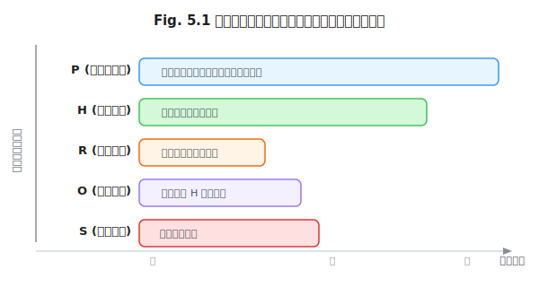
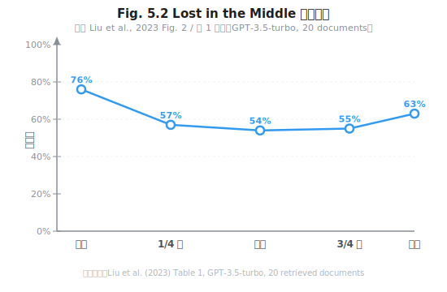

# 第 5 章 重新定义"上下文"

> **问题陈述**：在第 1 章中，我们将上下文形式化定义为五元组 $C = \langle P, H, R, O, S \rangle $。然而，大多数学者和工程师在使用"上下文"一词时，仍然将其等价于"提示词"或"对话历史"。本章将"上下文"与"提示词"解耦，揭示上下文的真正构成——为什么它不再是工程师手写的文本，而是一个由多种来源动态组装的信息容器，以及如何度量其质量。

**第二部分导读：** 第 5–8 章构成上下文工程（Context Engineering）的完整体系。第 5 章重新定义上下文本身——将"上下文"从模糊的概念提升为可度量的工程对象。第 6 章在此基础上深入检索增强（RAG）的工程细节，第 7 章构建记忆系统，第 8 章讨论工具与函数作为上下文成员的角色。如果你主要关注上下文的结构与质量，第 5–6 章是核心；如果你关心 Agent 的持久化行为，第 7 章不可跳过。

> **跳读代价**：如果跳过本章，你的"上下文"概念将停留在"历史对话 + 我的提示词"的阶段，无法理解第 6 章 RAG 中检索结果如何参与上下文组装、第 7 章记忆系统如何影响上下文内容。五元组框架是全 Part 2 的坐标系。

> **贯穿案例**：本章及后续第 6–7 章将围绕一个**个人科研助手**案例展开。初始上下文状态：科研助手知道用户的姓名和专业方向，没有对话历史，没有检索结果。随着使用，上下文将逐步丰富——在第 7 章结束时，它已经具备了跨会话持久记忆和主动反思能力。

---

## 5.1 上下文 ≠ 提示词

提示词（Prompt）是上下文的**一部分**，但不是全部。将上下文降级为"更长的提示词"是上下文工程的头号误解。

### 5.1.1 上下文 = 提示词 + 历史 + 检索 + 工具结果 + 系统状态

**上下文五元组形式化定义。** 基于第 1 章的定义 1.2，上下文是五个独立来源的联合体：

$$C = \langle P, H, R, O, S \rangle$$

其中各分量的含义和典型来源为：

| 分量 | 含义 | 典型来源 | 生命周期 |
|------|------|---------|---------|
| $ P$ | 系统提示词（System Prompt） | 开发者编写的角色/任务/格式指令 | 跨会话稳定，按版本迭代 |
| $ H$ | 对话历史（History） | 用户与模型之间的多轮交互记录 | 会话内累积，会话结束可丢弃 |
| $ R$ | 检索结果（Retrieved Context） | 向量数据库 / BM25 / 搜索引擎的 Top-k 结果 | 单次查询生成，用完即弃 |
| $ O$ | 工具输出（Tool Output） | Function Calling 的返回结果、代码执行结果 | 单次调用生成，写入 $ H$ 后保留 |
| $ S$ | 系统状态（System State） | 当前时间、用户身份、上下文预算使用量、Agent 内部状态 | 随系统运行持续更新 |

五个分量的工程意义在于：它们的**可变性**和**生命周期**完全不同。$ P$ 是相对稳定的（由开发者维护），$ H$ 是会话内累积的，$ R$ 和 $ O$ 是每次交互即时生成的。这意味着对它们的管理策略也应不同——$ P$ 需要版本管理（第 4 章），$ H$ 需要截断策略，$ R$ 需要相关性排序，$ O$ 需要裁剪与摘要。

**各组件的可变性与生命周期。** 五个分量的可变性排序为 $ P < H < S < O < R $（从最稳定到最易变）。生命周期排序为 $ P \gg H \gg S \geq O \geq R $（从最长到最短）。这两个排序直接决定了上下文压缩策略的优先级：当上下文窗口空间不足时，首先应该压缩或丢弃的是 $ R $（最短生命周期），其次是 $ O $（已写入 $ H$ 的可摘要），最后才是 $ P $（最长生命周期——且一旦丢失系统行为可能失控）。



> **反方观点**：部分框架将 $ R$ 和 $ O$ 合并进 $ H $，认为"检索结果和工具输出最终都写入了对话历史，不需要单独管理"。这种简化在中小场景下可行，但会丢失重要的粒度信息——例如你不知道准确率下降是因为检索质量差还是模型推理逻辑有问题。五元组分离的代价是额外的管理复杂度，收益是可归因的工程调试。

**个人科研助手案例（初始状态）：** 用户对助手说"帮我整理一下我近期关注领域的论文列表"。此时的上下文五元组为：
- $ P$ = "你是一位科研助手，帮助用户管理文献、设计实验和撰写论文。用户的研究方向是自然语言处理。"
- $ H$ = []（空——这可能是第一轮对话）
- $ R$ = None（未检索）
- $ O$ = None（未调用工具）
- $ S$ = {user_name: "张三", field: "NLP", session_start: "2026-06-24T10:00:00"}

助手应该调用什么工具？这取决于 $ P$ 中的角色定义和 $ S$ 中的用户信息。如果没有 $ S$ 的参与，助手无法个性化回答。这已经证明了五元组中每一个分量的独立价值。

### 5.1.2 上下文窗口的经济学

上下文窗口是 Agent 系统的核心稀缺资源——正如算力和存储之于传统软件工程。

**每 Token 的边际收益曲线。** 上下文窗口中的 Token 不是等价的。前 2,000 Token（通常包含 $ P$ 和 $ H$ 的开头部分）承载了系统的核心行为定义，每投入一个 Token 的边际收益极高。中间 10,000–30,000 Token（通常包含 $ R$ 和 $ O$ 的累积内容）的边际收益递减——模型从大量冗余信息中提取关键事实的效率随长度下降 (Liu et al., 2023)。超过 32K Token 后，新加入 Token 的边际收益趋近于零，甚至为负（因为注意力稀释开始抵消新增信息)。工程含义：为上下文窗口设置**有效使用上限**，不要填满模型声称的最大长度。建议上限为模型最大长度的 50–70%。

**KV-Cache 命中率与成本。** KV-Cache 是 Transformer 推理时的中间计算结果。在长上下文场景中，KV-Cache 的存储成本随上下文长度线性增长（据经验估算，约 2MB per 1K Token for FP16 7B 模型）。这意味着每增加 10K Token 的上下文，推理的显存需求增加约 20MB。对于每分钟处理数百次请求的生产系统，这是一个不可忽略的成本。优化策略：在预填充阶段尽量复用 KV-Cache（如同一系统提示词 $ P$ 只需要计算一次），将可变部分（$ R, O $）保持在最小。LLM 推理引擎（如 vLLM）提供了 prefix caching 支持这一模式。

---

## 5.2 上下文质量度量

上下文可以填充，但填充不等于有用。需要一组指标来度量上下文的质量。

### 5.2.1 四维指标

**定义 5.1（上下文四维质量）**：上下文 $ C$ 的质量由四个维度组成：

$$Q(C) = \langle R_e, D_e, F_r, C_r \rangle$$

其中 $ R_e$ 为相关性（Relevance），$ D_e$ 为密度（Density），$ F_r$ 为新鲜度（Freshness），$ C_r$ 为可信度（Credibility）。

**相关性（Relevance）。** 上下文中的每个信息片段与当前用户请求的相关程度。$ R_e$ 的度量方法：对 $ C$ 中的每个信息片段计算与查询 $ Q$ 的语义相似度（使用嵌入模型），取 Top-$ k$ 的平均值。以下为经验参考值：$ R_e > 0.6 $（基于通用嵌入模型）为可接受。这是四维指标中最重要的一个——与问题无关的上下文不仅没用，还会通过注意力稀释降低整体质量。

**密度（Density）。** 单位 Token 中承载的有用信息量。密度越高，说明上下文越"紧凑"。$ D_e$ 的度量方法：用 LLM 对上下文做抽取式摘要，计算摘要 Token 数与原上下文 Token 数的比值。一个紧凑的上下文 $ D_e > 0.5 $（即 50% 的 Token 包含了可被提取的有效信息）。低密度的典型原因是大量冗余检索结果和未裁剪的工具输出。

**新鲜度（Freshness）。** 上下文中信息的时效性。$ F_r$ 的度量方法：为每个信息片段标注时间戳，计算与当前时间的平均间隔。对于检索结果，新鲜度尤为重要——一份上月更新的文档在今天检索到仍算新鲜（$ F_r \approx 1 $），但三年前的专利文档除非背景研究，否则新鲜度较低。

**可信度（Credibility）。** 上下文信息来源的可靠性。$ C_r$ 的度量方法：为每个来源类型预设可信度基准（以下为作者设定的参考值——权威数据库 = 1.0、维基百科 = 0.7、用户生成内容 = 0.4、模型生成内容 = 0.3），按 Token 数加权平均。$ C_r < 0.5$ 时，生成内容中的"引用幻觉"风险显著增加。

**个人科研助手案例（成熟状态，第 7 章结束时）：** 助手已经积累了多轮对话。用户问"帮我总结一下这个方向的最新进展"。此时的上下文质量：
- $ R_e$ = 0.72（检索结果与"最新进展"匹配良好）
- $ D_e$ = 0.38（偏低——因为 $ H$ 累积了多轮不相关的对话）
- $ F_r$ = 0.88（检索了最近三个月的论文）
- $ C_r$ = 0.85（检索来源为 arXiv 和 Semantic Scholar，均为可信源）

助手决定压缩 $ H $（将可能不相关的历史对话摘要化），使 $ D_e$ 从 0.38 提升至 0.65。

### 5.2.2 中间迷失现象

"Lost in the Middle"(Liu et al., 2023) 在第 2 章中已被引用作为注意力首尾偏置的证据。本章从上下文工程的角度重新审视它：这不是一个注意力机制的缺陷，而是一个**上下文结构设计**的问题。

**"Lost in the Middle"实验复现。** 将一条关键指令放在上下文窗口的不同位置（开头、1/4、中间、3/4、末尾），测量模型对该指令的遵守率。Liu et al. (2023) 在多个模型上的实验表明，当信息位于中间位置时，遵守率比位于开头或末尾显著更低。下图为据原文数据定性复现的近似曲线。



**关键信息的位置策略。** 基于上述发现，上下文结构设计应遵循以下位置策略：
- **开头层（0–10% 窗口）**：放置系统提示词 $ P $，包括角色、任务、输出格式——这些是模型的"启动指令"，必须被看到。
- **中间层（10–70% 窗口）**：放置检索结果 $ R $、工具输出 $ O$ 和历史摘要。此区域的信息应为支撑性而非决定性——即如果模型遗漏了这里的信息，不应导致系统行为彻底失效。
- **末尾层（70–100% 窗口）**：放置当前用户消息和最新的工具输出摘要。模型对末端位置的信息保持最高敏感度（Recency Effect）。

> **工程原则 1（上下文位置原则）**：系统提示词和当前用户请求分别置于上下文的开头和末尾；支撑性材料居中放置。支撑性材料在放入前应经过压缩和筛选，确保即使被部分遗漏也不影响核心行为。

**重要信息双重锚定。** 对于绝对不能被遗漏的关键信息（如安全约束、输出格式硬性要求），采用"双重锚定"策略：在开头层的 $ P$ 中提及一次，在末尾层的当前用户消息中再提及一次。例如，在 $ P$ 中写"必须输出合法 JSON"，在末尾的用户消息中再追加"请注意：必须输出合法 JSON"。这种冗余虽消耗 10–20 个额外 Token，但在长上下文中能显著降低指令遗漏率。

---

## 附：上下文质量评估指标表

| 指标名称 | 定义 | 度量方法 |
|---------|------|---------|
| 上下文相关性 $ R_e$ | 信息片段与当前查询的语义相似度均值 | 用嵌入模型计算 $ C$ 中各片段与查询 $ Q$ 的余弦相似度后平均 |
| 上下文密度 $ D_e$ | 有效信息 Token 占总 Token 的比例 | LLM 做抽取式摘要后计算摘要 Token 数 / 原 Token 数 |
| 上下文新鲜度 $ F_r$ | 信息平均时效 | 为每个片段标注时间戳，计算距当前时间的加权平均间隔 |
| 上下文可信度 $ C_r$ | 信息来源可靠性 | 按来源类型预设基准值，按 Token 数加权平均 |
| KV-Cache 命中率 | 预填充阶段缓存命中的 Token 比例 | 推理引擎报告的 cache hit 统计 |
| 指令遗漏率 | 关键指令在模型输出中被忽略的比例 | 在 Golden Set 中测试关键指令遵守率 |

---

## 开放问题

1. **五元组是否完备？** 是否存在第六个分量——例如"模型内部状态"（如 logprobs 分布、不确定性估计）是否应该被纳入上下文？如果模型能够感知自身的认知不确定性，是否会改变生成策略？

2. **上下文窗口容量的"软上限"。** 当模型声称支持 128K 上下文时，它的"有效上下文"（ECL）可能是远低于此。是否存在一个通用的经验公式，根据模型架构和任务类型估算 ECL？

3. **个性化 $ P$ 与共享 $ P$ 的冲突。** 在多租户场景中，系统提示词 $ P$ 需要兼顾通用性和个性化。用户画像存储在哪里？是写入 $ P $（每次用户请求时动态组装）还是写入 $ S $（系统状态中读取）？两者的性能差异和隐私含义如何？

4. **上下文压缩的自动化。** 能否训练一个专门的"上下文压缩模型"，它比通用 LLM 更高效地执行抽取/摘要/结构保持任务？这个模型与主 LLM 的关系是什么（嵌入层、Adapter、独立模型）？

---

## 练习

### 思考题

1. 选一个你常用的 LLM 应用（如 Claude、ChatGPT、Gemini），尝试将它的上下文拆解为五元组结构。哪几个分量是"满"的？哪几个是"空"的？空缺的分量对应用的功能边界产生了什么影响？

2. 上下文的密度 $ D_e$ 和模型输出质量之间存在过大的相关性？在一个长上下文任务中，如果你必须牺牲一个维度（$ R_e $、$ D_e $、$ F_r $、$ C_r $）来换取另一个维度的提升，你会如何选择？给出你的优先级排序并说明理由。

3. "双重锚定"策略（在开头和末尾各放一次关键指令）相当于以 10-20 Token 的代价购买了一份"注意力保险"。在哪些场景下这份保险值得买？在哪些场景下它是浪费的？

### 动手题

1. 为你自己的一个 LLM 应用（或第 1–4 章中的任何一个提示词模板）完成上下文五元组拆解。验收标准：以表格形式列出 $ P $、$ H $、$ R $、$ O $、$ S$ 各分量的具体内容，并标注每个分量的 Token 数和生命周期。

2. 对一个超过 8K Token 的上下文执行"四维质量评估"：分别计算 $ R_e $、$ D_e $、$ F_r $、$ C_r$ 的近似值，并给出一个改进优先级建议。验收标准：输出一份四维雷达图（分值 0–1）和至少一条具体的改进策略。

3. 设计一个"双重锚定"的中文提示词模板：你的系统需要确保模型输出时**不**包含 Markdown 代码块包裹（`` ```json ``）。设计 $ P$ 中的约束和 $ Q $（用户消息/任务结尾）中的后置提醒。验收标准：在至少一个长上下文（> 16K Token）场景下测试该模板，并记录是否出现过代码块包裹。

---

## 参考文献

- Liu, N. F., Lin, K., Hewitt, J., et al. (2023). Lost in the Middle: How Language Models Use Long Contexts. *ArXiv:2307.03172*.

> **本书叙述方向**：本章将"上下文"从模糊概念提升为五元组 $ C = \langle P, H, R, O, S \rangle$ 的工程对象，并给出了四维质量度量框架。下一章将深入五元组中最灵活也最复杂的分量——检索结果 $ R$。第 6 章"检索增强（RAG）的工程化"将从索引层、检索层到生成层，完整覆盖 RAG 系统的工程细节。
