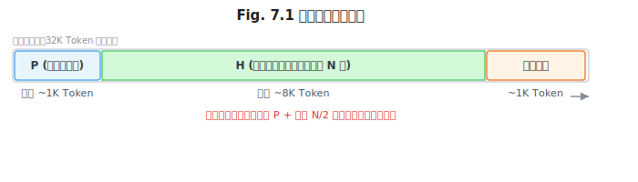
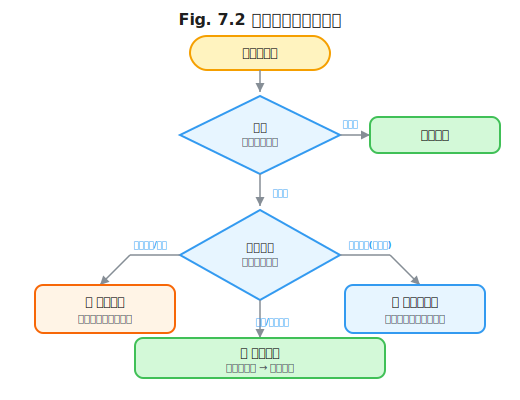

# 第 7 章 记忆系统

> **问题陈述**：第 5 章定义了上下文五元组 $C = \langle P, H, R, O, S \rangle$，第 6 章深入了检索分量 $R$。然而，$H$（对话历史）和 $S$（系统状态）这两个分量承载了 Agent 的**时间维度**——它们不是单次查询就能填充的，而是随着交互的累积逐步构建的持久化记忆。本章从短期记忆（对话状态管理）、长期记忆（用户与世界模型）、记忆冲突与遗忘三个层面，系统性地拆解 Agent 记忆系统的工程设计。

**本部分导读：** 第 5–6 章分别解决了上下文的结构定义和外部知识注入，第 7 章解决内部知识的时间持续性。短期记忆是 $H$ 分量的管理策略（如何截断、如何摘要），长期记忆是 $S$ 分量的扩展（事件流、结构化记忆、主动反思）。第 8 章将收尾 Part 2，讨论工具与函数作为上下文成员。

> **贯穿案例延续：** 本章将展示个人科研助手从无记忆（第 5 章初始状态）→ 滚动窗口短期记忆 → 摘要式压缩 → 结构化长期记忆的完整演进路径。到第 7 章结束时，助手已具备跨会话持久记忆和主动反思能力。

---

## 7.1 短期记忆：对话状态管理

短期记忆对应上下文五元组中的 $H$ 分量——它承载了当前会话内多轮交互的累积信息。短期记忆的管理核心是在"保留足够上下文"和"不溢出上下文窗口"之间寻找平衡。

### 7.1.1 滚动窗口

滚动窗口是最直接的短期记忆管理策略：保留最近的 $N$ 轮对话，丢弃更早的内容。

**截断策略与系统提示词保护。** 滚动窗口截断最容易犯的错误是将系统提示词 $P$ 与对话历史 $H$ 一起截断。$P$ 承载了角色的行为定义——一旦被截断，Agent 可能忘记自己的身份和约束。工程实现：在截断时始终保留 $P$ 在最前部（开头位置）——这是对第 2 章注意力首尾偏置（Primacy Effect）的直接工程应用（详见 2.1.2 节）。仅对 $H$ 做滚动。典型的窗口配置：$P$（固定占用 500–1,000 Token）+ $H$（滚动保留最近 8–16 轮对话，约 4K–8K Token）。$H$ 的轮数应根据任务复杂度动态调整——简单问答保留 8 轮，多步推理保留 16 轮以上。

**工具调用历史的可丢弃性。** Agent 的工具调用历史（如调用了什么函数、返回了什么结果）通常被写入 $H$ 中。但工具调用的详细日志（参数、返回结果）可能非常冗长。工程经验：工具调用的**结果**（工具返回了什么）应保留在 $H$ 中，但工具调用的**详情**（完整的 JSON 请求体、非关键的错误堆栈）可以丢弃或摘要。判断标准：如果当前的用户问题可以仅凭工具的最终结果回答，则工具调用的中间过程可以丢弃。

> 科研助手此处的记忆状态：滚动窗口保留最近 16 轮对话，$H$ 约 8K Token。系统提示词 $P$ 始终位于窗口最前部受保护区域。这是**无记忆 → 滚动窗口**的演进阶段。



> **工程原则 1（系统提示词保护原则）**：任何上下文截断策略都必须将 $P$ 置于受保护的"不裁剪区域"。$P$ 的丢失意味着系统行为定义丢失，无法通过增加 $H$ 的长度来弥补。

### 7.1.2 摘要式压缩

当滚动窗口不足以保留足够的历史信息时（如长达 50 轮以上的深度对话），需要将早期对话摘要化，释放上下文窗口空间。

**增量摘要触发时机。** 摘要的触发时机决定了系统响应延迟和摘要质量之间的平衡。两种策略：① **长度触发**——当上下文占用超过总窗口的 70% 时触发摘要，压缩 $H$ 中最早的部分；② **轮数触发**——每完成 $M$ 轮对话（如 $M=10$）后触发一次增量摘要。推荐策略：两者结合——阈值先到者触发。增量摘要的输入是"上一次摘要 + 上一次摘要之后的完整对话"，输出是一段新的摘要文本。这样确保每次摘要都基于最完整的上下文。

**定义 7.1（增量摘要）**：增量摘要函数 $f$ 将旧摘要 $S_{t-1}$ 和新对话 $D_t$ 合并为新的摘要 $S_t$：
$$S_t = f(S_{t-1}, D_t)$$
其中 $S_t$ 的 Token 数应近似守恒 $|S_t| \approx |S_{t-1}|$（以确保多次摘要后不会无限膨胀）。工程实现中，$f$ 通常是一个 LLM 调用，提示词为"基于之前的摘要和新的对话，生成一个更新后的摘要，不超过 500 Token"。

**摘要质量评估。** 自动评估摘要质量的方法：用原始对话+摘要分别运行 5 个典型查询，对比两种设置下的回答准确率。如果摘要后的准确率不低于原始准确率的 90%，则摘要质量可接受（即摘要保留了足够的信息）。质量低于此阈值时，应增加摘要 Token 预算或改进摘要 Prompt。

---

## 7.2 长期记忆：用户与世界模型

短期记忆随会话结束而丢失（除非写入长期记忆）。长期记忆是跨会话持久化的 $S$ 分量扩展，使 Agent 能够"记住"用户偏好、事件历史和学到的知识。

### 7.2.1 事件流（Event Log）

事件流是最简单的长期记忆形式：以追加写入（Append-only）的方式记录 Agent 与用户之间的所有重要事件。

**Append-only 写入与回放。** 事件流的核心设计原则是**不可变性**——事件一旦写入就不能修改或删除（仅通过"废止事件"来标记过时事件）。不可变性保证了审计追踪的完整性。回放机制：在 Agent 启动或用户开始新会话时，从事件流中读取最近 $K$ 个事件作为 $S$ 分量的上下文，让 Agent"知道"刚刚发生了什么。推荐的回放窗口：最近 10–20 个事件（约覆盖最近 1–3 小时的交互）。

```
事件流示例（科研助手案例）：
| 时间戳                     | 类型     | 内容摘要                                  |
|---------------------------|----------|------------------------------------------|
| 2026-06-20T09:15:00       | search   | 用户搜索了 "RLHF 最新进展"                 |
| 2026-06-20T09:20:00       | read     | 用户打开了 arXiv:2506.12345 论文          |
| 2026-06-21T14:00:00       | query    | 用户问 "帮我总结一下那篇 RLHF 论文"        |
```

**事件 Schema 演化。** 事件流在生产环境中会随着功能迭代扩展字段。工程建议：使用 Protobuf 或 Avro 作为事件序列化格式（而非 JSON），它们天然支持 Schema 演化——新增字段时旧事件仍然可读。JSON 事件可以通过在事件体中加入 `version` 字段来实现向前兼容。

> 科研助手增加了事件流后，跨会话上下文得以保持——用户昨天搜过的论文，今天再问时助手已经\"记得\"。这是**滚动窗口 → 摘要式压缩 → 事件流**的演进阶段。

### 7.2.2 结构化记忆

事件流提供了时间序列上的完整性，但在查询特定信息时效率低。结构化记忆将信息组织为更易于查询的形式。

**知识图谱式记忆。** 将 Agent 学到的实体和关系构建为知识图谱。示例：科研助手在多次对话后构建了一个关于"大语言模型"领域的知识子图——概念节点（RLHF、PPO、奖励模型）、论文节点（InstructGPT、Llama 2）和关系边（"提出"、"改进"、"对比"）。知识图谱的优势在于支持多跳推理——"RLHF 和 DPO 有什么关系？"可以从图中通过路径检索回答。

**定义 7.2（记忆图谱）**：记忆图谱 $G = (E, R, T)$ 是一个有向图，其中 $e \in E$ 为实体节点，$r \in R$ 为关系类型，$t \in T$ 为三元组 $(e_i, r, e_j)$ 表示"实体 $e_i$ 通过关系 $r$ 关联到实体 $e_j$"。三元组的时效由创建时间戳 $t_{\text{create}}$ 和重要性权重 $w$ 共同标注。

**槽位（Slot）式用户画像。** 对于用户偏好和属性信息，使用键值对（Slot）存储比知识图谱更高效。用户画像的典型槽位：

```
用户画像（科研助手）：
{
  "姓名": "张三",
  "研究方向": "自然语言处理 / 大语言模型",
  "偏好期刊": ["ACL", "NeurIPS", "ICML"],
  "偏好引用格式": "Author (Year)",
  "最近关注": "RLHF, 推理模型",
  "语言偏好": "中文为主, 原文引用保留英文"
}
```

槽位值可以通过**隐式学习**（从对话中自动提取，如"用户反复提到 RLHF"→更新"最近关注"）和**显式确认**（用户直接告知）两种方式更新。

> 结构化记忆建立后，助手可以回答"我最近关注什么"这类元问题——它不需要从事件流中回放，直接从用户画像槽位中读取。这是**事件流 → 结构化记忆**的演进阶段。

### 7.2.3 主动反思写入

事件流和槽位都是被动记录（Agent 等用户行动后才记录）。主动反思是 Agent 在空闲或触发条件下主动总结和结构化自己的记忆。

**反思触发条件。** 反思不应过于频繁，否则 Token 成本和系统延迟不可接受。三种推荐触发条件：① **关键事件触发**——用户完成了一个明显可标识的任务（如"查完了一个研究方向的文献"）；② **时间触发**——每 24 小时执行一次反思（适合跨会话场景）；③ **空闲触发**——系统负载低时执行后台反思。

**Generative Agents 的记忆评分模型。** Park et al. (2023) 在 Generative Agents 中提出了一种记忆评分模型：每条记忆被赋予一个综合得分 $S = w_i \times I + w_t \times T + w_r \times R$，其中 $I$ 为重要性（Importance，事件的显著性），$T$ 为时间衰减（Recency，越新的事件得分越高），$R$ 为相关性（Relevance，与当前任务的相关程度）。反思触发时，Agent 从记忆中检索得分最高的一组记忆，生成高层级反思（如"用户对 RLHF 领域的关注度在增加"），并将反思作为新记忆写回。这个"观察 → 反思 → 新记忆"的循环是第 16 章学习型循环的基础。

> **反方观点**：主动反思的工程开销经常被低估。每次反思消耗一次 LLM 调用，如果每 24 小时对 100 个活跃用户执行反思，每天增加 100 次额外 LLM 调用，对于成本敏感的系统是一个不可忽略的负担。替代方案：仅对高频用户（日活跃、周活跃）启用反思，低频用户依赖被动事件流即可。据工程经验观察，仅约 30% 的用户能从主动反思中获得可感知的体验提升。

---

## 7.3 记忆冲突与遗忘

长期记忆系统面临的核心挑战是：记住什么、忘记什么、以及当已有记忆与新信息冲突时怎么办。

### 7.3.1 时间衰减与重要性加权

记忆的时间衰减是"忘记"的自然机制。没有衰减的记忆系统最终会被噪声填满。衰减函数的选择至关重要：
- **线性衰减**：$w(t) = w_0 \times (1 - \alpha t)$，实现简单但过于刚性。
- **指数衰减**：$w(t) = w_0 \times e^{-\lambda t}$，更符合认知科学中的遗忘曲线 (Ebbinghaus, 1885)。$\lambda$ 控制衰减速度——对话历史的 $\lambda$ 应大于长期记忆的 $\lambda$（短期记忆忘得更快）。
- **访问强化**：每次记忆被检索时重置其衰减时钟，即"用过的记忆不会忘"。

工程实践：将时间和重要性结合，综合得分公式为：
$$S(m) = w_{\text{base}} + w_{\text{recency}} \times e^{-\lambda \Delta t} + w_{\text{frequency}} \times \log(N)$$

（对应的 Python 实现见 agent-engineering-code/part2-context/ch7-memory-system/incremental_summary.py 中的 `memory_score` 函数。）

其中 $w_{\text{base}}$ 为基础重要性，$\Delta t$ 为距上次访问的时间，$N$ 为被访问次数。

### 7.3.2 矛盾事实的合并策略

当新信息与已有记忆矛盾时（如用户先提到"我用 Python"，后来说"我主要写 Java"），系统需要决定信任哪一条。

三种合并策略：① **时间优先**——以最新的事件为准（适合用户偏好等易变信息）；② **置信度优先**——以置信度更高的来源为准（如显式确认 > 隐式推断）；③ **保留分歧**——记录两个矛盾事实，带上时间戳和置信度，在使用时让 Agent 自行判断（如"用户 2024 年说用 Python，2025 年改用了 Java"）。



### 7.3.3 用户主导的"被遗忘权"实现

用户应能够主动控制 Agent 记住什么、忘记什么。被遗忘权（Right to be Forgotten）不仅是伦理要求，也是 GDPR 等隐私法规的法律要求。

工程实现：提供三个层级的遗忘控制：
- **单条遗忘**：用户指定一条记忆删除（如"忘记我之前说过我用 Python"）。
- **时间段遗忘**：用户指定某个时间段内的所有记忆删除。
- **全量重置**：用户要求清空所有长期记忆，恢复出厂状态。

技术实现重点：删除操作需要同时删除结构化记忆、事件流记录和摘要缓存中的数据。由于事件流是 Append-only，删除实际上是在删除索引表中标记该条目为"已删除"（而非从存储中物理删除，以保持审计完整性）。

---

## 附：记忆系统评估指标表

| 指标名称 | 定义 | 度量方法 |
|---------|------|---------|
| 记忆召回率 | Agent 在回答中正确使用了历史记忆的比例 | 在测试集中检查 $N$ 个需要记忆的问答中记忆被正确使用的比例 |
| 摘要保留率 | 摘要后回答准确率不低于原始对话的比例 | 用摘要前和摘要后分别回答 $N$ 个问题，对比准确率 |
| 记忆冲突率 | 长期记忆中出现矛盾事实的比例 | 扫描记忆库中同一主体的冲突三元组数量 |
| 遗忘有效性 | 被标记为删除的记忆不会被检索到的比例 | 测试已遗忘记忆在后续检索中的出现次数 |
| 反思成本 | 每次反思消耗的平均 Token 数 | 记录反思 LLM 调用的输入和输出 Token 总数 |

---

## 开放问题

1. **记忆的序列化与反序列化。** 当 Agent 在一台计算设备上运行，记忆存在本地；如果 Agent 需要在云端和边缘设备之间迁移（或用户更换设备），记忆如何序列化/反序列化？记忆格式的标准化（类似 MCP 的记忆协议）是否必要？

2. **记忆的隐私与效用权衡。** 更多的记忆意味着更好的个性化，但也意味着更多的隐私风险。是否存在一个"隐私-效用帕累托前沿"，使系统在不存储原始对话的情况下仍能提供可接受的个性化体验？

3. **多 Agent 共享记忆。** 如果用户与多个 Agent 交互（如科研助手和代码助手），它们应该共享同一个长期记忆库还是各自独立？共享的好处是一致性，风险是 Agent 擅长的领域不同可能产生"记忆污染"。

4. **遗忘的可逆性。** 如果用户要求"被遗忘"但后来改变主意，技术上是否可以恢复？Append-only 事件流在被遗忘标记后，恢复是否意味着仅取消标记即可？

---

## 练习

### 思考题

1. 假设你的 Agent 连续工作了 24 小时，累积了 300 轮对话。使用 7.1 节的两种策略（滚动窗口 + 增量摘要），你会如何设计截断参数使 $H$ 始终保持在 10K Token 以内？画出你的配置决策树。

2. Generative Agents 的记忆评分模型使用了重要性、时间衰减和相关性三个权重。在科研助手这个场景中，三大方向的权重应该如何分配？例如，对于用户刚刚读了一篇论文这个事件，三个维度的分值各是多少？

3. 当用户先问"帮我查 Python 的 async/await 用法"，10 分钟后又问"Python 的协程和 Go 的 goroutine 有什么区别"——是否应该将这两次提问合并为一个记忆条目（"用户在学习并发编程"）？合并的触发条件和收益分别是什么？

### 动手题

1. 为你的一个 LLM 应用实现增量摘要函数 $f(S_{t-1}, D_t)$（定义 7.1），要求在 $S_t$ 的长度不超过 $S_{t-1}$ 长度 120% 的前提下，验证 5 个测试问题的回答准确率不低于原始对话的 90%。验收标准：输出原始对话 vs 摘要后回答的准确率对比表。

2. 实现一个简单的记忆评分模型，为给定的一组记忆（事件流中的 10–20 个事件）计算综合得分，并按从高到低排序。验收标准：输出排序后的记忆列表，标注每个事件的 $w_{\text{base}}$、$\Delta t$、$N$ 和最终得分。

3. 设计并实现一个"单条遗忘"功能：用户可以指定一条记忆内容，系统将其从结构化记忆和事件流中标记为已删除，并在后续检索中不可见。验收标准：在删除前和删除后分别检索该记忆，验证删除后检索结果为空。

---

## 参考文献

- Ebbinghaus, H. (1885). *Über das Gedächtnis: Untersuchungen zur experimentellen Psychologie*. Duncker & Humblot.
- Park, J. S., O'Brien, J. C., et al. (2023). Generative Agents: Interactive Simulacra of Human Behavior. *UIST 2023*.

> **本书叙述方向**：本章从短期记忆、长期记忆到记忆冲突与遗忘，完整覆盖了 Agent 记忆系统的工程设计。下一章将收尾 Part 2——第 8 章"工具与函数作为上下文"将讨论上下文五元组中的 $O$（工具输出）分量，揭示工具描述为何本质上是另一种形式的 Prompt，以及工具结果如何参与上下文组装。
