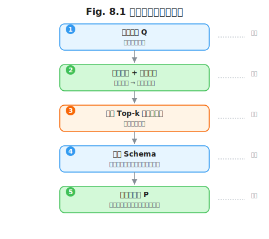

# 第 8 章 工具与函数作为上下文

> **问题陈述**：第 5 章的上下文五元组中， $O$（工具输出）是继 $R$（检索结果）之后第二个需要被深度管理的上下文分量。工具调用不仅是 Agent 执行动作的通道，工具描述本身就是一种特殊形式的 Prompt——它指导模型如何理解、选择和使用工具。本章从工具描述的设计原则和工具结果的上下文管理两个维度，揭示 $O$ 分量的工程内涵。

**第二部分结束语：** 本章是上下文工程（Part 2）的收尾章。前四章分别解决了上下文的结构定义（第 5 章）、外部知识注入（第 6 章）、内部记忆持久化（第 7 章）和工具交互的上下文管理（第 8 章）。至此，Window 层的完整图景浮现：上下文不是"更长的提示词"，而是一个由 $P$、 $H$、 $R$、 $O$、 $S$ 五个不同生命周期分量动态组装的工程对象。在第 9 章开始的驾驭工程（Harness Engineering）中，我们将看到这些窗口内容如何被运行时环境（Runtime）封装和执行。

> **贯穿案例延续：** 科研助手在第 6 章检索了论文，在第 7 章记住了用户的偏好。现在它准备调用工具执行具体的操作——搜索论文数据库、读取 PDF 摘要、生成引用列表。工具调用结果 $O$ 将被写回 $H$，并最终影响 $S$ 中的用户画像更新。

---

## 8.1 工具描述也是 Prompt

工具描述（Function Description）是 Agent 与外部世界交互的接口。一个设计糟糕的工具描述会导致模型选错工具、填错参数、用错返回结果——这些本质上不是"模型的问题"，而是"输入的质量问题"。

### 8.1.1 函数签名设计原则

工具函数签名是模型理解工具的核心入口。与 API 文档面向人类不同，工具签名面向的是一个统计语言模型——它没有"常识"来判断参数的隐含语义。

**参数命名的自描述性。** 参数名是模型理解参数含义的第一线索。一个自描述的参数名应满足：即使没有 `description` 字段，仅凭参数名也能推断出它的用途。

```
// 反例：不具自描述性的参数名
"parameters": {
  "q": {"type": "string"},
  "n": {"type": "integer"},
  "lang": {"type": "string"}
}

// 正例：自描述性参数名
"parameters": {
  "search_query": {"type": "string", "description": "用户的搜索关键词"},
  "max_results": {"type": "integer", "description": "最大返回结果数（1-50）"},
  "language": {"type": "string", "enum": ["zh", "en"], "description": "返回结果的语言"}
}
```

经验法则：参数名建议使用 `snake_case` 全拼（而非缩写），长度在 2-4 个英语单词之间。过短的参数名（如 `q`）依赖 `description` 才能被理解，过长的参数名（如 `user_search_query_for_paper_database`）消耗 Token 且不会显著提升准确率。

**描述长度与调用准确率的关系。** 每个参数的 `description` 字段存在一个"甜点长度"：过短（< 10 Token）不足以消除歧义，过长（> 100 Token）会被模型忽视。实验经验：参数描述的理想长度为 15-50 Token，工具函数本身的描述理想长度为 30-80 Token。在参数描述中加入**典型值示例**（如"请用英文关键词搜索"）比纯抽象描述（如"关键词，字符串类型"）的调用准确率高 10-15%。

```
// 正例：包含典型值示例的参数描述
"search_query": {
  "type": "string",
  "description": "搜索关键词。例如：'transformer attention mechanism' 或 'RLHF 最新进展'"
}
```

**枚举型参数 vs 自由字符串。** 当参数值来自一个固定集合时，使用 `enum` 类型而非自由字符串。枚举不仅能约束模型的输出空间，还能消除"近似但不同的表述"导致的解析失败。例如，与其让模型写 `"recent"` 或 `"latest"` 或 `"new"` 这三个同义词中的任意一个，不如定义 `"sort_order": {"type": "string", "enum": ["recent", "relevance", "citations"]}`。枚举的副作用是增加了 Token 消耗（每个枚举值在 tool schema 中占约 5-10 Token），但对于调用准确率的提升，这个代价通常是值得的。

> **反方观点**：部分框架（如 LangChain 的 Tool 抽象）允许工具参数使用 Python 类型注解而非 JSON Schema，由框架自动生成描述。这种做法的优点是开发效率高，但自动生成的描述往往缺乏典型值示例和边界条件说明，导致模型调用准确率低于手工优化过的工具签名。建议：开发阶段使用自动生成，生产阶段手动优化 Top-10 高频工具的签名。

### 8.1.2 工具数量爆炸

Agent 可用的工具数量从个位数增长到数百个时，"找到正确的工具"本身变成了一个检索问题。

**工具检索式选择（RAG over Tools）。** 当工具数量超过 20-30 个时，将所有工具的 Schema 一次性注入系统提示词 $P$ 的 Token 成本变得不可接受（假设每个工具 Schema 平均 500 Token，30 个工具就是 15K Token）。解决方案：使用 RAG 从工具库中检索当前查询相关的 Top- $k$ 个工具，仅将这 $k$ 个工具的 Schema 注入 $P$。工具检索的核心是**工具描述的嵌入向量**——每个工具的描述文本（功能描述 + 参数摘要）被嵌入到向量空间中，用户查询经过语义匹配找到最相关的工具。Schick et al. (2023) 在 Toolformer 中首次系统性地展示了 LLM 通过少量示例自主学习使用工具的能力，为工具检索式选择提供了基础范式。

**定义 8.1（工具检索的匹配开销）**：给定工具库 $\mathcal{T} = \{t_1, t_2, \ldots, t_n\}$，用户查询 $Q$，和上下文窗口预算 $B$（Token 上限），工具检索选择函数 $S(Q, \mathcal{T}, B)$ 的任务是从 $\mathcal{T}$ 中选出子集 $\mathcal{T}' \subseteq \mathcal{T}$，使得 $\text{TokenCost}(\mathcal{T}') \leq B$ 且 $\mathbb{E}[\text{Acc}(Q, \mathcal{T}')]$ 最大化。工程经验中， $k = \lfloor B / \bar{c} \rfloor$，其中 $\bar{c}$ 为工具 Schema 的平均 Token 数。



**工具分组与命名空间。** 除了检索，第二种管理工具数量的方法是分层组织。将工具按领域划分为命名空间（如"论文检索"、"代码执行"、"数据库查询"），在每个命名空间下定义通用的 `execute` 接口和具体的操作参数。这种设计允许 $P$ 中只注入命名空间的描述（几十 Token），而不是所有具体工具的 Schema（数千 Token）。代价是模型需要额外的推理步骤来"导航"命名空间——它必须先生成一个"去哪个命名空间执行什么操作"，再生成具体的参数。这种"两步走"的延迟通常在 100-300ms 之间，对于非实时系统是可接受的。

> **工程原则 1（工具最少化原则）**：在任何时刻，系统提示词 $P$ 中只应包含当前查询最可能用到的 $k$ 个工具（$k$ 通常为 5-15 个）。额外的工具应通过检索或命名空间导航在运行时动态加载。

---

## 8.2 工具结果的上下文化

工具调用完成后，结果 $O$ 被写回上下文。未经处理的原生工具结果——可能是数万 Token 的 JSON 响应、二进制文件内容或错误堆栈——直接写入 $O$ 会污染上下文并稀释注意力。

### 8.2.1 结果裁剪与摘要

工具结果在写回 $O$ 之前应经过裁剪和摘要。

裁剪策略：① **字段白名单**——只保留工具返回结果中对后续生成有实际贡献的字段（如搜索结果只保留标题 + 摘要 + 链接，丢弃元数据）；② **长度截断**——对长文本字段（如论文摘要）截断到 200-500 Token；③ **去重**——多次调用同一工具的结果，如果内容高度重叠，只保留最新版本。

摘要策略：对于需要保留完整信息但 Token 消耗过大的结果（如检索返回了 50 条结果），先用 LLM 对结果做摘要（"将这些结果浓缩为 5 个要点"），再将摘要注入 $O$。在需要精确引用时（如学术写作），保留原始结果的引用标记，仅对正文部分做摘要。

**Part 2 五元组串联示例：** 科研助手接收用户请求后，Harness 的五元组上下文组装流程演示了 $O$ 如何与其余四个分量互动。 $P$（角色定义："你是科研助手"）在会话开始时固定； $H$（对话历史）包含了用户之前问过的研究方向； $R$（检索结果）携带了第 6 章 RAG 系统返回的 3 篇最新论文； $S$（系统状态）记录了用户偏好——论文摘要保留英文原文。当助手调用 `search_paper` 工具检索更多文献时，工具返回的 $O$ 被裁剪为 Top-5 结果注入上下文；同时 $O$ 中的一篇论文标题匹配了 $H$ 中用户关注过的"RLHF"方向，助手据此调整了推荐优先级。此例展示了 $P$（角色定义）、 $H$（历史偏好）、 $R$（外部检索）、 $O$（工具结果）和 $S$（系统状态）如何在一次请求中同时作用——五元组不是静态的字段集合，而是动态交叉影响的联合体。

```
个人科研助手案例（工具结果裁剪）：
原始工具返回（arXiv API 搜索结果，约 3,200 Token）：
  - 20 篇论文的完整元数据（标题、作者、摘要、分类、日期、DOI...）
裁剪后 $O$（约 800 Token）：
  - Top-5 论文的 {标题 + 第一作者 + 摘要前 200 字 + arXiv ID}
  - 其余 15 篇仅保留标题和 arXiv ID，用"可展开"标记标注
```

### 8.2.2 错误信息的写回策略

工具调用失败时产生的错误信息（如 API 超时、权限不足、参数不合法）也需要被管理。

三种错误处理策略及其对 $O$ 的影响：
- **透明策略（Transparent）**：将原始错误信息完整写回 $O$，让模型自行判断错误原因并决定重试或降级。优点是灵活性高，缺点是冗长的错误信息可能污染上下文。
- **分类策略（Classified）**：将错误分类（临时性/永久性）并写回分类结果而非原始错误文本。Harness 层（第 10 章）的重试逻辑决定后续动作。优点是 $O$ 保持简洁，缺点是模型无法做出异常判断。
- **静默策略（Silent）**：完全不写回错误信息。由 Harness 层处理重试和降级，仅在最终失败时通知模型。优点是上下文最干净，缺点是模型对系统状态完全无感知。

工程建议：对**临时性错误**（网络超时、限流）使用**静默策略**（不写回，由 Harness 自动重试）；临时性错误重试耗尽后改为**分类策略**（写回分类结果 "search_paper 工具因认证失败无法执行"）；对**永久性错误**（参数错误、权限不足）使用**透明策略**（写回原始错误信息，帮助模型理解并调整后续行为）。

> **工程原则 2（错误信息渐进策略）**：工具调用的错误信息写回策略应随着异常严重程度的增加而增加透明度——临时错误不写回，重试失败写回摘要，永久错误写回全量信息。

### 8.2.3 二进制 / 大文件的引用式回传

Agent 系统有时需要处理大文件（图像、PDF、zip 包）——这些二进制内容不能直接放入上下文窗口。

策略：将大文件存储在外部系统（对象存储、文件系统）中，在 $O$ 中只写入文件引用（路径或 URL）。模型可以在需要时通过专门的工具（如 `read_file`、`load_image`）按需读取文件内容。

引用式回传的核心是统一引用格式：
```json
{
  "file_reference": {
    "path": "/data/papers/paper_12345.pdf",
    "type": "application/pdf",
    "size_bytes": 2048576,
    "page_count": 12,
    "summary": "本文提出了一种新的 RLHF 训练方法...",
    "citation_key": "paper_12345"
  }
}
```

模型在生成答案时可以使用 `citation_key` 引用该文件（如"如论文 [paper_12345] 所述"），而无需文件内容占据上下文窗口。Harness 层（第 10 章）负责在文件引用被使用时将文件内容按需加载。

---

## 附：工具上下文评估指标表

| 指标名称 | 定义 | 度量方法 |
|---------|------|---------|
| 工具调用准确率 | 模型选择正确工具和参数的比例 | 在 Golden Set 中验证 $N$ 次调用的工具名称 + 参数匹配度 |
| $O$ 压缩率 | 裁剪/摘要后 $O$ 的 Token 数占原始返回结果的比例 | $\text{TokenAfter} / \text{TokenBefore}$（越低越好） |
| 工具检索命中率 | 检索式工具选择中正确工具出现在 Top- $k$ 的比例 | $\lvert\text{正确工具} \cap \text{Top-}k\rvert / 1$ |
| 错误信息占比 | $O$ 中错误信息 Token 数占总 $O$ Token 数的比例 | $\text{TokenError} / \text{TokenO}$ |
| 文件引用有效性 | 引用式回传的文件在需用时能被正常加载的比例 | 对 $N$ 个文件引用执行加载操作，统计成功率 |

---

## 开放问题

1. **工具描述的版本同步。** 工具 API 更新后，工具描述 Schema 如何与代码同步？如果 Schema 陈旧，模型可能调用已弃用的工具或使用错误的参数。是否需要一个类似 OpenAPI/Swagger 的标准来管理工具 Schema 版本？

2. **多模型工具兼容性。** 不同模型提供商对工具 Schema 的格式要求不同（OpenAI 的 `functions`、Anthropic 的 `tools`、Google 的 `function_declarations`）。能否定义一个统一的"工具描述中间表示"，自动翻译为目标模型的格式？

3. **工具结果的因果链。** 当 Agent 连续调用多个工具时（如先搜索论文、再读取 PDF、再生成摘要），前一个工具的 $O$ 直接影响后一个工具的参数选择。这种"工具结果的因果链"如何建模和调试？是否需要类似函数式编程的 Monad 抽象？

4. **工具数量的物理上限。** 当工具数量超过 100、1,000 时，检索式工具选择的准确率必然下降。工具数量的物理上限在哪里？是受限于嵌入模型的语义区分度，还是受限于模型的工具选择能力？

---

## 练习

### 思考题

1. 假设你有一个搜索论文的工具和一个搜索代码的工具，它们的参数签名几乎相同（只有 `search_query` 和 `max_results`）。如果不仔细写工具描述，模型会如何选择？你会如何修改描述以帮助模型区分？

2. 当你给 Agent 提供 30 个工具时，将所有工具 Schema 注入 $P$ 需要约 15K Token。使用工具检索式选择后， $P$ 降至 5K Token，但工具检索选择了错误的工具（命中率 85%）。你会接受这个 15% 的错误率吗？如果不会，你如何优化？

3. 工具调用返回一个包含 50 条论文结果、总计 8K Token 的 JSON。你会如何设计裁剪策略（保留哪些字段、截断多长）？给出一个具体的裁剪后数据结构示例，并估算裁剪后的 Token 数。

### 动手题

1. 为一个已有的 API 设计工具函数签名（OpenAI 格式，含 `parameters` 和 `description`）。验收标准：签名应包含至少 3 个参数，每个参数有自描述性的参数名和包含典型值示例的描述。

2. 实现一个工具检索式选择函数：给定工具库（至少 15 个工具）和用户查询，返回 Top-5 最相关的工具。验收标准：使用嵌入模型（如 `text-embedding-3-small`）计算查询与工具描述的余弦相似度，输出 Top-5 工具名称 + 相似度分值表。

3. 为一个搜索工具的结果实现裁剪函数：原始结果是一个包含 20 条论文摘要的 JSON（总计约 3,200 Token），将其裁剪到不超过 800 Token。验收标准：裁剪后的输出至少包含 Top-5 论文的标题、第一作者和摘要前 200 字，且满足 Token 上限。

---

## 参考文献

- Schick, T., Dwivedi-Yu, J., Dessì, R., et al. (2023). Toolformer: Language Models Can Teach Themselves to Use Tools. *NeurIPS 2023*.

> **本书叙述方向**：本章是上下文工程（Part 2）的收官之作。至此，我们完成了四层洋葱图第二层（Window 层）的完整叙述——从上下文五元组（第 5 章）到 RAG（第 6 章）到记忆系统（第 7 章）到工具上下文（第 8 章）。下一章将进入第三层——第 9 章"什么是 Harness"将定义驾驭工程的核心概念，揭示 Harness 作为"Agent 的宿主操作系统"的角色。
