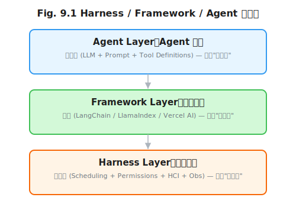
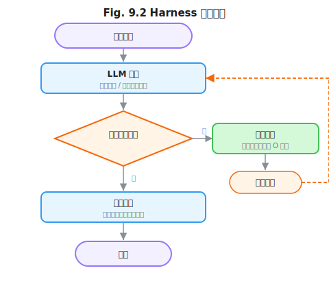

# 第 9 章 什么是 Harness

> **问题陈述**：前八章分别从 Token 层（Prompt Engineering）和 Window 层（Context Engineering）讨论了提示词的设计、上下文的管理以及记忆与工具的集成。然而，所有这些能力都需要一个运行时环境来承载——这个环境让 LLM 能够执行代码、调用工具、接收反馈、持久化状态。驾驭工程（Harness Engineering）就是这个运行时环境的设计与实现方法论。本章定义 Harness 的概念边界与核心职责，并给出一个最小 Harness 的骨架，作为后续三章的能力生长点。

**第三部分导读：** 第 9–12 章构成驾驭工程（Harness Engineering）的完整体系。第 9 章定义 Harness 的概念边界和核心职责，并给出一个 200 行最小 Harness 作为代码骨架。第 10 章在此基础上生长工具系统（权限、沙箱、子 Agent 调度），第 11 章增加人机交互层，第 12 章构建可观测性。如果你主要关注 Agent 的运行时架构，这三章是必读；如果你关心 Agent 的安全与可控性，第 10 章的权限模型和第 12 章的可观测性不可跳过。

> **跳读代价**：如果跳过本章，你将在构建 Agent 时混淆"框架"和"运行时"的角色——Framework 是库，Harness 是宿主操作系统。不理解这个区别，你会在选择技术栈时做出错误的架构决策。

---

## 9.1 Harness 的定义与边界

Harness 是一个在 Agent 社区中常被误用或混淆的概念。它与 Framework（框架）和 Agent（智能体）在系统架构中扮演完全不同且互补的角色。

### 9.1.1 Harness vs Framework vs Agent

**Framework 是库，Harness 是运行时。** Framework（如 LangChain、LlamaIndex）提供的是**编程接口**——一组封装了常见 LLM 调用模式的类库和工具函数。开发者使用 Framework 来构建 Agent，就像使用 React 来构建 Web 应用。Harness 则提供的是**运行时环境**——它负责管理 Agent 的进程生命周期、工具执行、权限控制、人机交互和可观测性。同一个 Harness 可以运行不同 Framework 构建的 Agent，同一个 Framework 构建的 Agent 也可以部署到不同的 Harness 上。

**定义 9.1（Harness vs Framework vs Agent）**：三者构成一个三层栈：
- **Agent（智能体）**：由 LLM + Prompt + 工具定义构成的行为逻辑，解决"做什么"的问题。
- **Framework（框架）**：构建 Agent 的开发工具库，解决"怎么写"的问题。
- **Harness（驾驭器）**：运行 Agent 的运行时环境，解决"怎么跑"的问题。



**Harness 是 Agent 的"宿主操作系统"。** 这个类比值得深究：操作系统为应用程序提供进程调度、内存管理、文件系统和设备驱动；Harness 为 Agent 提供 LLM 调用调度、上下文窗口管理（$P$ / $H$ / $R$ / $O$ / $S$ 五元组的运行时组装）、工具权限控制和可观测性通道。没有操作系统，程序无法运行；没有 Harness，Agent 只是一个 LLM 调用脚本。

> **反方观点**：部分 Agent 框架（如 AutoGPT、BabyAGI）将 Harness 的功能内建于 Framework 中，声称"框架即运行时"（详见对应项目的架构文档）。这种方案在原型阶段效率很高（开发者无需额外部署一个 Harness），但在生产环境中面临扩展性瓶颈——当需要精细的权限控制、多租户隔离或企业级可观测性时，内置的运行时代理无法独立演进。工程建议：原型阶段可容忍耦合，生产阶段必须分离。

**三者的接口划分。** 接口划分的关键原则是：**Agent 不知道它运行在哪个 Harness 上，Harness 不关心 Agent 使用了什么 Framework。** Agent 通过标准化的工具接口（Tool API）与 Harness 通信，Harness 通过标准化的生命周期回调（on_start / on_step / on_error / on_end）与 Agent 集成。

```
Listing 9.1  Agent / Harness 接口规范（概念）

# Agent 侧 —— 定义工具和行为
class Agent:
    tools: list[Tool]
    system_prompt: str
    def run(self, task: str) -> Result: ...

# Harness 侧 —— 运行 Agent
class Harness:
    def register_agent(self, agent: Agent): ...
    def execute(self, task: str) -> Result: ...
    # 生命周期回调（由 Agent 实现）
    callbacks = {
        "on_start": lambda: ...,
        "on_step": lambda step: ...,
        "on_error": lambda e: ...,
        "on_end": lambda r: ...,
    }
```

### 9.1.2 经典 Harness 解剖

分析四个有代表性的 Harness 实现，帮助建立 Harness 的设计空间直觉。

**Claude Code 的工具集与权限模型。** Claude Code 是 Anthropic 推出的编码 Agent，其 Harness 设计最具参考价值的是**权限模型**：Claude Code 将操作分为读（read）、写（write）、执行（execute）三个权限级别，每个工具属于一个级别，用户可以通过 `--permission` 参数控制级别。例如，`Read` 级别允许文件读取和搜索，`Write` 级别允许文件修改，`Execute` 级别允许运行 shell 命令。这种渐进式权限模型让用户可以根据信任程度逐步开放 Agent 的能力。

**Cursor 的编辑器集成路径。** Cursor 将 Harness 植入 IDE 中——它不是独立的运行时，而是 VSCode 的一个插件进程。这意味着 Cursor 的 Harness 可以利用编辑器的原生能力（文件系统访问、Diff 展示、终端集成）而不需要自己实现这些基础设施。Cursor 的 Harness 核心是一个 LLM 调用循环，每次循环中：观察编辑器状态 → 决定一个操作 → 执行操作（修改文件、打开终端等）→ 观察结果 → 继续。这种"嵌入式 Harness"的设计模式适用于已有编辑器基础设施的场景。

**Devin / OpenHands 的容器化思路。** Devin 和 OpenHands 将整个 Harness 封装在容器中，为每个 Agent 分配独立的沙箱环境。容器化 Harness 的核心优势是隔离性——Agent 可以在容器中任意执行代码、安装依赖、修改文件，而不会影响宿主系统。代价是资源开销（每个容器约 200–500MB 内存）和启动延迟（容器冷启动约 2–5 秒）。OpenHands 进一步实现了"暂停-恢复"机制，允许容器长时间闲置后自动休眠并在需要时恢复。

**Aider 的最小化哲学。** Aider 的 Harness 极简——它基本上就是一个 LLM 调用循环 + Git 操作。Aider 不提供独立的工具系统或权限模型，而是让 LLM 直接通过 Bash 和文件系统操作来工作。Aider 的最小化哲学证明了：当 Harness 足够简单时，大部分复杂的工具管理和权限控制可以委托给操作系统本身（文件权限、Git 历史）。

---

## 9.2 Harness 的核心职责

无论 Harness 的具体实现如何，所有 Harness 都承担四个核心职责。

### 9.2.1 调度

调度是 Harness 最核心的职责——它决定 LLM 调用何时发生、如何发生、何时停止。

**同步 vs 异步循环。** 同步循环是"请求-响应"模式：LLM 输出一个回复，Harness 检查是否包含工具调用，如果有则执行工具，将结果写回上下文，再次调用 LLM。这种 "Thought → Action → Observation" 的循环（ReAct 范式，详见第 13 章）是大多数 Harness 的默认模式。异步循环则允许 LLM 调用与工具执行重叠——当 LLM 在处理当前步骤时，Harness 可以预取下一步可能需要的数据。异步 Harness 的延迟更低，但实现复杂度显著增加（需要处理竞态条件和状态同步）。

**中断与续跑。** 长时间运行的 Agent 任务（如"审查整个代码库并提交 PR"）可能超过用户可接受的等待时间。Harness 应支持**中断**（用户可以在任意时刻暂停任务，查看中间结果）和**续跑**（从中断点恢复执行，不丢失已完成的工作）。续跑的工程挑战在于：恢复时需要重建上下文状态——当前步骤的中间结果、工具调用的部分输出、以及用户的中断指令都需要被正确地写入 $H$ 分量。



### 9.2.2 权限

权限控制决定了 Agent "能做什么和不能做什么"。

权限模型的最小设计应包括：①**功能级权限**——是否允许执行代码 / 访问网络 / 修改文件；②**资源级权限**——允许访问哪些路径（如 `/home/user/projects/` 允许，`/etc/` 禁止）；③**操作级权限**——读 / 写 / 执行 的分离控制。权限的配置形式可以是启动参数（如 Claude Code 的 `--permission`），也可以是策略文件（如 `harness.policy.yaml`）。

Harness 权限设计与第 10 章的沙箱方案紧密关联：权限定义了"能不能做"，沙箱定义了"做了以后如何隔离影响"。

### 9.2.3 可观测性

可观测性是 Harness 区别于简单"LLM 调用脚本"的标志。第 12 章将深入技术实现，本章给出概念框架。

Harness 应暴露三类可观测性数据：①**Trace**——每一次 LLM 调用、工具执行、状态变更的完整链路；②**Token 账本**——每个步骤的输入/输出 Token 消耗，用于成本归因和预算控制；③**事件日志**——Agent 的决策日志（"为什么选择了这个工具"、"为什么重试了这个调用"），用于调试和审计。

> **工程原则 1（Harness 可观测性原则）**：Agent 在 Harness 上运行时产生的每一次操作——LLM 调用、工具执行、状态变更——都应有对应的 Trace 记录。没有可观测性的 Harness 是一个黑盒，无法用于生产环境。

### 9.2.4 人机协作

Harness 是人机交互的最后一层——它决定了用户如何与 Agent 交互。

三种交互模式已在第 11 章详细展开，本章给出概要：①**计划模式（Plan Mode）**——Agent 输出执行计划，用户批准后执行；②**审批模式（Approval Mode）**——每个工具调用前请求用户确认；③**自动模式（Auto Mode）**——Agent 自由执行，仅在错误时回退到审批模式。Harness 的人机协作设计直接影响用户对 Agent 的信任度——一个只提供 Auto 模式的 Harness 会让用户感到失控。

---

## 附：最小 Harness 核心循环

以下是本书 Listing 9.2 的最小 Harness 核心骨架。完整可运行版本见代码仓：

agent-engineering-code/part3-harness/mini-harness/harness.py

```python
# Listing 9.2  最小 Harness 核心循环
# 完整代码见 agent-engineering-code/part3-harness/mini-harness/harness.py
import json
from typing import Callable

class Tool:
    """工具定义"""
    def __init__(self, name: str, fn: Callable, schema: dict):
        self.name = name
        self.fn = fn
        self.schema = schema

class Harness:
    """最小 Harness 核心循环

    接收外部传入的 OpenAI 客户端和模型名，
    不负责 env 读取——调用者需事先配置环境变量。
    """
    def __init__(self, client, model: str):
        self.client = client
        self.model = model
        self.tools: list[Tool] = []
        self.history: list[dict] = []
        self.system_prompt = ""
        self.max_steps = 20
        self.on_step = None            # 生命周期回调

    def register_tool(self, tool: Tool):
        self.tools.append(tool)

    def run(self, user_input: str) -> str:
        self.history.append({"role": "user", "content": user_input})
        step = 0
        while step < self.max_steps:
            step += 1
            response = self.client.chat.completions.create(
                model=self.model,
                messages=[{"role": "system", "content": self.system_prompt}]
                         + self.history,
                tools=[t.schema for t in self.tools],
            )
            msg = response.choices[0].message
            self.history.append(msg)
            if self.on_step:
                self.on_step(step, msg)
            if msg.tool_calls:
                for tc in msg.tool_calls:
                    tool = self._find_tool(tc.function.name)
                    if tool:
                        args = json.loads(tc.function.arguments)
                        result = tool.fn(**args)
                        self.history.append({
                            "role": "tool",
                            "tool_call_id": tc.id,
                            "content": str(result),
                        })
            else:
                return msg.content
        return "达到最大步数，任务未完成"

    def _find_tool(self, name: str) -> Tool | None:
        for t in self.tools:
            if t.name == name:
                return t
        return None
```

---

## 附：Harness 评估指标表

| 指标名称 | 定义 | 度量方法 |
|---------|------|---------|
| 单步延迟 | 一次 LLM 调用 + 工具执行的全链路时间 | 从 LLM 请求发出到工具结果写回的耗时（不含用户等待） |
| 最大连续步数 | Harness 在终止前允许的最大循环次数 | 配置参数 $N_{\max}$ |
| 调度中断成功率 | 用户中断后成功恢复的比例 | 在 $N$ 次中断测试中成功续跑的比例 |
| 工具调用响应率 | Harness 对 Agent 工具调用请求的响应比例 | Agent 发起的工具调用中成功执行的占比 |
| 可观测事件覆盖率 | 关键操作被 Trace 记录的比例 | 已记录的 Trace 事件数 / 应记录的关键操作数 |

---

## 开放问题

1. **Harness 的标准化。** 是否存在一个通用的 Harness API 标准，使任何 Framework 构建的 Agent 都能运行在任何 Harness 上？类似 Web 应用的 WSGI/ASGI 标准。

2. **Harness 与操作系统的边界。** 当 Harness 运行在容器中时，Harness 的权限模型和容器的权限模型在语义上重叠——两者都在控制"能做什么"。两者的职责边界在哪里？

3. **最小 Harness 到底可以有多小？** Aider 的 Harness 证明了 200 行级别的 Harness 可以工作。但 50 行行不行？10 行行不行？最小化 Harness 的极限取决于哪些功能是"不可归约"的。

4. **Framework 吞噬 Harness 的趋势。** 越来越多的 Framework（如 Vercel AI SDK、LangGraph）开始内置运行时功能。当 Framework 完全内置了 Harness 后，三層栈是否应该简化为两层？

---

## 练习

### 思考题

1. 选择一个你熟悉的 Agent 系统（如 Claude Code、OpenHands、Cursor），用 9.1 节的三层栈框架分析它的架构：哪部分是 Agent、哪部分是 Framework、哪部分是 Harness？这三层在你的系统中是清晰分离的还是耦合的？

2. Harness 的四个核心职责（调度、权限、可观测性、人机协作）中，你认为哪个对于**个人开发者**的本地 Agent 最重要？对于**企业级生产系统**呢？给出你的优先级排序并说明理由。

3. 如果 Framework 最终吞噬了 Harness（两者合并为一层），那开发者还需要学习"Harness 设计"吗？还是说 Harness 的职责会全部被云服务商（如 AWS Bedrock、Google Vertex AI）接管？

### 动手题

1. 基于 Listing 9.2 的最小 Harness 骨架，添加一个 `before_tool_call` 回调（在工具执行前触发），实现一个"审批模式"——每次工具调用前打印工具名称和参数，等待用户输入 y/n 确认。验收标准：在运行一个使用两个工具的 Agent 时，两个工具调用都会触发审批提示。

2. 修改最小 Harness，增加"中断与续跑"能力：添加一个 `interrupt()` 方法和一个 `resume()` 方法，使 Agent 在执行过程中可以被暂停并在之后恢复。验收标准：Agent 执行到第 3 步时被中断，调用 `resume()` 后从第 3 步继续（不重复已执行的步骤）。

3. 为最小 Harness 添加一个简易的可观测性模块：记录每次 LLM 调用和工具执行的 Trace（LLM 请求时间、响应时间、Token 数、工具名称、工具执行时间）。验收标准：Agent 运行完毕后输出一份 Trace 列表（CSV 格式或 Markdown 表格），包含至少 3 条记录。

---

## 参考文献

本章的 Harness 设计与分析基于以下系统的架构文档和实践经验：

- Anthropic. (2024). Claude Code: Architecture and Permission Model. *Anthropic Documentation*.
- OpenHands Team. (2024). OpenHands: A Platform for AI Software Development Agents. *GitHub Repository*.
- Aider Team. (2024). Aider: AI Pair Programming in Terminal. *GitHub Repository*.

> **本书叙述方向**：本章定义了 Harness 的概念边界和四个核心职责，并给出了 200 行最小 Harness 的骨架。下一章将在这个骨架上生长最重要的能力——第 10 章"工具系统设计"将讨论工具粒度、权限与沙箱、子 Agent 调度这三个 Harness 最核心的工程子领域。
