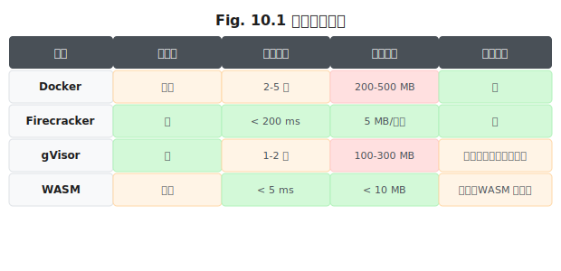

# 第 10 章 工具系统设计

> **问题陈述**：第 9 章定义的 Harness 提供了运行 Agent 的骨架——调度循环、中断恢复、权限控制和可观测性通道。然而，Agent 最核心的能力来自它能够调用的**工具**。工具系统是 Harness 中与 Agent 交互最频繁的子系统——每次 LLM 调用都可能触发零到多次工具执行。本章从工具粒度、权限与沙箱、子 Agent 与并行三个维度，系统性地拆解工具系统的工程设计。

---

## 10.1 工具粒度

工具粒度决定了 Agent 对环境的控制精细度。粒度过粗（一个"完成所有工作"的工具）剥夺了模型的决策空间；粒度过细（"读取字节 1-10"级工具）则让模型的每一步都需要多次工具调用，增加成本和延迟。

### 10.1.1 原子工具

原子工具是 Harness 工具系统的最小单元——它执行一个不可分割的基本操作并返回结果。

**read / write / list / search 四件套。** 多数 Harness 的工具系统都围绕四个基本操作构建：`read`（读取文件 / URL / 数据库记录）、`write`（写入文件 / 插入记录）、`list`（枚举目录 / 列出选项）、`search`（全文搜索 / 过滤查询）。这四件套覆盖了 Agent 与外部世界交互的 90% 以上的场景。每个原子工具应满足：① **单一功能**——一个工具只做一件事（`read_file` 只读文件，不做搜索）；② **无副作用**——读操作不修改状态，写操作明确产生预期的变更；③ **可组合**——原子工具的输出可以作为另一个原子工具的输入。

```python
# Listing 10.1  原子工具四件套实现示例
# 完整代码见 agent-engineering-code/part3-harness/mini-harness/tools.py
import os
import glob


def read_file(path: str, max_bytes: int = 4096) -> str:
    """读文件。max_bytes 防止大文件撑爆上下文。"""
    with open(path, "rb") as f:
        return f.read(max_bytes).decode("utf-8", errors="replace")


def write_file(path: str, content: str) -> str:
    """写文件。自动创建父目录。"""
    os.makedirs(os.path.dirname(path), exist_ok=True)
    with open(path, "w") as f:
        f.write(content)
    return f"已写入 {len(content)} 字节到 {path}"


def list_dir(path: str = ".") -> list[str]:
    """列出目录内容。返回相对路径列表。"""
    return sorted(glob.glob(os.path.join(path, "*")))


def search_text(pattern: str, root: str = ".", ext: str = ".py") -> list[str]:
    """搜索匹配的文件。返回匹配行。"""
    import subprocess
    result = subprocess.run(
        ["grep", "-rn", pattern, root, f"--include=*{ext}"],
        capture_output=True, text=True, timeout=5,
    )
    return result.stdout.splitlines()[:50]
```

**幂等性与可重试性。** `write_file` 多次执行的结果应与一次执行一致——这是幂等性的核心要求。非幂等的操作（如 `append_file`、`create_record`）需要格外小心：Agent 可能在超时后重试，导致重复追加或重复创建。工程建议：优先提供幂等工具（`write` 覆盖而非追加），非幂等操作在重试前由 Harness 做去重检查（记录工具调用的输入指纹，相同输入跳过重复执行）。

### 10.1.2 组合工具

组合工具将多个原子工具的执行序列封装为单一工具，用于固定流程或性能优化。

**何时把"流程"封装成单一工具。** 将流程封装为组合工具的条件：①**固定顺序**——操作序列的每一步都是确定的，不需要模型在中间步骤做决策（如"克隆仓库 → 安装依赖 → 运行测试"）；②**原子性要求**——整个流程要么全部成功要么全部回滚（如"创建用户 → 发送欢迎邮件"）；③**性能优化**——多个原子工具调用合并为一次 API 调用，减少 LLM 循环次数。

```
# 组合工具示例：审查一个 Pull Request
def review_pr(repo_url: str, pr_number: int) -> dict:
    """组合工具：克隆仓库 → 获取 diff → 运行 linter → 生成报告。"""
    clone_repo(repo_url)
    diff = get_pr_diff(pr_number)
    lint_errors = run_linter()
    return {
        "diff_summary": summarize_diff(diff),
        "lint_issues": lint_errors,
        "review_report": generate_report(diff, lint_errors),
    }
```

**组合工具的失败归因难题。** 组合工具内部发生错误时，Agent（以及它的开发者）难以确定错误的根因——是第一步（克隆失败）还是第二步（Linter 出 Bug）？解决方案：组合工具应返回一个结构化的结果，包含每个子步骤的成功/失败状态和执行时间，方便归因。当然，这又增加了结果 $O$ 分量的 Token 消耗——这是一个典型的工程取舍。

### 10.1.3 通用 IO 抽象

通用 IO 抽象为 Agent 提供三个与物理世界交互的标准化通道。

**文件系统作为共享记忆。** 文件系统是 Agent 最自然的持久化媒介——没有数据库、没有缓存，Agent 通过读写文件来维护状态。Harness 应为 Agent 提供一个**工作区目录**（workspace），Agent 可以在其中任意创建、读写、删除文件。工作区是 $S$ 分量（系统状态）的文件系统映射。

**Shell 作为兜底接口。** 当原子工具覆盖范围不足时，Shell 作为兜底接口允许 Agent 执行任意命令。Shell 是一把双刃剑——它提供了最大的灵活性，也引入了最大的安全风险。第 10.2 节的权限模型和沙箱方案专门处理 Shell 的安全问题。

**浏览器作为人类世界的代理。** 当 Agent 需要与人类使用的 Web 应用交互时（如访问网页、填写表单），浏览器工具代理 Agent 执行操作。浏览器工具的抽象层屏蔽了 DOM 操作和事件处理的复杂性——Agent 只需要说"点击登录按钮"，浏览器工具负责解析和执行。

> **工程原则 1（工具分层原则）**：工具系统应分层设计：**原子工具**层（read/write/list/search 四件套）+ **组合工具**层（固定流程封装）+ **通用 IO 抽象**层（文件系统 / Shell / 浏览器）。Agent 优先使用原子工具，必要时升级到组合工具，兜底使用 Shell。

---

## 10.2 权限与沙箱

工具系统的安全设计决定了 Agent 的可信运行边界。权限控制"能做什么"，沙箱控制"做了以后如何隔离影响"。

### 10.2.1 能力清单（Capability）模型

能力清单模型为每个 Agent 实例显式声明它被授予的权限集合。

**白名单 vs 黑名单。** 白名单策略（"除了允许的，都是禁止的"）比黑名单策略（"除了禁止的，都是允许的"）更安全——新增的未知操作默认被拒绝而非通过。工程建议：**始终使用白名单**。黑名单在实践中难以维护——总会有新的攻击路径不在列表中。

**定义 10.1（能力清单，Capability）**：能力清单 $C$ 是一个三轴权限约束的三元组：
$$C = \langle F, N, P \rangle$$
其中 $F$ 为文件系统权限集（File System Permissions）， $N$ 为网络权限集（Network Permissions）， $P$ 为进程权限集（Process Permissions）。一个操作 $O$ 被允许当且仅当它在三条轴上均通过检查： $O \in F \land O \in N \land O \in P$ 。

白名单的初始配置：

```yaml
# harness.policy.yaml — 能力清单示例
capabilities:
  filesystem:
    read: ["/home/user/projects/*", "/usr/share/doc/*"]
    write: ["/home/user/projects/*"]
    execute: false  # 不允许直接执行文件
  network:
    http: ["https://api.github.com/*", "https://arxiv.org/*"]
    all: false       # 其他网络访问全部禁止
  process:
    run: ["python3", "node", "gcc"]  # 只允许运行这些程序
    shell: false    # 禁止 shell
```

> **反方观点**：白名单的配置成本远高于黑名单——在开发阶段，Agent 每个新操作都需要管理员手动更新白名单，影响开发效率。折衷方案：**开发环境用宽松配置**（接近黑名单），**生产环境用严格配置**（白名单），通过环境变量切换。

**路径 / 网络 / 进程的三轴控制。** 权限的维度可以归纳为三个轴：①**路径轴**（文件系统允许访问的目录）；②**网络轴**（允许的 URL 和端口）；③**进程轴**（允许执行的程序和参数）。三轴控制独立配置、联合生效——一个操作必须同时通过三个轴的检查才能执行。例如，`write_file("/etc/passwd", ...)` 会被路径轴拒绝（不在白名单中）；`curl https://evil.com` 会被网络轴拒绝；`bash -c "rm -rf /"` 会被进程轴拒绝（Shell 被禁止）。

### 10.2.2 沙箱方案

沙箱在权限模型的基础上增加一层隔离——即使权限配置出错，沙箱也能限制影响范围。

**Docker 容器隔离。** Docker 是最成熟的沙箱方案。为每个 Agent 会话创建一个临时容器，Agent 的所有操作都在容器内执行。隔离性：强——容器崩溃不影响宿主。性能：中等——冷启动约 2-5 秒，热启动约 200ms。资源消耗：每个容器约 200-500MB 内存。适用场景：多租户 SaaS 服务或企业级安全要求场景。

**Firecracker / gVisor 微 VM。** Firecracker（AWS Lambda 底层）和 gVisor（Google 的容器沙箱）提供了比 Docker 更强的隔离性——每个 Agent 获得一个微观虚拟机，内核级别的完全隔离。Firecracker 的启动延迟低于 200ms（比 Docker 快约 10 倍），内存开销约 5MB 每实例。适用于需要强隔离且对启动延迟敏感的场景。

**WASM 的能力与局限。** WASM（WebAssembly）提供了一种轻量级沙箱——Agent 的代码编译为 WASM 后运行，无法访问宿主文件系统和网络。优势：启动延迟趋近于零（< 5ms）、内存开销极低（< 10MB）。局限：WASM 生态的工具覆盖有限——许多通用工具（如 `git`、`curl`）未编译为 WASM。使用 WASM 作为沙箱意味着 Agent 的工具集被限制在 WASM 生态内。



### 10.2.3 危险操作的人工确认

某些操作的风险太高，不能仅靠白名单和沙箱——需要人类参与确认。

**风险评级与升级路径。** 每个工具应被打上风险等级：**安全级**（读文件、搜索）→ 自动执行，无需确认；**警告级**（写文件、安装包）→ 自动执行但记录日志；**高危级**（执行 shell 命令、删除文件、修改系统配置）→ 需要人工确认。风险评级的粒度可以细化到参数级别——"写文件"在项目目录内和安全级别，但在 /etc/ 目录下为高危级。

> **工程原则 2（最小权限原则）**：Agent 应只被授予完成当前任务所需的最小权限集合。在编程式粒度上，这意味着：设计阶段只开启必要工具，执行阶段根据上下文动态收缩权限范围。一个"只需要读文件"的 Agent 不应该拥有写权限。

**确认 UI 的反疲劳设计。** 每次确认弹窗都是对用户注意力的消耗。频繁的确认请求会导致"确认疲劳"——用户在关键操作上也会习惯性点击"确认"，丧失确认的意义。缓解设计：①**上下文感知确认**——同一会话内的同类高危操作只确认一次；②**渐进式信任**——Agent 在执行历史中从未出错的高危操作可以逐步降级为警告级；③**延迟确认**——将多个高危操作打包为一份"待确认清单"，用户一次性确认或拒绝。

---

## 10.3 子 Agent 与并行

复杂任务可能需要多个 Agent 并行工作。子 Agent 管理是工具系统的新场景。

### 10.3.1 Sub-agent 的隔离上下文

每个子 Agent 拥有独立的 $P$ 、 $H$ 、 $R$ 、 $S$ 分量——它们不共享对话历史。

**上下文复制 vs 引用。** 子 Agent 的初始化上下文有两种策略：①**复制**——将父 Agent 的上下文"快照"传给子 Agent（包括 $P$ 、 $H$ 、 $S$ 的当前状态）。优点是子 Agent 获得了完整的背景知识；缺点是大上下文复制消耗大量 Token。②**引用**——子 Agent 只接收一个简化的 $P$（"你的任务是 X"）和必要的 $S$（任务参数）， $H$ 和 $R$ 从父 Agent 按需读取。优点 Token 效率高；缺点是子 Agent 缺少上下文可能导致次优决策。工程建议：对于需要全部背景知识的任务（如"帮我写一份关于整个项目代码库的报告"）使用复制；对于独立性强、只需要部分信息的任务（如"计算第 3 个函数的复杂度"）使用引用。

**结果回传的契约。** 子 Agent 完成工作后，以结构化的方式将结果回传给父 Agent。契约应包括：①**任务标识**——子 Agent 对应的原始任务 ID；②**状态**——成功 / 部分成功 / 失败（含失败原因）；③**产出**——工具调用结果列表或摘要文本；④**成本**——子 Agent 消耗的 Token 数和时间。

```
# 子 Agent 结果回传契约
{
    "task_id": "subtask-03",
    "status": "success",
    "output": "函数 `quick_sort` 的时间复杂度为 O(n log n)...",
    "tokens_used": {"input": 4500, "output": 1200},
    "duration_ms": 8500,
    "tool_calls": [
        {"tool": "read_file", "args": {"path": "sort.py"}, "result": "...", "duration_ms": 120}
    ]
}
```

### 10.3.2 并行调度

多个子 Agent 可以在隔离的上下文中同时运行，父 Agent 等待所有子 Agent 完成后聚合结果。

**任务依赖图构建。** 并非所有子任务都可以并行——存在数据依赖的任务需要串行执行。Harness 应支持 DAG（有向无环图）的任务依赖描述：父 Agent 定义任务和依赖关系，Harness 自动解析成并行执行。例如，"审查代码库"可以拆分为：`read_dir → read_file × N (并行) → generate_report`，其中 `read_file` 各实例并行执行，`generate_report` 等待所有 `read_file` 完成后执行。

**资源竞争与限流。** 并行子 Agent 可能竞争同一资源（如 GPU、数据库连接、API rate limit）。Harness 应为每个受限资源设置并发上限（max_concurrency）并在超限时将子 Agent 排队。资源竞争不仅是技术问题——如果多个子 Agent 同时修改同一个文件，最后写入的可能覆盖前面的，工程建议：共享文件由父 Agent 在聚合阶段统一写入，子 Agent 只读。

**结果聚合与冲突合并。** 多个子 Agent 返回的结果可能存在冲突——一个 Agent 认为函数是 O(n)，另一个认为是 O(n log n)。Harness 的聚合逻辑应：①**标记冲突**——将结论不一致的结果标注出来；②**回传原始依据**——每个结论附带引用原文；③**交由父 Agent（或人类）裁定**——将冲突结果和原始依据作为输入，让父 LLM 做出最终判断。

---

## 附：工具系统评估指标表

| 指标名称 | 定义 | 度量方法 |
|---------|------|---------|
| 工具调用成功率 | 原子工具执行失败的比例 | 成功执行数 / 总调用数 |
| 工具覆盖率 | 工具系统覆盖 Agent 所需操作的比例 | 已实现的工具数 / 任务所需工具数 |
| 沙箱启动延迟 | 从请求沙箱到沙箱就绪的时间 | 冷启动实测值（如 Docker 2-5s, Firecracker < 200ms） |
| 权限拒绝率 | 被权限系统拒绝的调用占总调用的比例 | 被拒绝数 / 总调用数（正常应为 0-5%） |
| 子 Agent 并行效率 | 并行子 Agent 的实际加速比 | 串行执行时间 / 并行执行时间（理想值为 N） |

---

## 开放问题

1. **工具 Schema 的自动生成。** 能否从代码的类型声明自动生成工具 Schema？Pyright / mypy 的类型信息是否能直接映射为 OpenAI 的 `parameters` 格式？

2. **跨任务沙箱复用。** 一个沙箱（Docker 容器）可以在多个任务间复用还是每次都创建新的？复用的优点是省去了每次的冷启动，风险是 Agent 在沙箱中留下的"残渣"可能影响下一个任务。

3. **子 Agent 的自我复制。** 子 Agent 是否可以在自己的运行时再创建子 Agent？如果可以，递归深度应该由什么机制控制？递归的 Agent 任务可能产生指数级的 Token 消耗。

4. **工具调用的因果溯源。** 当错误发生在组合工具的第 3 步时，如何自动化地定位到根因？是否需要类似分布式 Tracing（如 OpenTelemetry）的工具调用因果链追踪？

---

## 练习

### 思考题

1. 假设你需要为一个代码审查 Agent 设计工具集。你会提供哪些原子工具？哪些组合工具？使用 10.1 节的工具分层原则分析你的设计，每个工具属于哪一层？

2. 你的 Agent 需要同时访问三个服务：GitHub API（读取）、本地文件系统（读写）、数据库（写入）。使用 10.2 节的三轴控制模型设计它的能力清单。验收标准：列出路径轴、网络轴、进程轴各自的白名单配置。

3. 如果子 Agent 的并行度设置为 5，但其中一个子 Agent 因为 API 限流失败了，父 Agent 应该如何决定——重试失败的那个、丢弃它的结果、还是重新运行所有子 Agent？你设计的决策逻辑基于什么标准？

### 动手题

1. 基于第 9 章的最小 Harness，为其添加权限控制：实现一个 `CapabilityChecker` 类，检查每次工具调用的参数是否在白名单内。验收标准：能区分 "允许的操作" 和 "被拒绝的操作"。

2. 在第 9 章的最小 Harness 上实现"人工确认"功能：为高危工具添加 `requires_approval=True` 标记，在调用前打印工具名称和参数，等待用户输入 y/n。验收标准：安全级工具自动执行，高危级工具需要确认。

3. 实现一个简单的子 Agent 调度器：给定一组子任务和它们的 DAG 依赖关系，自动并行执行无依赖的任务，串行执行有依赖的任务。验收标准：给定 4 个任务（A→B, A→C, B+C→D），输出执行时间线并验证 B 和 C 是并行的。

---

## 参考文献

- Docker Inc. (2024). Docker Container Security Documentation. *Docker Docs*.
- AWS. (2024). Firecracker: Secure and Fast microVM for Serverless Computing. *GitHub Repository*.
- Google. (2024). gVisor: Container Runtime Sandbox. *GitHub Repository*.
- WebAssembly Community Group. (2024). WebAssembly Security Documentation. *W3C*.

> **本书叙述方向**：本章从工具粒度、权限与沙箱到子 Agent 并行，完整覆盖了 Harness 工具系统的工程设计。下一章将增加 Harness 的"人面"——第 11 章"人机交互层"将讨论流式输出与中断、三种交互模式，以及可解释性 UI 的设计。
