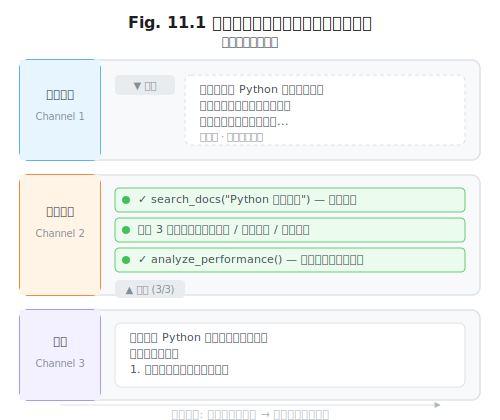
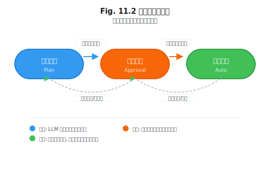

# 第 11 章 人机交互层

> **问题陈述**：前两章构建了 Harness 的骨架（第 9 章）和工具系统（第 10 章）。然而，没有用户界面的 Harness 只是一个无人驾驶的引擎——它需要人机交互层来展示工作进度、接收用户指令、解释 AI 决策。人机交互层是 Harness 中最接近用户的子系统，它的设计直接影响用户对 Agent 的信任度、控制感和满意度。

---

## 11.1 流式输出与中断

Agent 的生成过程不是瞬时的——一次复杂的任务可能包含多次 LLM 调用和工具执行，持续数十秒甚至数分钟。流式输出让用户实时感知进度，中断让用户在必要时介入。

### 11.1.1 Token 流的分级渲染

LLM 生成 Token 时，不同性质的 Token 应有不同的可见性和优先级。

**思考过程 / 工具调用 / 最终回答的分通道。** Agent 的输出可以按来源分为三个通道：①**思考过程通道**——模型在生成工具调用或最终回答之前的内部推理（如 CoT）；②**工具调用通道**——模型决定调用某个工具时，工具名称、参数和返回结果；③**最终回答通道**——模型向用户呈现的正式输出。

三个通道应以不同的方式渲染：

| 通道 | 渲染方式 | 可见性 | 示例 |
|------|---------|--------|------|
| 思考过程 | 灰 / 折叠 | 默认折叠，可展开 | "用户想知道 Python 的性能优化方法，需要先搜索文档，然后…" |
| 工具调用 | 结构卡片 | 默认可见，可折叠 | `[search_docs] 关键词=Python 性能优化 → 3 条结果` |
| 最终回答 | 正常文本 | 全可见 | "以下是对 Python 代码进行性能优化的几个建议…" |

分通道渲染避免了用户被冗长的中间推理信息淹没，同时保留了必要时检查 Agent 决策细节的能力。



### 11.1.2 用户中断的语义

用户在 Agent 执行过程中可以发送中断指令。中断的语义决定了 Agent 如何响应——是追加指令还是回滚状态。

**软中断（追加指令）。** 用户在 Agent 执行过程中给出额外指令，Agent 应在当前步骤完成后处理新指令。典型场景：用户在 Agent 搜索论文时说"顺便帮我查一下这个作者的 h-index"。软中断后，Agent 的上下文 $H$ 中会新增一条用户指令，Agent 按照正常循环处理它。软中断不丢失已完成的工作。

**硬中断（回滚状态）。** 用户要求立即停止当前任务并回滚到开始之前的状态。典型场景：Agent 开始执行一个错误的操作（如"删除项目目录"），用户要求立即停止。硬中断的工程要求：Harness 必须维护足够的快照信息来恢复到任务开始前的状态。对于文件系统操作，回滚意味着恢复被修改的文件（通过备份或 Git）；对于数据库操作，回滚意味着执行事务回滚。

> **工程原则 1（中断语义可识别原则）**：Harness 必须在收到用户中断时能识别中断类型——软中断追加到 $H$ 后继续循环，硬中断终止循环并执行回滚。不能将用户的所有中断一律当作"停止"处理。

---

## 11.2 三种交互模式

不同的用户和任务需要不同级别的控制权限。三种交互模式对应从"全程控制"到"全权委托"的信任光谱。

### 11.2.1 计划模式（Plan Mode）

Agent 在开始执行前输出一份完整的执行计划，等待用户批准后才执行。计划应包含：要执行的步骤、每个步骤将调用的工具、预期的输入输出。

```
# 计划模式示例
📋 执行计划 — 代码审查 PR #123
  步骤 1: read_file("src/main.py") → 获取当前代码
  步骤 2: search("FIXME|TODO|HACK", "src/") → 标记待办事项
  步骤 3: run_linter("src/main.py") → 检查代码规范
  步骤 4: generate_report() → 生成审查报告

  检查点: 步骤 1-3 将读取文件，不修改任何内容。
  是否继续？ (y/N)
```

计划模式适用于高风险操作（如"删除数据库表"）或用户对 Agent 不熟悉的初期阶段。

### 11.2.2 审批模式（Approval Mode）

每个工具调用前需要用户确认。模式提供最细粒度的控制，但也是最消耗用户注意力的模式。审批模式的关键设计是**最小化确认疲劳**——详情见第 10.2.3 节的"确认 UI 的反疲劳设计"。

审批模式的适用场景：**高风险的首次操作**和**非确定性操作**。例如，Agent 第一次请求执行 `rm -rf` 时应审批，但如果用户之前已经批准过类似操作（删除同一目录下的其他文件），Harness 可以自动升级为"信任此操作类型"。反之，`read_file` 这种确定性的读取操作不应触发审批——即使文件包含敏感信息，审批也无法帮助用户判断，因为用户无法在弹窗中仔细通读文件内容。

**审批超时策略**：如果 Agent 发起的工具调用在 $T$ 秒内未获得用户确认，Harness 应如何处理？两种常见策略：①**拒绝并继续**——超时后自动拒绝该工具调用，Agent 收到"工具调用被拒绝（超时）"的错误信息，自行决定下一步；②**降级执行**——超时后自动将高危操作降级为只读操作（如 `rm -f` 降级为 `ls -l`）。工程推荐使用策略①，因为策略②的"降级语义"在不同的工具之间难以统一定义。

**产品对比**：Claude Code 对超出权限的操作直接报错，不留待审批入口——用户在事前通过 `--permission` 配置权限。OpenHands 提供了"点击确认"的审批入口，超时 60 秒自动拒绝。Cursor 没有显式的审批模式——所有操作在用户部署 Agent 前已通过配置文件授权。

默认使用审批模式的高危操作包括：写文件、执行 shell 命令、发送网络请求、删除操作。

### 11.2.3 自动模式（Auto Mode）

Agent 自由执行，无需用户确认每一步。自动模式适用于用户信任 Agent、且任务风险较低的场景。自动模式并不等于"无限制"——第 10.2 节的权限模型和沙箱方案在自动模式下仍然生效，它们提供了自动模式的"安全网"。

### 11.2.4 模式切换的状态机

三种模式不应是静态的——用户和系统可以在运行时动态切换。



状态切换的条件：
- **计划模式 → 审批模式**：用户点击"批准并信任此会话"，跳过计划步骤直接进入审批模式。
- **审批模式 → 自动模式**：用户连续批准了 5 个同一类型的工具调用后，Harness 可以询问"是否以后自动批准这类操作？"
- **自动模式 → 审批模式**：工具调用失败（如删除文件出错）→ 自动回退到审批模式，防止级联错误。
- **审批模式 → 计划模式**：用户手动切换，或检测到高风险上下文（如操作涉及生产数据库）。

> **反方观点**：三种模式的切换增加了 Harness 的复杂度，对于个人开发者使用的本地 Agent 来说可能过度工程化。Aider（仅支持 Auto Mode）和 Claude Code（仅支持 Plan + Auto）证明，两种模式（Plan + Auto）对大多数场景已经足够。三种模式的架构更适合企业级多租户场景。

---

## 11.3 可解释性 UI

可解释性 UI 让用户理解 Agent"为什么这么做"。它直接影响用户对 Agent 的信任度——不可解释的 Agent 给人一种"黑盒"的不安全感和失控感。

### 11.3.1 思考过程的折叠与展开

Agent 的思考过程（CoT）通常是冗长的。默认折叠，用户需要时再展开——这种设计保证了初次阅读的流畅性，同时保留了深入检查的可能性。

**折叠层级的设计博弈**：设计师需要在"折叠太深"和"折叠太浅"之间找平衡。折叠太深（所有 CoT 全部折叠，只显示最终回答）——用户无法感知 Agent 的推理质量，可能在错误发生时措手不及；折叠太浅（每一步 CoT 都可见）——信息过载，用户失去耐心。推荐的三层设计解决了这个博弈：第一层（默认可见）是思考摘要（"用户想审查代码，我决定先搜索 FIXME 标记"）；第二层（可展开）是完整 CoT 文本；第三层（仅调试模式可见）是 logprobs 和 Token 级别的信心度。Cursor 的实现接近此方案——默认显示工具调用摘要，展开后显示完整推理。

### 11.3.2 工具调用的可读化渲染

工具调用的原始格式是 JSON——对人类不友好。可读化渲染将 `{"tool": "search_docs", "args": {"keywords": "Python 性能优化", "max_results": 5}}` 渲染为 `🔍 搜索文档 "Python 性能优化"（最多 5 条）`。

**渲染性能开销**：大型工具返回结果（如搜索返回 100 条数据库记录、`read_file` 读取了一个 5MB 的日志文件）的 JSON 序列化本身可能消耗数百毫秒。如果渲染逻辑在每次工具调用后都同步执行，用户的交互延迟会显著增加。工程建议：渲染结果使用**虚拟滚动**（Virtual Scrolling）——只渲染用户当前可见的一小部分（如前 5 条结果），其余结果以"还有 95 条，点击加载更多"的形式折叠。Claude Code 的终端渲染使用了类似策略——工具返回结果超过 20 行时自动折叠，用户可通过快捷键展开。

```
# JSON 原始格式（不可读）
{"tool": "run_command",
 "args":{"cmd":"grep -rn 'FIXME' src/"},
 "result":{"exit_code":0,"stdout":"src/main.py:10: // FIXME: 优化这个循环"}}

# 可读化渲染（终端）
🔧 执行命令: grep -rn 'FIXME' src/
  返回: 找到 1 个结果
  src/main.py:10: // FIXME: 优化这个循环
```

### 11.3.3 文件差异的内联展示

当 Agent 修改了代码文件时，Harness 应展示修改的差异（diff）而非直接显示修改后的完整内容。Diff 内联展示的设计要点：①**行内高亮**——新增行用绿色，删除行用红色，修改行用黄色；②**可折叠上下文**——每处修改前后各显示 3 行上下文，完整文件默认折叠；③**跳过已确认的修改**——用户已批准过的修改在后续展示中标记为"✓ 已确认"。

**部分确认的 undo 处理**：当 Agent 一次性修改了 5 个文件，用户只批准了其中 3 个文件，拒绝 2 个——Harness 如何处理这 2 个被拒绝的修改？最简单的方案是将被拒绝的修改记录在 $H$ 中，让 Agent 在后续循环中自行决定：它可以选择重新修改（按用户反馈调整），也可以跳过。更复杂的方案是 Harness 自动对已拒绝的文件执行 `git checkout` 恢复原状。推荐使用前者——自动恢复可能覆盖 Agent 在后续步骤中对同一文件的合法修改。

> **工程原则 2（可解释性分层原则）**：三个层次的用户需要三种粒度的可解释性——目录级（只看工具名和状态）、步骤级（看工具参数和返回摘要）、全量级（看完整 CoT 和原始输出）。Harness 应允许用户在三层之间自由切换。

---

## 附：人机交互评估指标表

| 指标名称 | 定义 | 度量方法 |
|---------|------|---------|
| 中断响应延迟 | 从用户发送中断到 Harness 响应的间隔 | 生产环境实测软中断/硬中断的响应时间 |
| 确认疲劳率 | 用户未经仔细确认就批准的审批比例 | 用户打开确认弹窗到点击确认的时间 < 500ms 的比例 |
| 计划准确率 | 计划模式中计划的步骤与实际执行一致的次数 | 计划步骤被修改/追加的比例（越低越好） |
| 交互模式切换频次 | 用户在三种模式之间切换的频率 | 单次任务中模式切换次数 |
| 可解释性满意度 | 用户在完成任务后对 Agent 决策理解程度的评分 | 用户调研或退出问卷的打分（1-5 分） |

---

## 开放问题

1. **语言交互 vs GUI 交互。** Agent 的输出已全部使用自然语言。未来的 Agent 会完全通过自然语言交互，还是需要 GUI 组件（按钮、表格、图表）来辅助沟通？两者的边界在哪里？

2. **中断的语义解析。** 用户说"等一下"是软中断还是硬中断？"算了"呢？人类语言的歧义性使得自动识别中断类型成为一个 NLP 问题——Harness 是否应该使用一个小模型来专门解析中断指令的类型？

3. **模式切换的自动化。** 能否训练一个模型来根据任务类型、历史行为和环境上下文自动选择交互模式？例如，对于"列出文件"任务自动进入自动模式，对于"修改生产配置"任务自动进入计划模式。

4. **多用户并发交互。** 当多个用户同时与一个 Agent 交互时（如团队协作场景），人机交互层如何处理并发输入、冲突指令和状态同步？这与软件工程中的协同编辑（如 Google Docs）面临相似的问题。

---

## 练习

### 思考题

1. 设计一个"中断指令识别"规则：用户发送"停下"、"等一下"、"换个方式"、"继续"、"重新来"这五个指令时，分别对应软中断还是硬中断？如果用户说"停下"其实是"暂时停一下、我改个参数"呢——Harness 如何才能区分？

2. 假设你是 Cursor 的产品经理，你要为它设计交互模式切换的默认配置。一个新用户第一次使用时，默认进入哪种模式？使用 10 次后？100 次后？你的决策逻辑是什么？

3. 思考过程通道的工具调用渲染：如果工具返回了一个非常大的结果（如 100 条数据库记录），可读化渲染应该如何截断？折叠全部结果并在第一页显示 5 条？还是仅显示统计摘要（"返回 100 条记录"）？

### 动手题

1. 在第 9 章最小 Harness 中实现一个简单的分通道渲染：在控制台中用 `[💭]`、`[🔧]`、`[✓]` 三个前缀分别标记思考过程、工具调用和最终回答。验收标准：运行一个包含至少一次工具调用的任务，输出格式为三通道标记。

2. 为最小 Harness 添加"计划模式"支持：Agent 在开始执行前输出执行计划，等待用户输入 y/n 后才执行。验收标准：Agent 先输出计划（含步骤和工具名），然后提示"是否继续？(y/N)"，输入 y 后开始执行，输入 n 后退出。

3. 为最小 Harness 实现一个简单的工具调用可读化渲染函数：输入 `{"tool":"search_docs","args":{"query":"Python 性能"}}`，输出 `🔍 搜索文档(query="Python 性能")`。验收标准：渲染后的文本以 emoji + 工具名 + 关键参数的形式呈现。

---

## 参考文献

- Nielsen, J. (1994). *Usability Engineering*. Morgan Kaufmann. — 经典人机交互原则
- Anthropic. (2024). Claude Code: User Experience Design Documentation. *Anthropic Documentation*. — 分通道渲染与中断语义

> **本书叙述方向**：本章从流式输出、中断语义、三种交互模式到可解释性 UI，完整覆盖了 Harness 人机交互层的设计。下一章将收尾 Part 3——第 12 章"Harness 的可观测性"将讨论 Trace、Span、Token 账本和时间旅行调试，让 Harness 的每个操作都有迹可循。
