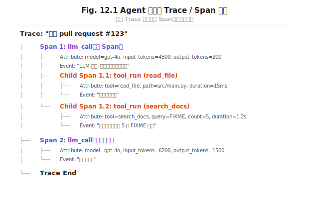
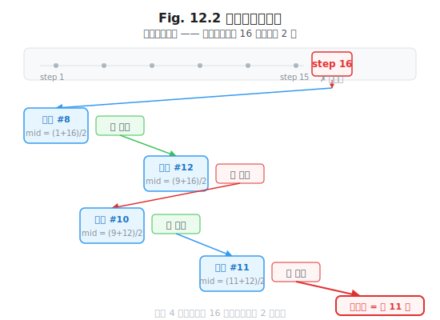

# 第 12 章 Harness 的可观测性

> **问题陈述**：第 9–11 章构建了 Harness 的调度、工具系统和交互层。然而，运行中的 Harness 是一个黑盒——开发者无法知道 Agent 为什么选择了某个工具、为什么花了 30 秒才回复、为什么最终输出与预期不符。可观测性是让 Harness 从黑盒变为白盒的能力：Trace 记录每一次操作，Token 账本归因每一分钱，时间旅行调试让开发者可以"重放"Agent 的决策过程。

**第三部分结束语：** 本章是驾驭工程（Harness Engineering）的收尾章。前四章分别解决了 Harness 的骨架设计（第 9 章）、工具系统（第 10 章）、人机交互（第 11 章）和可观测性（第 12 章）。在第 13 章开始的循环工程（Loop Engineering）中，Agent 将获得自主推进任务的能力——而可观测性是确保这个自主推进过程不至于失控的基石。

---

## 12.1 Trace、Span、Token 账本

可观测性的三个核心数据模型是 Trace（追踪）、Span（跨度）和 Token 账本。三者从不同维度记录 Agent 的执行行为，互补而不重叠。

### 12.1.1 OpenTelemetry 在 Agent 场景的适配

OpenTelemetry（OTel）是云原生领域可观测性的事实标准。它定义了 Trace（一个端到端请求的执行链路）和 Span（链路中的单个操作）。将 OTel 引入 Agent 场景需要适配：Agent 的一次"请求"不是 HTTP 请求，而是**一次用户输入到最终输出的完整 Agent 执行周期**。这个周期可能包含多个 LLM 调用、工具执行和用户中断。

适配的关键映射：

| OTel 概念 | Agent 场景映射 | 示例 |
|-----------|---------------|------|
| Trace | 一次用户输入 → 最终输出的完整周期 | "审查 pull request #123" 的完整执行 |
| Span | 单次 LLM 调用、单次工具执行、单次状态变更 | `llm_call(invoke)`、`tool_run(search_docs)` |
| Attribute | Span 的属性键值对 | `llm.model = "gpt-4o"`, `tool.name = "search_docs"` |
| Event | Span 内的日志事件 | `tool.callback_id = "call_xxx"`, `context.tokens_input = 4500` |



### 12.1.2 Span 属性的最小集

Agent 的 Span 属性比传统的微服务 Span 多了一类关键信息——**语义信息**。除了延迟、状态码等基础设施属性，Agent Span 还应包含：

- **LLM Span**：`model`（模型名）、`input_tokens` / `output_tokens`（Token 计数）、`temperature` / `top_p`（采样参数）、`system_prompt_hash`（系统提示词哈希，用于版本关联）。
- **Tool Span**：`tool_name`（工具名）、`tool_args`（参数摘要，不记录完整参数以保护隐私）、`tool_result_size`（结果 Token 数）。
- **Decision Span**：`reasoning`（模型选择此操作的原因摘要）、`alternatives_considered`（模型评估的其他选项列表或数量）。

**定义 12.1（Span 最小集）**：每个 Agent Span $S$ 是一个元组 $ S = \langle T, K, V, E \rangle $，其中 $ T$ 为 Span 类型（`llm_call` / `tool_run` / `decision` / `user_interrupt`），$ K$ 为该类型必需的属性键集合，$ V$ 为 $ K$ 对应的时值，$ E$ 为事件列表（可选）。仅记录 $ K_{\min}$（最小必要属性）以减少存储成本。

### 12.1.3 Token 账本与成本归因

Token 账本是 Harness 可观测性中最贴近业务的维度——它记录了 Token 消耗的去向和原因。

账本设计：以 Span 为粒度，每个 Span 记录其消耗的输入/输出 Token 数。总 Token 消耗 = 所有 LLM Span 的输入/输出之和。成本归因则进一步按"域"分摊：归因到特定用户、特定任务或特定 Agent 版本。

```
# Token 账本示例（一次 Agent 执行）
Span                     Input Tokens  Output Tokens  Cost ($)
─────────────────────────────────────────────────────────────
llm_call (初始推理)      4,500         200            0.023
├─ tool_run (read_file)  (不计费)      (不计费)        0
├─ tool_run (search)     (不计费)      (不计费)        0
llm_call (生成报告)      6,200         1,500           0.038
─────────────────────────────────────────────────────────────
合计                     10,700        1,700           0.061
```

Token 账本的可视化通常以瀑布图展示，让开发者直观地看到"哪一步花了最多 Token"——通常是上下文窗口最大时的那次 LLM 调用（$ P$ + 累积的 $ H$ + $ R$ + $ O$ 全部注入后）。这个信息可以直接指导上下文压缩策略（第 6.3.1 节）的优化方向。

> **工程原则 1（可观测性不例外原则）**：Harness 的可观测性系统本身也必须可观测——OTel Agent 进程的运行状态、Token 账本的存储成本、Trace 导出的网络开销都应有对应的监控指标。可观测性不能成为 Harness 的黑盒。

---

## 12.2 失败回放与时间旅行调试

可观测性不仅用于监控生产环境——它也是调试 Agent 行为的利器。时间旅行调试让开发者可以"重放"Agent 的决策过程，理解为什么它会做出某个错误选择。

### 12.2.1 状态快照设计

时间旅行的基础是状态快照——在 Agent 执行的每个关键决策点保存一份完整的上下文状态。

快照应包含的内容：①**时间戳**——快照生成的时间；②**步骤编号**——当前是第几步；③**完整的 Prompt**——当前输入给 LLM 的所有 Token（$ P$ + $ H$ + $ R$ + $ O$ + $ S $）；④**LLM 输出**——模型生成的回复（含工具调用指令或最终回答）；⑤**工具调用记录**——如果这一步调用了工具，记录所有调用的输入和输出；⑥**元数据**——Token 消耗、延迟、模型版本。

**定义 12.2（状态快照）**：在步骤 $ t$ 生成的状态快照 $ C_t$ 是一个六元组：
$$C_t = \langle t, P_t, H_t, R_t, O_t, S_t \rangle$$
其中 $ t$ 为步骤序号，$ P_t/H_t/R_t/O_t/S_t$ 为第 $ t$ 步骤开始时上下文五元组的完整内容。快照 $ C_t$ 的大小通常为数千 Token，在内存中保留最近 $ N$ 个快照，较旧的快照序列化到磁盘。

> **真实失败案例**：某团队在生产环境中发现一个 Agent 在 5% 的请求中生成了错误的 SQL 语句。团队花了两周时间尝试改进 Prompt，问题却始终未解决。直到他们启用了状态快照并分析了失败案例，才发现问题根因是**上下文中前一轮工具调用返回了大量 SQL 错误信息**，这些错误信息污染了第二轮 LLM 调用的上下文——模型从错误信息中"学习"了错误的 SQL 写法，而非 Prompt 设计有问题。修复方案：在工具调用 $ O$ 写回 $ H$ 之前，对错误信息做摘要而非完整写回。

### 12.2.2 确定性重放的前提条件

重放（Replay）是指用相同的输入和状态快照重新执行 Agent 的某个步骤，期望得到完全相同的结果。

确定性重放需要满足：①**固定的 LLM 参数**——seed 相同、temperature=0（或相同 seed + 温度）；②**固定的模型版本**——模型更新会改变 logits 分布，导致同一 seed 下的输出不同；③**固定的上下文**——重放时的 $ P/H/R/O/S$ 必须与快照中记录的内容完全一致；④**固定的工具实现**——工具函数的代码不能改变（至少重放的那段历史不能改变）。工程挑战：前三个条件在受控环境中容易满足，但第四个条件需要工具的每个版本都被版本化——这对快速迭代的 Agent 系统是一个不小的维护负担。

### 12.2.3 分歧点（Divergence Point）定位

当一次 Agent 执行的结果与预期不符时，开发者需要定位"从哪一步开始走偏了"——这个位置称为分歧点。

分歧点定位方法：使用二分搜索遍历状态快照。假设 Agent 执行了 16 步，第 16 步的结果是错误的。开发者先重放第 8 步的快照，检查第 8 步的结果是否正确；如果第 8 步正确，则第 9–16 步中有问题，继续二分搜索第 12 步…… 16 步的问题最多只需要 4 次重放就能定位分歧点。



> **工程原则 2（快照采样策略）**：状态快照存储成本随执行步数线性增长。工程实践：默认保留最近 5 个快照在内存中，每 10 步将历史快照异步写入磁盘。对于调试任务，开发者在开始执行时可以选择"全量快照模式"（保留每一步的完整状态）。

---

## 附：可观测性评估指标表

| 指标名称 | 定义 | 度量方法 |
|---------|------|---------|
| Trace 覆盖率 | 被 Trace 记录的 Agent 执行占总执行数的比例 | 有 Trace 记录的执行数 / 总执行数（目标：100%） |
| Span 属性完整性 | Span 包含其类型所必需的所有最小属性集的比例 | 属性完整的 Span 数 / 总 Span 数 |
| 状态快照命中率 | 开发者在调试时使用的快照中能正确定位分歧点的比例 | 正确定位的调试次数 / 总调试次数 |
| Token 预算偏差率 | 实际 Token 消耗与预算的偏差 | （实际 - 预算）/ 预算 |
| 重放成功率 | 确定性重放成功还原出相同结果的比例 | 成功重放的步骤数 / 总重放步骤数 |

---

## 开放问题

1. **Trace 的存储成本。** 如果每次 Agent 执行都生成一个 Trace（包含多个 Span），对于每日处理百万次请求的生产系统，Trace 的存储成本可能超过 Agent 本身的推理成本。如何设计抽样策略？（按用户抽样？按步骤数抽样？按异常状态抽样？）

2. **分歧点定位的自动化。** 能否训练一个模型来自动比较"期望执行路径"和"实际执行路径"，自动标注分歧点的位置和可能原因？这类似于程序调试中的故障定位（Fault Localization）。

3. **多 Agent Trace 的关联。** 当多个 Agent 协同工作时（一个 Agent 的输出是另一个 Agent 的输入），如何将它们的 Trace 关联为一个整体的交互图？这需要跨 Trace 的传播上下文 ID。

4. **Token 账本的精确度 vs 成本。** 记录每一步的 Token 消耗需要调用 tokenizer 对 Prompt 编码后计数——这本身也消耗 Token。是否有更经济的估算方法（如基于 Prompt 字符数的线性回归模型）？

---

## 练习

### 思考题

1. 假设你的 Agent 在一个步骤中调用了 3 个工具，然后 LLM 生成了最终回答。使用 12.1 节的 Trace/Span 模型，画出这个 Agent 执行的 Trace 树。每个 Span 应该包含哪些最小属性？

2. 你通过状态快照定位到一个分歧点——第 7 步的 LLM 调用得到了与预期不同的输出。你现在需要确定：是 Prompt 设计问题（上下文中的指令表达不够清晰）还是上下文内容问题（检索结果中包含了误导性信息）？你会如何通过快照中的信息来做这个区分？

3. Token 账本显示一轮 Agent 执行消耗了 50K 输入 Token，其中 70% 来自 $ H $（对话历史），20% 来自 $ R $（检索结果），10% 来自 $ P $（系统提示词）。你会优先优化哪个分量？优化策略是什么？

### 动手题

1. 为第 9 章的最小 Harness 添加 Span 记录：每次 LLM 调用和工具执行都创建一个 Span 对象（含开始时间、结束时间、类型、属性）。验收标准：一个运行 2 步的 Agent（1 次 LLM 调用 + 1 次工具执行 + 1 次 LLM 调用）产生 3 个 Span。

2. 在最小 Harness 中实现"状态快照"功能：每一步生成一个状态快照 $ C_t$，包含当前步骤序号和上下文内容。验收标准：Agent 运行完毕后输出一个快照列表，每个快照包含步骤序号和 Token 数。

3. 实现一个简单的"分歧点定位"函数：给定一系列状态快照和"预期正确结果"，用二分搜索定位第一个出现异常的快照编号。验收标准：在一个 8 步的执行日志中，函数能在最多 3 次检查中定位到异常步。

---

## 参考文献

- OpenTelemetry Community. (2024). OpenTelemetry Documentation: Traces, Spans, and Attributes. *CNCF*.

> **本书叙述方向**：本章是驾驭工程（Part 3）的收官之作。至此，我们完成了四层洋葱图第三层（Harness 层）的完整叙述——从 Harness 骨架（第 9 章）到工具系统（第 10 章）到人机交互（第 11 章）到可观测性（第 12 章）。下一章将进入第四层——第 13 章"从单次调用到自主循环"将定义循环工程的核心概念，揭示 Agent 从"回答一次"到"自主完成一个任务"的范式跃迁。
