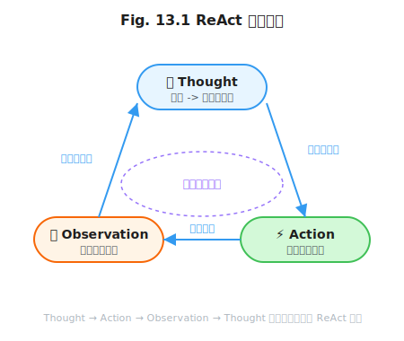

# 第 13 章 从单次调用到自主循环

> **问题陈述**：前十二章构建了 Agent 的提示词能力（Part 1）、上下文管理（Part 2）和运行时环境（Part 3）。然而，这些能力都服务于"单次交互"——用户问一句，Agent 答一句。当任务需要 Agent 自主推进（如"审查整个代码库并提交 PR"），单次交互就不够了。循环工程（Loop Engineering）解决的是**多次 LLM 调用的编排问题**：如何设计目标分解、反思纠正、终止判断和资源管理，让 Agent 可靠地完成需要多步行动的复杂任务。

**第四部分导读：** 第 13–16 章构成循环工程（Loop Engineering）的完整体系。第 13 章定义 Loop 的四种基本拓扑——ReAct、Plan-Execute、Reflexion、Tree Search——它们的终止条件和不确定性模型。第 14 章在此基础上构建目标分解与评估循环（Critic Agent、多 Agent 辩论），第 15 章处理长程任务的上下文滚动与失败恢复，第 16 章引入学习型循环（经验回放、Prompt 自进化）。如果你主要关注 Agent 的自主任务能力，第 13–14 章是核心；如果你要构建生产级长程 Agent，第 15 章不可跳过。

> **跳读代价**：如果跳过本章，你将在第 14–16 章反复遇到"循环"相关概念（终止条件、反思、错误累积）而不知道它们的底层拓扑是什么。本章是循环工程的坐标系——所有后续讨论都基于本章的四种拓扑。

---

## 13.1 Loop 的拓扑学

Loop 的拓扑定义了 Agent 如何在多次 LLM 调用之间流转信息和控制。

### 13.1.1 ReAct 范式

ReAct（Reasoning + Acting）是 Agent Loop 最基础的拓扑，由 Yao et al. (2023) 提出。

**定义 13.1（ReAct 循环）**：一个 ReAct 循环由三元组 $L_{\text{ReAct}} = \langle T, A, O \rangle$ 构成，其中 $ T$ 为思考（Thought）——模型的内部推理文本，$ A$ 为行动（Action）——模型发出的工具调用指令，$ O$ 为观察（Observation）——工具执行后返回给模型的结果。循环过程为：
$$T_t \rightarrow A_t \rightarrow O_t \rightarrow T_{t+1} \rightarrow \ldots$$
直到满足终止条件 $ C $。

**Thought-Action-Observation 三元组。** 每个循环步由三个连贯的阶段组成：模型先生成一段思考（"我需要先搜索用户提到的论文"），然后发出一个行动（调用 `search_paper`），最后接收一个观察（返回的论文列表）。下一次循环时，这个三元组被写入 $ H$ 分量，成为后续推理的上下文。三元组的完整性至关重要——缺失思考环节的循环（Action → Observation → Action → Observation）退化为"盲目试错"，模型无法从错误中学习；缺失观察环节的循环（Thought → Action → Thought → Action）模型则无法感知执行结果。



**Listing 13.1  ReAct 循环核心实现（基于 Ch9 最小 Harness）**

```python
# Listing 13.1  ReAct 循环核心实现（基于 Ch9 最小 Harness）
# 完整代码见 agent-engineering-code/part4-loop/ch13-react-loop/react_cycle.py
import json
from typing import Any


def execute_tool(name: str, args: dict) -> Any:
    """执行工具（需根据 Harness 的工具注册表实现）。"""
    raise NotImplementedError("需接入具体的工具系统")


def react_cycle(client, model: str, system_prompt: str, tools: list[dict],
                user_input: str, max_steps: int = 10, seed: int = 42) -> str:
    """ReAct 循环：Thought → Action → Observation"""
    history = [{"role": "user", "content": user_input}]
    for step in range(max_steps):
        response = client.chat.completions.create(
            model=model,
            messages=[{"role": "system", "content": system_prompt}] + history,
            tools=tools,
            seed=seed,
        )
        msg = response.choices[0].message
        history.append(msg)
        if not msg.tool_calls:
            return msg.content
        for tc in msg.tool_calls:
            result = execute_tool(tc.function.name, json.loads(tc.function.arguments))
            history.append({
                "role": "tool",
                "tool_call_id": tc.id,
                "content": json.dumps(result),
            })
    return "达到最大步数，任务未完成"
```

**ReAct 的失效场景。** ReAct 在以下场景容易失效：①**循环依赖**——Agent 反复调用同一个工具得到相同结果（如重复搜索同一个关键词），陷入无限循环；②**思考不足**——Agent 在未充分推理的情况下直接调用工具，导致行动方向错误；③**上下文污染**——前一步的 Observation 中包含了错误的输出，误导后一步的 Thought。第 15 章的死循环检测（动作哈希指纹、N-gram 重复阈值）和推断回滚机制专门处理这些失效。

### 13.1.2 Plan-Execute 范式

ReAct 的"边想边做"在复杂任务中效率不高——Agent 可能在第一步就做出次优决策。Plan-Execute 将"计划"和"执行"分离。

**定义 13.2（Plan-Execute 循环）**：Plan-Execute 循环 $ L_{\text{PE}}$ 由两个阶段构成：计划阶段生成执行计划 $\Pi = \langle \pi_1, \pi_2, \ldots, \pi_n \rangle $，其中 $\pi_i$ 是一个步骤描述（含目标工具和预期输出）；执行阶段按顺序执行计划中的每个 $\pi_i $，每步完成后可选择性地更新剩余计划。

**显式计划的可修改性。** Plan-Execute 的优势在于计划的**可修改性**——用户和 Agent 可以在执行过程中修改剩余计划。例如，计划中的第 3 步是"搜索关于 X 的论文"，但第 2 步已经找到了一篇相关论文，用户可以说"第 3 步不用做了，直接开始写报告"。实现要求：计划必须以结构化的、人类可编辑的形式存储（如 JSON 列表），而非直接写入 $ P$ 中的一段文字。

**重新规划（Replan）触发条件。** 计划不需要一成不变。以下情况触发重新规划：①**关键假设失效**——第 2 步发现 API 不可用，原计划中依赖该 API 的所有后续步骤需要重新设计；②**意外发现**——第 1 步找到了一篇关键论文，原计划中"搜索"部分的 Token 预算可以重新分配为"阅读"；③**用户中断**——用户在过程中追加新指令。

> **反方观点**：Plan-Execute 的"先计划再执行"在简单任务中增加了不必要的开销——对于"打开文件并读取内容"这种一步任务，ReAct 的边想边做更高效。工程建议：给 Agent 一个"任务复杂度评估器"，简单任务走 ReAct，复杂任务走 Plan-Execute。

### 13.1.3 Reflexion 与自我批评

ReAct 和 Plan-Execute 都不具备自我纠正能力——Agent 错了就是错了，下一个步骤不会从错误中学习。Reflexion 通过在循环中引入反思机制来解决这个问题。

**定义 13.3（Reflexion 循环）**：Reflexion 循环 $ L_{\text{Refl}}$ 在 ReAct 的基础上增加了反思步骤 $ R $：
$$T_t \rightarrow A_t \rightarrow O_t \rightarrow R_t \rightarrow T_{t+1} \rightarrow \ldots$$
其中 $ R_t$ 是 Agent 对之前 $ K$ 步的自我评估（"我刚才的做法是否正确？是否有更好的方法？"）。反思结果写回 $ H$ 分量，供后续步骤参考。

**反思信号的来源。** 有三种反思信号：①**执行失败信号**——工具调用返回了错误（如搜索超时、编译错误）→ 反思"为什么失败？如何避免？"；②**语义不一致信号**——LLM 的最终输出与用户意图不一致（通过一个独立的 Critic LLM 调用检测）→ 反思"哪里理解错了？"；③**低置信度信号**——生成 Token 的 logprobs 均值低于阈值（参考 Ch2 的 logprobs 诊断）→ 反思"是否应该重新考虑前提？"。

**反思写回的存储介质。** 反思本身也是一个文本，需要被写回到后续循环的上下文中。写回方式有三种：①**直接追加到 $ H $**——最简单，但长期执行后 $ H$ 中的反思内容会稀释；②**写入独立的反思缓冲区**——在 $ S$ 中维护一个反思列表，每次循环开始时注入，循环结束时更新（类似 Generative Agents 的记忆评分模型，见 Ch7）；③**写入外部存储**——对长时间运行的 Agent，反思写入数据库或文件系统，通过 RAG 按需检索。

### 13.1.4 Tree Search 与 MCTS Agent

ReAct 是一条单一路径——Agent 在每一步只探索一个分支。当任务需要探索多个可能性时，Tree Search 提供了多分支的循环拓扑。

**定义 13.4（Tree Search 循环）**：Tree Search 循环 $ L_{\text{TS}}$ 在每一步生成 $ b$ 个候选 Action，为每个候选评估一个分数 $ f(O_t)$，选择分数最高的分支继续搜索，对其他分支做剪枝或保留待探索。

**状态评估器设计。** 评估器 $ f(O_t)$ 的设计直接决定搜索质量。三种常见评估器：①**任务完成度**——当前步骤的结果 $ O_t$ 距离目标状态还有多远（如代码编译错误数）；②**信息增益**——$ O_t$ 提供了多少新信息（如搜索结果的数量和多样性）；③**混合评估**——结合任务完成度和信息增益加权求和。Yao et al. (2023) 的实验表明，在 24 点游戏等推理密集型任务中，混合评估器比单一评估器的搜索效率高 30–50%。

**探索-利用平衡。** Tree Search 面临的核心困境：是沿着当前最有希望的分支深入（利用），还是尝试尚未充分探索的分支（探索）？MCTS（Monte Carlo Tree Search）通过 UCB（Upper Confidence Bound）公式解决这个困境：$ Score = Q(v) + c \times \sqrt{\frac{\ln(N_{\text{parent}})}{N(v)}}$，其中 $ Q(v)$ 为节点的平均收益（利用），第二项为探索奖励。常数 $ c$ 控制探索强度——$ c$ 越大，Agent 越倾向于试新的分支。

> **工程原则 1（Loop 拓扑选择原则）**：任务的确定性决定 Loop 拓扑——确定性任务（已知步骤、已知工具）用 ReAct；半结构化任务（步骤可预计但需调整）用 Plan-Execute；需要从错误中学习的任务用 Reflexion；需要探索多个可能性的任务用 Tree Search。

---

## 13.2 循环的终止条件

一个没有终止条件的循环是一个无限循环。终止条件是 Loop 的安全性机制。

### 13.2.1 显式终止：目标完成判定

Agent 在每步循环后判断是否完成了用户设定的目标。判断方法：使用一个独立的 Critic LLM 调用来评估当前状态是否达成目标。如果达成，输出终止信号并退出循环。目标完成判定是比"模型认为任务完成了"更可靠的终止信号——模型可能高估自己的完成度（"我觉得我已经做完了"），而 Critic 的评估基于客观指标（如"文件已创建"、"测试已通过"）。

### 13.2.2 隐式终止：预算耗尽 / 无进展检测

隐式终止是 Agent 的安全网——当 Agent 无法完成目标时，不能让它在循环中无限运行。两个隐式终止条件：①**Token 预算耗尽**——运行前设定一个 $ T_{\max}$（最大 Token 消耗），达到后强制终止并返回已完成的中间成果；②**无进展检测**——连续 $ N_{\text{stall}}$ 步后，关键指标（如文件变更数、问题解决数）未发生变化，判定为无进展，终止循环。推荐配置：$ T_{\max}$ 比"正常执行"的 Token 消耗高 50% 作为安全缓冲区；$ N_{\text{stall}} = 5 $。

### 13.2.3 自适应步数控制

固定的最大步数 $ N_{\max}$ 过于刚性——简单任务分配了多余的步数（浪费 Token），复杂任务步数不够（任务失败）。自适应步数控制根据任务的实时进展动态调整允许的最大步数。初始步数设置为 $ N_{\text{init}}$，每当 Agent 在一步中取得"显著进展"（如完成了原计划的 1/3 工作量），奖励额外的步数 $\Delta N $；如果 Agent 连续 $ M$ 步无进展，减少可用的剩余步数。

---

## 13.3 循环中的不确定性

Agent 的每一步 LLM 调用都有一定的随机性（即使在 Temperature=0 时，模型版本更新、硬件差异也会引入不确定性）。多步循环放大了这种不确定性。

### 13.3.1 错误累积模型

**步骤独立性假设的破产。** 在设计 Agent 时，开发者常假设"每一步的 LLM 调用是独立的"——第 2 步的错误不会影响第 3 步。这个假设在实践中不成立，因为每一步的输出被写入 $ H$ 并作为后续步骤的上下文。一个步骤中的错误（如工具调用的错误输出了错误的 SQL）会作为 Observation 写回 $ H $，直接污染后续所有步骤的推理。

**错误率的复合增长。** 如果单步错误率为 $ p $（如 3%），独立假设下 10 步循环的成功率为 $(1-p)^{10} \approx 74\%$ 。但实际上，由于步骤间的依赖，错误会复合增长——第 1 步的错误可能导致第 2 步也出错，即使第 2 步本身是正确的。经验数据显示，10 步 ReAct 循环的实际成功率约为 $ 55–65\%$，远低于独立假设的 $ 74\%$。这正是 Reflexion 引入的必要性——通过反思在每步检测并纠正错误，将有效错误率从 $ p$ 降低到 $ p^2$ 级别。

### 13.3.2 检查点与回滚

**检查点粒度选择。** 检查点应该在每一步循环结束时生成（参考 Ch12 的状态快照），还是每 $ K$ 步？粗粒度（每 $ K$ 步）降低了存储成本，但回滚时丢失的进度更多。推荐配置：默认每步生成检查点（内存），每 5 步将检查点序列化到磁盘。对于特别关键的 Agent（如执行数据库迁移），可配置为每一步都序列化。

**回滚的语义一致性。** 回滚到检查点后，Agent 需要从该点的状态重新开始。语义一致性要求：回滚后的第一次 LLM 调用产生与原始执行**相同**（或可接受范围内等价）的输出。这需要：①回滚时恢复完整的 $ P/H/R/O/S$ 五元组；②使用相同的 seed（如果 Temperature=0）；③使用相同的模型版本。如果条件①和②满足但模型版本已更新（生产环境中常见），回滚可能产生不同的输出——这就是为什么确定模型版本对可观测性如此重要。

---

## 附：循环工程评估指标表

| 指标名称 | 定义 | 度量方法 |
|---------|------|---------|
| 循环成功率 | Agent 在 $ N_{\max}$ 步内完成目标的概率 | 在 Golden Set 中运行 $ N$ 次，统计成功次数占比 |
| 平均步数 | 完成目标所需的平均循环步数 | 成功执行的步数 / 成功次数 |
| 反思纠正率 | Reflexion 中反思导致的行为改变的占比 | 反思后 $ A_t$ 与反思前 $ A_{t-1}$ 不同的步数 / 总反思步数 |
| 终止准确率 | 显式终止判定与真实任务完成状态一致的次数 | Critic 判定一致数 / 总判断次数 |
| 回滚恢复率 | 回滚后 Agent 成功完成任务的概率 | 回滚后成功次数 / 总回滚次数 |

---

## 开放问题

1. **四拓扑选择的自动化。** 能否用一个轻量级模型（如分类器）在任务开始时自动选择最合适的 Loop 拓扑？所需的特征是什么（任务描述、工具数量、历史成功率）？

2. **反思的边际收益。** 每次反思消耗一次 LLM 调用。随着循环步数增加，反思的边际收益是否递减？是否存在一个"反思阈值"——超过该阈值的循环步不需要反思，因为错误已经被前一步的反思覆盖？

3. **Tree Search 的符号空间约束。** MCTS 在棋盘游戏中表现优异（有限的符号空间），但在 Agent 任务中（无限的自然语言空间），状态评估器的设计仍然是一个开放问题。是否存在一种通用评估器，可以在任意 Agent 任务中有效评估状态质量？

4. **循环的并行化。** ReAct 和 Reflexion 在本质上是串行的（每步依赖前一步的 Observation）。是否存在一种"分叉-合并"的循环模式，允许 Agent 在决策点同时探索多个分支？

---

## 练习

### 思考题

1. 为以下三个任务选择合适的 Loop 拓扑并说明理由：①"将 Markdown 文件转换为 PDF"（已知步骤、确定性输出）；②"为这个代码库添加单元测试"（步骤可预计但需要调整）；③"研究 Transformer 的注意力机制并写一份报告"（需要多角度探索）。

2. 如果 ReAct 循环在第 5 步产生了错误，但 Reflexion 没有检测到（反思判定"一切正常"），第 10 步时才发现了问题。此时回滚到第 5 步——第 5 步的检查点存在，但第 5-10 步消耗的 Token 已经不可收回。如果回滚后第 5 步再次产生相同错误怎么办？设计一个"回滚+修复"流程来处理这种情况。

3. 假设你的 Agent 使用的 LLM 提供商突然更换了模型版本，旧版本的所有 seed 在新版本上产生不同输出。你的 Agent 的终止条件、反思信号和回滚机制分别会受什么影响？

### 动手题

1. 基于第 9 章的最小 Harness，实现各 ReAct 循环（Listing 13.1）并运行一个需要 2 步工具调用的任务（如先搜索再读取）。验收标准：输出包含 Thought、Action（含工具名和参数）、Observation（含工具返回）三步的完整循环日志。

2. 在 ReAct 循环的基础上添加 Reflexion 支持：每步循环后追加一次反思 LLM 调用，检查前一步的执行结果是否合理。如果反思认为不合理，在当前步纠正方向。验收标准：在一个会出错的 3 步任务中，Reflexion 至少纠正一次 Agent 的行为。

3. 为 ReAct 循环添加"预算耗尽"终止条件：在循环开始前设定 Token 预算上限，每次 LLM 调用后累加 Token 消耗，超过上限后强制终止并返回已完成的中间结果。验收标准：在一个需要 10 步的任务中，将 Token 预算设为只能完成 5 步的量，验证循环在第 5 步或第 6 步终止。

---

## 参考文献

- Yao, S., Zhao, J., Yu, D., et al. (2023). ReAct: Synergizing Reasoning and Acting in Language Models. *ICLR 2023*.
- Shinn, N., Cassano, F., Gopinath, A., et al. (2023). Reflexion: Language Agents with Verbal Reinforcement Learning. *NeurIPS 2023*.

> **本书叙述方向**：本章定义了四种 Loop 拓扑——ReAct、Plan-Execute、Reflexion 和 Tree Search——以及它们的终止条件和不确定性模型。下一章将利用这些拓扑构建更上层的控制结构——第 14 章"目标与评估循环"将讨论目标分解（子目标树）、自评与互评（Critic Agent、多 Agent 辩论）和共识形成机制。
