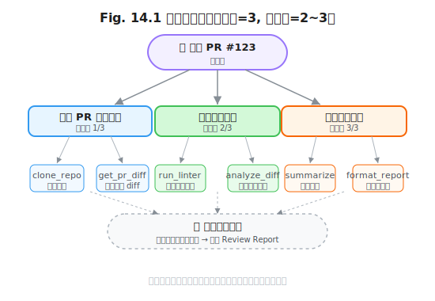

# 第 14 章 目标与评估循环

> **问题陈述**：第 13 章定义了四种循环拓扑——ReAct、Plan-Execute、Reflexion 和 Tree Search。然而，这些拓扑解决的只是"如何循环"的问题，没有回答**"为什么循环"**——Agent 循环的每一轮都应该朝着用户设定的目标前进。本章讨论两个紧密耦合的问题：如何将用户模糊的需求分解为可执行的子目标（目标分解），以及如何让 Agent 自我评估其进度和质量（自评与互评）。

---

## 14.1 目标分解

用户的需求通常是模糊的（"帮我优化这个项目"）。目标分解将模糊需求转化为可执行的子目标列表。

### 14.1.1 显式目标 vs 隐式目标

**用户意图与表层任务的区分。** 用户说"帮我审查这个 PR"，表层任务是"审查代码变更"，但隐式意图可能包含"确保代码符合团队风格规范"和"不要删除现有注释"。Agent 在目标分解阶段需要同时提取这两种目标。方法：将用户原始请求送入一个"意图澄清" LLM 调用，输出一个结构化的目标列表——包含一个显式目标（从用户直述中提取）和若干隐式目标（从上下文 $H$ 和系统状态 $S$ 中推断）。

**定义 14.1（意图澄清）**：意图澄清函数 $C(Q, H, S)$ 将用户查询 $Q$、对话历史 $H$ 和系统状态 $S$ 映射为一个目标集合 $G = G_{\text{explicit}} \cup G_{\text{implicit}}$，其中 $G_{\text{explicit}}$ 为从 $Q$ 直接提取的显式目标， $G_{\text{implicit}}$ 为从 $H$ 和 $S$ 中推断的隐式约束和期望。

```
意图澄清输出示例：
输入 Q: "帮我审查这个 PR"
输出 G:
  explicit:
    - "审查 PR #123 的代码变更"
  implicit:
    - "检查代码是否符合项目风格规范（基于 H 中用户过去的审查反馈）"
    - "不要删除现有注释（基于 S 中保存的用户偏好）"
    - "生成一份包含严重级别分类的审查报告"
```

**隐式约束的挖掘提示词。** 隐式约束的挖掘依赖一个专门的提示词模板。该模板引导 LLM 从用户的对话历史和行为模式中提取约束：

```
你正在为用户的请求挖掘隐式约束。用户说："{user_query}"

基于以下对话历史，推断用户可能期望但没有直接说出的约束：
- 用户过去拒绝过什么做法？（从 H 中提取）
- 用户的个人风格偏好是什么？（从 S 中提取）
- 当前任务的边界条件是什么？（如时间限制、资源限制）

请输出不超过 3 条隐式约束，以 JSON 格式返回。
```

> **反方观点**：隐式约束的挖掘可能过度解读用户意图——Agent 可能"自作主张"添加用户不想要的约束。例如，用户只说了"审查 PR"，Agent 自行添加"不要删除注释"的约束，而用户其实想彻底重写代码。工程建议：隐式约束在分解阶段以"建议"而非"硬约束"的形式呈现，最终由用户确认或拒绝。

### 14.1.2 子目标树

子目标树将顶层目标递归分解为可执行的子目标。

**自顶向下分解的深度限制。** 子目标树每增加一层，总子目标数呈指数增长（每个父目标拆解为 $b$ 个子目标， $d$ 层后的总子目标数为 $b^d$）。深度限制的工程建议：最大分解深度 $d_{\max} = 3$（根目标→子目标→动作级目标）。超过 3 层的分解会让子目标数量爆炸（ $b=3, d=3 \rightarrow 27$ 个动作），超出可管理的 Token 预算。对于需要更细粒度的任务，在动作级目标中使用工具链（组合工具）而非进一步分解。



**子目标依赖与并行机会。** 子目标之间可能存在数据依赖，也可能彼此独立。在分解阶段标注依赖关系，Harness 可以利用这些信息在第 10.3 节的子 Agent 并行调度中自动安排并行执行。

### 14.1.3 目标漂移检测

Agent 在长时间循环执行中可能逐渐偏离原始目标——这是"目标漂移"（Goal Drift）。表现为：Agent 最初在优化排序算法，第 10 步时却在重构文件结构——不是因为它认为文件结构更重要，而是因为一个中间步骤的输出将它"带偏"了。

目标漂移检测方法：每 $K$ 步（推荐 $K=5$）将当前的子目标树与原始目标做一次"目标一致性检查"。检查方式：将原始目标和当前已完成/进行中的子目标列表输入一个独立的 LLM 调用，询问"当前工作是否仍在推进原始目标？如果偏离，偏离程度如何（轻度/中度/严重）？"。

> **真实失败案例**：某 Agent 被要求"为 Python 项目添加单元测试"。第 1-3 步完成了测试框架配置和第一个测试用例。第 4 步发现了一个函数没有类型注解，开始"顺手"添加类型注解。第 8 步时，Agent 完全沉浸在了类型注解的修改中，原始目标"添加单元测试"被遗忘。使用第 8 步时的目标一致性检查发现：已完成事项中只有 30% 与原始目标相关——Agent 在目标漂移了 5 步后才被纠正。修复方案：每 3 步执行一次目标一致性检查，将偏离容忍度从 5 步降低到 2 步。

> **工程原则 1（目标一致性检查周期）**：目标一致性检查的周期 $K$ 应小于 Agent 可容忍的无意义工作步数。经验值： $K = \max(3, \lfloor N_{\max} / 10 \rfloor)$，即至少每 3 步检查一次，对于最大步数较大的任务，检查周期可以适当放宽。

---

## 14.2 自评与互评

目标分解定义了"做什么"，自评与互评定义了"做得好不好"。

### 14.2.1 Critic Agent 设计

Critic Agent 是一个独立于 Actor（执行 Agent）的评估者，负责审查 Actor 的输出质量。

**与 Actor 的上下文隔离。** Critic 的上下文不应包含 Actor 的完整执行历史——否则 Critic 可能被 Actor 的推理过程"说服"，失去独立判断能力。推荐的隔离策略：只给 Critic 提供 Actor 的最终输出（而非思考链）和原始目标。如果 Critic 需要了解某个决策的背景，可以通过专门的查询接口按需获取。

**定义 14.2（上下文隔离度）**：Actor 与 Critic 的上下文隔离度 $\gamma$ 定义为 Critic 可见的 Actor 内部状态占 Actor 全部内部状态的比例。完全隔离的 Critic（ $\gamma=0$）只看最终产出；完全透明的 Critic（ $\gamma=1$）能看到 Actor 的每一步推理。工程建议： $\gamma = 0.3$——Critic 看到 Actor 的输出和工具调用名称，不看到完整的 CoT 文本。

**Critic 的过拟合风险。** 如果 Critic 和 Actor 使用同一个模型（或同一个模型系列），Critic 可能对 Actor 的错误产生"同温层效应"——同一个模型在评估自己的输出时倾向于认可而非批判。缓解措施：①**模型分离**——使用不同模型系列作为 Critic（如 Actor 用 GPT-4o，Critic 用 Claude-3.5）；②**输出匿名化**——Critic 不知道正在评估的输出来自 Actor 还是理想答案；③**数据增强**——在 Critic 的训练/提示词中加入常见错误模式作为负样本。

### 14.2.2 多 Agent 辩论

单 Critic 的评估可能不够全面。多个 Critic 从不同角度评估，通过辩论达成更可靠的判断。

**角色分工：提议者 / 质疑者 / 仲裁者。** 三个 Agent 扮演不同角色：
- **提议者（Proposer）**：提出一个评估结论（如"这个方案的复杂度为 O(n)，可以接受"）。
- **质疑者（Critic）**：对提议者的结论提出疑问（如"最坏情况下的复杂度呢？退化到 O(n²) 的场景你是否考虑了？"）。
- **仲裁者（Moderator）**：听取双方的论点后做出最终判断（"同意质疑者——需要补充最坏情况分析"）。

**辩论轮数与收敛性。** 辩论不能无限进行下去。实验经验：3 轮辩论（每轮包含提议→质疑→仲裁三个步骤）后，评估结论的质量趋于稳定。第 4 轮及之后的边际改进 < 5%。工程建议：固定辩论轮数 $R=3$，最后一轮仲裁者的判断为最终评估结果。

```python
# Listing 14.1  多 Agent 辩论循环
# 完整代码见 agent-engineering-code/part4-loop/ch14-critic-agent/debate_framework.py

def llm_call(client, model: str, prompt: str) -> str:
    """一次 LLM 调用（复用外部传入的客户端）"""
    response = client.chat.completions.create(
        model=model,
        messages=[{"role": "user", "content": prompt}],
        max_tokens=200,
    )
    return response.choices[0].message.content.strip()


def debate(client, model, topic: str, rounds: int = 3) -> str:
    """三轮提议-质疑-仲裁辩论"""
    proposer = lambda ctx: llm_call(client, model,
        f"作为提议者。上下文: {ctx}\n请提出你的提议。")
    critic = lambda ctx: llm_call(client, model,
        f"作为质疑者。上下文: {ctx}\n请提出你的质疑。")
    moderator = lambda p, c: llm_call(client, model,
        f"作为仲裁者，比较以下提议和质疑。\n提议: {p}\n质疑: {c}")

    context = f"主题: {topic}"
    for r in range(rounds):
        proposal = proposer(context)
        critique = critic(f"{context}\n提议: {proposal}")
        verdict = moderator(proposal, critique)
        context += f"\n第 {r+1} 轮裁定: {verdict}"
    return verdict
```

### 14.2.3 共识形成

辩论的最终目标是形成共识——一个被多方认可的评估结论。

共识形成的三种策略：①**多数投票**（Majority Vote）——让多个 Critic 独立评估，取多数结论。简单可靠，但忽略了少数派的正确意见。②**加权评分**（Weighted Score）——每个 Critic 的评分被赋予一个权重（基于历史准确率），加权平均后作为最终评分。权重通过历史的校准数据学习——准确率越高的 Critic 权重越大。③**辩论式共识**（Deliberative Consensus）——上述的提议-质疑-仲裁机制，通过论据的说服力而非投票来达成共识。辩论式共识的质量最高，但 Token 消耗也最大（一次评估可能消耗 2,000-5,000 Token）。

三种策略的实现对比：多数投票的实现最简单——只需汇总各 Critic 的评分后取众数；加权评分需要一个持续的校准流程——每次人工评估后更新权重矩阵；辩论式共识的实现最复杂——需要维护辩论上下文和仲裁规则。选型建议：**开发阶段用多数投票**（快速搭建），**实验阶段用加权评分**（调优 Critic 权重），**生产环境的敏感决策用辩论式共识**（如代码发布审批、金融交易决策）。

> **工程原则 2（评估成本-质量权衡原则）**：评估质量与 Token 成本成正比。使用多数投票（3 个独立 Critic，约 1,500 Token）可获得基线质量；加权评分（约 2,000 Token）提升 5-10% 准确率；辩论式共识（约 3,000-5,000 Token）再提升 5%。推荐：日常评估用多数投票，关键决策（如"是否发布代码变更"）用辩论式共识。

---

## 附：目标与评估循环评估指标表

| 指标名称 | 定义 | 度量方法 |
|---------|------|---------|
| 目标分解完整度 | 分解后的子目标覆盖原始目标需求的比例 | 独立评估者在 $N$ 次任务中判定的覆盖度评分 |
| 目标漂移检测率 | 目标漂移被一致性检查正确识别的比例 | 在模拟漂移的测试中正确识别的次数 / 总漂移次数 |
| Critic-Actor 一致性率 | Critic 的评估结果与 Actor 的输出质量的实际对应关系 | Critic 评定的"优秀"输出被人工评估为优秀的比例 |
| 辩论收敛率 | 辩论在第 $R$ 轮前达成共识的概率 | $R$ 轮内 proposer 和 critic 达成一致的次数 / 总辩论次数 |
| 共识形成 Token 成本 | 达成一次共识消耗的 Token 数 | 一次辩论式共识的总输入+输出 Token 数 |

---

## 开放问题

1. **隐式约束的隐私风险。** 隐式约束挖掘需要访问用户的 $H$ 和 $S$，其中可能包含敏感信息（用户过去的错误、未公开的项目细节）。这些信息在目标分解阶段被暴露给了 LLM——这是否引入了新的隐私泄露风险？ 

2. **Critic 的自我循环。** 如果 Actor 的输出质量持续低，Critic 的批评是否会让 Actor 陷入"越批评越自信"的反常循环——Actor 频繁收到批评后产生的"防御性推理"（花更多 Token 辩护而非改进输出）？

3. **辩论的公平性。** 提议者和质疑者的能力不对称可能导致"能言善辩的质疑者战胜了正确的提议者"。仲裁者如何评估论据的质量而非表面说服力？是否需要一个独立的"论据质量评分器"？

4. **分解的自动化解耦。** 目标分解能否完全自动化？如果用户说"帮我重构这个模块"，Agent 是否能自动决定哪些子目标需要并行、哪些需要串行，而无需用户介入？

---

## 练习

### 思考题

1. 用户说"帮我优化这个 Python 项目的性能"。用 14.1.1 节的意图澄清方法，输出它的显式目标和至少 2 条隐式约束。隐式约束基于以下假设：用户是一个有 5 年经验的 Python 开发者，代码库中使用了 asyncio。

2. 设计一个 Critic-Actor 隔离方案：Actor 使用 GPT-4o、Critic 使用 Claude-3.5。列出具体的技术实现步骤，包括上下文如何传递、输出如何格式化、以及 Critic 如何在不看到完整 Actor 推理链的情况下做出有意义的评估。

3. 如果一个 Agent 系统每周运行 10,000 次多 Agent 辩论（每次约 4,000 Token）。辩论式共识的成本是多少（按 GPT-4o 定价计算）？如果改用多数投票（3 个独立 Critic，每次约 1,500 Token），成本降低多少？你愿意用多少准确率换取这个成本降低？

### 动手题

1. 实现意图澄清函数 $C(Q, H, S)$（定义 14.1）：输入一个用户查询、对话历史和系统状态，输出一个结构化的目标集合（显式+隐式）。验收标准：给定 3 个测试查询，输出包含至少 1 个显式目标和 2 个隐式约束。

2. 实现目标一致性检查函数 $check(Q_{原始}, G_{子目标})$：每 $K$ 步调用一次，返回当前工作是否仍在推进原始目标的状态。验收标准：在一个包含 5 个子目标的列表中，如果其中 3 个与原始目标无关，检查函数应返回"中度偏离"。

3. 实现多 Agent 辩论框架（Listing 14.1 的完整版）：给定一个评估主题，执行 3 轮提议-质疑-仲裁，输出最终评估结论。验收标准：输出包含每轮的提议、质疑和仲裁结果，以及最终的共识结论。

---

## 参考文献

- Shinn, N., Cassano, F., Gopinath, A., et al. (2023). Reflexion: Language Agents with Verbal Reinforcement Learning. *NeurIPS 2023*. — Critic Agent 设计的基础框架
- Yao, S., Zhao, J., Yu, D., et al. (2023). ReAct: Synergizing Reasoning and Acting in Language Models. *ICLR 2023*. — 提议-质疑-仲裁的 Actor-Critic 原型

> **本书叙述方向**：本章从目标分解和自评互评两个维度构建了循环工程的上层控制结构。下一章将处理循环工程中最具挑战性的场景——第 15 章"长程任务的工程难题"将讨论上下文滚动、资源预算和失败模式分类与恢复。
