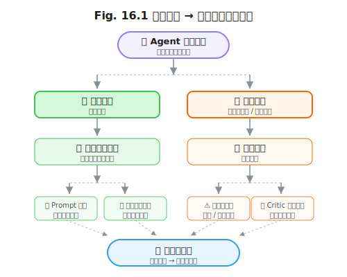

# 第 16 章 学习型循环

> **问题陈述**：第 13–15 章的循环拓扑、评估机制和长程恢复策略都假设 Agent 每次执行都是"从零开始"——过去的成功和失败经验不会被保留到下一次任务。学习型循环（Learning Loop）改变了这个假设：Agent 在执行过程中积累的轨迹（Trajectories）可以被回放、分析和提炼为新的提示词或工具描述，使 Agent 在下一次面对类似任务时表现更好。本章从经验回放、在线优化和生态演化三个层次构建学习型循环。

**第四部分结束语：** 本章是循环工程（Loop Engineering）的收尾章。前四章分别解决了循环拓扑（第 13 章）、评估控制（第 14 章）、长程恢复（第 15 章）和从经验中学习（第 16 章）。在第 17 章开始的综合实践中，我们将把四层洋葱图的所有层——Prompt、Context、Harness、Loop——整合为一个端到端的 Agent 系统。

---

## 16.1 经验回放

学习型循环的基础是经验回放（Experience Replay）——Agent 将执行轨迹保存下来，在任务之间或任务之中"回顾"这些轨迹来改进自己的行为。

### 16.1.1 轨迹存储格式

轨迹是 Agent 从用户输入到最终输出的完整执行记录。一个可被回放使用的轨迹需要比第 12 章的 Trace 包含更多的语义信息。

**定义 16.1（Agent 轨迹）**：Agent 的一次完整执行轨迹 $\tau$ 是一个有向无环图 $\tau = (V, E)$，其中 $v \in V$ 为执行步骤节点，包含步骤序号 $t$、类型 type（`thought` / `action` / `observation` / `reflection`）、内容和对应的 Span 元数据；$e \in E$ 为步骤间依赖边，表示数据流动关系（如 action 的输出流入下一步的 observation）。

轨迹的存储格式应满足三个要求：①**可回放**——给定输入，可以重新执行轨迹中的每一步并比对输出；②**可搜索**——通过自然语言检索相似轨迹（"之前是怎么处理 API 超时的？"）；③**可摘要**——长轨迹可以被压缩为经验摘要。

```
# 轨迹存储格式示例（JSON Lines）
{"step": 1, "type": "thought", "content": "用户想搜索论文，我需要调用 search_paper",
 "tokens": 450, "span_id": "span_001"}
{"step": 2, "type": "action", "tool": "search_paper", "args": {"query": "RLHF 2025"},
 "result_summary": "返回 5 条结果", "tokens": 0, "span_id": "span_002"}
{"step": 3, "type": "observation", "content": "搜索结果: [论文1, 论文2, ...]",
 "tokens": 1200, "span_id": "span_003"}
```

### 16.1.2 成功 / 失败样本的差异化利用

成功和失败的轨迹对学习有不同价值。

**成功轨迹**：→ 提炼为"最佳实践"提示词模板。将成功轨迹中的 effective thought 模式（如"我每次搜索前先确认关键词的准确性"）提取为显式的提示词指令，追加到系统提示词 $P$ 中。成功轨迹的采样权重应高于失败轨迹（推荐 3:1），因为成功的模式是可以复用的。

**失败轨迹**：→ 提炼为"反模式"和"检查点"。失败轨迹中的错误步骤被标记为"需要审计"——Agent 在未来的类似步骤前应暂停并检查前提条件。失败轨迹是 LLM-as-Judge 训练数据的天然来源——给出一个错误输出和正确输出的对比对，用于微调 Critic 的评估能力。



> **工程原则 1（经验-提示词闭环原则）**：每一次 Agent 执行的轨迹都应被分析并可能回到提示词层面——成功轨迹强化有效模式，失败轨迹添加检查点。提示词不再是手工编写的静态文本，而是从实际执行中持续学习生成的动态资产。

---

## 16.2 在线优化

经验回放是"事后学习"，在线优化是"在任务执行中实时改进"。

### 16.2.1 Prompt 自进化（DSPy / TextGrad 思路）

DSPy（Declarative Self-improving Python）和 TextGrad 代表了 Prompt 自动优化的两种方法论。

DSPy 思路：将 Prompt 视为可编程模块——用声明式 API（`dspy.ChainOfThought`、`dspy.ReAct`）替代手写 Prompt，由 DSPy 编译器自动优化底层的 Prompt 文本。优化过程：在 Golden Set 上运行自动评测（第 4 章），DSPy 根据评测结果自动调整 Prompt 中的示例选择、指令措辞和格式约束。DSPy 适合**离线优化**——在两次部署之间优化，不占用推理时间。

TextGrad 思路：通过反向传播将 LLM 输出的文本偏差信号（"回答太长"、"缺少引用"）反向传播到输入的 Prompt Token 上，使用 LLM 自身作为"梯度计算器"来更新 Prompt。TextGrad 适合**在线优化**——在每次推理后根据用户反馈 micro-adjust Prompt。

```
# Listing 16.1  DSPy 风格的声明式 Agent
class RAGAgent(dspy.Module):
    def __init__(self):
        self.retrieve = dspy.Retrieve(k=3)
        self.generate = dspy.ChainOfThought("context, question -> answer")
    
    def forward(self, question):
        context = self.retrieve(question).passages
        return self.generate(context=context, question=question)

# DSPy 编译器自动优化底层 Prompt
optimizer = dspy.BootstrapFewShot()
optimized_agent = optimizer.compile(RAGAgent(), trainset=golden_set)
```

### 16.2.2 工具描述的自动改写

第 8 章讨论了工具描述的静态设计。在线优化让工具描述可以根据实际使用模式自动改——如果模型频繁调用 `search_paper` 时填写了错误的参数，Harness 可以自动在工具描述中添加参数用法示例。

方法：收集工具调用的成功/失败记录，分析报错模式。如果某个参数的 80% 失败都是由"用户用了缩写而非全称"导致的，自动在参数的 `description` 中添加"请使用全称，例如 'natural language processing' 而非 'nlp'"。工具描述的自动改写，要求工具 Schema 在运行时是可修改的（典型 Harness 实现中，Schema 在启动时加载后不会修改）。

> **反方观点**：工具描述自动改写可能导致"反馈过拟合"——基于少量失败案例修改描述，可能让描述适配了特例而劣化了通用情况。解决方案：自动修改需在 Golden Set 上经过回归测试（第 4 章的 `test_no_regression_after_change`），通过率不低于阈值时才部署。

### 16.2.3 何时升级到微调

学习型循环的最终形态不是优化 Prompt，而是微调模型本身。决策树：

```
当前的 Prompt 优化是否已达到瓶颈？
↓是
是否有足够的标注数据（≥ 1,000 条高质量轨迹）？
↓是
任务的收益是否覆盖了微调成本（约 $100-500 / 轮）？
↓是
→ 进行 LoRA 微调（低秩适配，约 2-4 小时）
```

Prompt 优化的收益递减点通常在 5-10 轮迭代后——此时每次修改的准确率提升 < 2%。如果此时仍有大量高质量失败样本，升级到微调是合理的。微调不应替代 Prompt 优化——微调后的模型仍然需要良好的 Prompt 来定义任务边界。正确的关系是：**微调增强模型的基础能力，Prompt 引导模型的输出方向**。

**定义 16.2（优化层级）**：Agent 性能优化分为三个层级：L1（Prompt 优化）→ L2（检索/工具优化）→ L3（模型微调）。每上一层，优化效果更加显著但成本更高。推荐路径：从 L1 开始，收益递减后进入 L2，再递减后进入 L3。

---

## 16.3 从循环到生态

单个 Agent 的学习能力有限。当多个 Agent 协作时，学习从个体层面扩展到群体层面——生态系统演化。

### 16.3.1 多 Agent 社会的角色分工

多 Agent 系统（Multi-Agent System, MAS）将任务分配给专业化 Agent。专业化的优势：每个 Agent 维护自己的轨迹库和经验摘要，Agent 之间的知识通过共享经验库传递。

典型的角色分工：
- **PM Agent**：任务分解和调度——接收用户请求，分解为子任务，分配给对应 Agent。
- **Developer Agent**：代码编写和修改——拥有代码库和编程工具的上下文。
- **Reviewer Agent**：代码审查和测试——与 Developer 形成第 14 章的 Actor-Critic 对。
- **Documenter Agent**：文档生成和维护——不直接参与编码，但在代码变更后更新文档。

角色分工的经验交换：Developer Agent 学会的"处理 API 超时"的经验，不应只保留在 Developer 的经验库中，也应同步到 PM Agent（以便在任务分解时预判超时风险）。经验共享通过第 7 章的长期记忆系统中的共享知识图谱实现。

### 16.3.2 通信协议（A2A / MCP）

多 Agent 系统需要标准化的通信协议。

**MCP（Model Context Protocol）**：Anthropic 提出的 Agent-工具通信协议。Agent 通过 MCP 与工具服务器通信，每个工具服务器暴露一组工具，Agent 通过标准化的 discovery / invocation / result 接口调用它们。MCP 适合 Agent-工具通信。

**A2A（Agent-to-Agent）**：Google 提出的 Agent- Agent 通信协议。A2A 定义了 Agent 之间的任务发布、进度查询、结果回传的标准接口。A2A 适合 Agent- Agent 通信。

在本书的四层架构中：MCP 位于 Harness 层的工具系统（第 10 章），A2A 位于 Loop 层的多 Agent 协作（第 16 章）。两个协议互补而非竞争。

### 16.3.3 涌现行为与可控性的张力

当多个 Agent 自由交互时，可能出现开发者未设计的**涌现行为**（Emergent Behavior）——Agent 们自发形成的工作模式、沟通习惯或决策流程。涌现行为可能有益（Agent 学会了比预设计更高效的工作流），也可能有害（Agent 之间形成了"互相帮忙掩盖错误"的默契）。

可控性策略：①**观察而非干预**——在早期阶段观察涌现行为，不强制纠正（有益的涌现可能后续自行收敛）；②**边界约束**——定义 Agent 行为的硬边界（如"任何 Agent 不能删除其他 Agent 创建的文件"），边界内自由演化；③**周期性审计**——定期检查 Agent 群体行为的统计特征（协作频率、冲突率、任务完成率），超出阈值时人工介入。

---

## 附：学习型循环评估指标表

| 指标名称 | 定义 | 度量方法 |
|---------|------|---------|
| 经验回放利用率 | 轨迹库中被实际用于 Prompt 优化的轨迹比例 | 被提炼的轨迹数 / 总轨迹数 |
| Prompt 自进化幅度 | 每次自动优化后 Prompt 的 Golden Set 通过率变化 | 优化前后通过率的差值 |
| 工具描述改进率 | 工具描述自动改写后调用成功率的变化 | 改写前 vs 改写后的调用成功率 |
| 多 Agent 协作效率 | 多 Agent 并行完成任务的时间与单 Agent 串行时间之比 | 并行时间 / 串行时间 |
| 涌现行为异常率 | 被标记为有害的涌现行为占总涌现行为的比例 | 有害涌现数 / 总涌现数 |

---

## 开放问题

1. **经验回放的存储成本。** 如果每个 Agent 每次执行都保存完整轨迹，存储成本将快速增长。对于日处理 10 万次请求的系统，每周可能产生 TB 级轨迹数据。抽样策略如何设计？（按用户抽样？按异常状态全量保存？）

2. **Prompt 自进化的收敛性。** DSPy 的自动优化轮数是否有理论上的收敛性？无限轮优化是否会导致 Prompt 对 Golden Set 过拟合，但对真实世界数据的泛化能力下降？

3. **多 Agent 经验的"负迁移"。** Developer Agent 学会的"Python 代码风格"经验如果共享给 Documenter Agent——Documenter 生成 Markdown 文档时可能不适当地应用了 Python 的格式约定。如何防止经验在角色间的"负迁移"？

4. **涌现行为的可专利权性。** 如果多 Agent 系统自发产生了新的算法或设计模式——这个涌现结果的"所有权"属于开发者、训练数据的提供者还是 Agent 本身？

---

## 练习

### 思考题

1. 你有一个 Agent 每周执行 1,000 次代码审查任务。设计它的经验回放策略：保存哪些轨迹？成功和失败的采样比例是多少？如何将成功轨迹提炼为 Prompt 优化？

2. DSPy（声明式编程）和 TextGrad（文本梯度）代表了 Prompt 自进化的两种方法论。这两种方法分别适合哪类任务？在你的 Agent 中你会选择哪种方法？为什么？

3. 多 Agent 系统中，Developer Agent 和 Reviewer Agent 之间的通信频率应该是多少？如果 Developer 提交了一个 PR，Reviewer 需要立即审查还是可以在批量模式中集中审查？两种策略的优缺点分别是什么？

### 动手题

1. 设计一个轨迹存储函数 `save_trajectory(trajectory: list[dict])`，将 Agent 的步骤列表保存为 JSON Lines 格式。验收标准：输出的文件内容包含 step、type、content 等字段，且每行是一个有效的 JSON 对象。

2. 实现一个"成功轨迹→Prompt 优化"的简单流水线：给定一系列成功轨迹，提取其中的 thought 模式（"每次搜索前先确认关键词"），生成一个 Prompt 追加建议。验收标准：输入 3 条成功轨迹，输出至少 1 条可用的 Prompt 优化建议。

3. 实现一个简单的多 Agent 协作模拟：给定一个 4 步任务，分配两个 Agent 各执行 2 步，由一个 Router Agent 做任务分解和结果聚合。验收标准：最终输出包含两个子 Agent 的单独结果和 Router 的合并结果。

---

## 参考文献

- DSPy Team. (2024). DSPy: Compiling Declarative Language Model Calls into Self-Improving Pipelines. *GitHub Repository*. 
- Google. (2025). Agent-to-Agent Protocol (A2A): Open Standard for Multi-Agent Communication. *Google Research*.
- Anthropic. (2024). Model Context Protocol (MCP): A Standard for Connecting AI Agents to Tools. *Anthropic Documentation*.

> **本书叙述方向**：本章是循环工程（Part 4）的收官之作。至此，四层洋葱图的全部四层的叙述已完成。下一章将进入第五部分——第 17 章"端到端案例研究"将综合运用 Prompt、Context、Harness、Loop 四层工程，通过三个真实案例展示 Agent 系统的完整构建过程。
