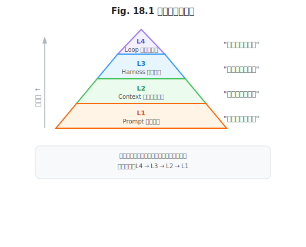
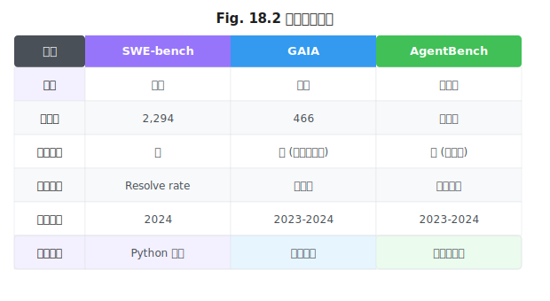

# 第 18 章 评估与基准

> **问题陈述**：前 17 章构建了智能体系统的四层工程方法论，但方法论的有效性需要被评估——我们的 Prompt 是否比上一版本更好？Context 的召回是否覆盖了用户的需求？Harness 在负载下的表现如何？Loop 的长程任务成功率是否在提升？本章提出四层评估金字塔，综述公开基准的适用性与局限性，并给出自建基准的方法论。

---

## 18.1 四层评估金字塔

评估不能只关注端到端表现——端到端指标告诉你好不好，分层指标告诉你为什么不好。四层评估金字塔从最底层的 Prompt 单元测试到最顶层的 Loop 端到端基准，每层解决不同的问题。

### 18.1.1 Prompt 单元测试

Prompt 单元测试是第 4 章 PromptOps 的核心实践的延伸。每个 Prompt 版本在发布前应通过以下测试：①**格式合规性**——输出是否符合指定的 JSON Schema 或格式约束；②**边界条件**——空输入、极长输入（超过窗口限制）、特殊字符输入时的行为是否符合预期；③**指令遵守率**——在 Golden Set 上验证模型是否遵守了 $P$ 中的关键指令（如"必须输出 JSON"、"禁止添加 Markdown 代码块包裹"）。单元测试应集成到 CI 流水线中，每次 Prompt 变更时自动运行。

### 18.1.2 Context 召回与忠实度

Context 层评估两个维度：**召回质量**（检索结果是否覆盖了用户需要的信息）和**忠实度**（模型的输出是否基于检索结果而非幻觉）。

**召回质量评估**：使用第 6 章的 Recall@K 和 NDCG@K 指标。在 Golden Set 上运行检索，计算检索结果中相关文档的比例。阈值：Recall@5 > 85%。

**忠实度评估**：使用第 6.3.2 节的引用验证方法——模型输出中的每个事实主张都应在 $R$ 中有对应的原文引用。自动评估方法：用独立 LLM 调用检查模型输出的每个句子，判定该句子是否在 $R$ 中有原文支持。如果超过 $T$%（推荐 10%）的句子无对应引用，判定为忠实度不达标。

### 18.1.3 Harness 集成测试

Harness 层评估 Agent 运行时环境的稳定性和安全性。测试包括：①**工具调用成功率**——Agent 发起的工具调用被 Harness 成功执行并返回结果的比例（阈值 > 98%）；②**沙箱隔离测试**——Agent 在容器中执行 `rm -rf /` 或读取宿主系统文件，验证沙箱是否能阻止这些操作；③**中断恢复测试**——在 Agent 执行中途发送中断信号，验证 Harness 能否在 2 秒内响应并正确保存/恢复状态。

### 18.1.4 Loop 端到端基准

Loop 层评估 Agent 在自主循环中的整体表现。第 17 章的案例评估对比表给出了不同任务类型的端到端指标。通用端到端指标包括：①**任务完成率**——Agent 在预算内完成目标的概率；②**平均步数**——完成目标所需的 ReAct 循环步数；③**成本**——每次任务的平均 Token 消耗和 API 成本。

> **工程原则 1（向下归因原则）**：端到端指标下降时，应按金字塔顺序向下排查——先检查 Loop 层的任务完成率是否下降，若无问题再查 Harness 层的工具调用成功率，再查 Context 层的召回精度，最后查 Prompt 层的单元测试。逐层排查可以定位"哪一层出了问题"而非笼统地"Agent 不好用了"。

---

## 18.2 公开基准

公开基准为不同 Agent 系统的横向对比提供了标准化的评测数据集。然而，基准的有效性正在下降。

### 18.2.1 SWE-bench / GAIA / AgentBench 综述

三个最有影响力的 Agent 基准：

**SWE-bench**：面向编码 Agent 的基准，测试 Agent 是否能独立修复 GitHub Issue (Jimenez et al., 2024)。包含 2,294 个来自 12 个 Python 仓库的真实 Issue。任务类型：代码修改 + 测试验证。测量指标：resolve rate（Issue 被成功修复的比例）。当前最强模型在 SWE-bench Verified 子集上的准确率约为 45%（2024 年底数据）。SWE-bench 的局限性：仅覆盖 Python 代码、Issue 选择可能偏向于简单任务。

**GAIA**：面向通用 Agent 的基准，测试 Agent 在开放世界中的推理和工具使用能力 (Mialon et al., 2024)。包含 466 个多层次问题（Level 1-3），需要 Agent 调用搜索、计算、文件操作等多个工具才能回答。GAIA 的独特价值在于测试 Agent 的**工具组合能力**——单工具能解决的问题较少，大部分问题需要 2-5 个工具的序列化调用。

**AgentBench**：多维度 Agent 基准，覆盖 Web 浏览、操作系统操作、数据库操作、知识问答等 8 个场景 (Liu et al., 2024)。AgentBench 的设计原则是"一个基准不够，用多个子基准覆盖不同能力维度"。AgentBench 的优势是覆盖面广，劣势是不同子基准之间的难度差异大，总分可能被简单子基准拉高。

### 18.2.2 基准饱和与污染问题

**基准饱和**：当模型在某个基准上的得分接近人类天花板时，该基准对区分模型能力的价值大幅下降。SWE-bench Verified 的"人类专家"基线约为 60-70%，当前最强模型已达 45%。预计 1-2 年内会有模型接近饱和点。基准饱和后，Agent 社区需要更新一代更难的任务集。

**基准污染**：模型的训练数据中可能包含基准评测集中的样本（如 SWE-bench 的 Issue 描述是公开的 GitHub 数据，很可能被爬取并纳入训练语料）。污染后的模型在基准上的得分不再反映真实的泛化能力——它们可能"记住"了正确答案。缓解措施：①**定期更新评测集**——至少每年更新一次，使用模型训练截止日期之后的数据；②**保留私有验证集**——不公开所有测试样本，仅公开部分样本供开发者调试，其余样本用于最终评测；③**污染检测**——在模型输出中搜索与基准测试样本高度相似的内容，作为污染的信号。

> **反方观点**：基准污染在学术圈被过度关注。实践中，被污染的基准仍然可以作为**相对改进**的指标——如果你的 Prompt 优化在污染的基准上提升了 5%，这个提升在干净数据上很可能也存在（同向效应）。绝对数值不值得信任，但相对变化趋势是有意义的。

---

## 18.3 自建基准

公开基准的覆盖范围有限——企业知识助手（第 17.1 节）在 SWE-bench 上没有评测入口。团队需要自建针对自身业务场景的基准。

### 18.3.1 业务任务的可评分化

业务任务被转化为可评分的形式，才能纳入自建基准。转化方法：为每个业务任务定义"评价函数" $E(\text{output}, \text{expected})$ ，输出一个 0-1 之间的分数。评价函数的设计取决于任务类型：

| 任务类型 | 评价函数示例 |
|---------|-------------|
| 分类任务 | `1 if output == expected else 0`（精确匹配） |
| 检索任务 | `len(set(output) ∩ set(expected)) / len(set(expected))`（召回率） |
| 生成任务 | LLM-as-Judge 评分（第 4 章） |
| 代码任务 | 测试用例通过率（`passed_tests / total_tests`） |

**定义 18.1（业务任务可评分率）**：一个业务领域 $\mathcal{D}$ 的可评分率 $R(\mathcal{D})$ 定义为领域中可被形式化评价函数 $E$ 衡量的任务占比。 $R(\mathcal{D}) > 80\%$ 时，适合搭建自建基准。

### 18.3.2 评分稳定性度量

自建基准的评分需要稳定——相同 Prompt 在不同时间运行的评分差异应在一个可接受的范围内。

评分不稳定性的主要来源：①**LLM 输出的随机性**——即使 Temperature=0，模型版本更新、推理硬件差异也会引入变化；②**Golden Set 的数据漂移**——业务数据随时间变化（如产品文档更新），3 个月前标注的 Golden Set 今天可能不适用了；③**Judge 的不一致性**——如果使用 LLM-as-Judge 评分，Judge 本身的输出也具有随机性。

**定义 18.2（评分稳定性）**：一个评测系统 $\mathcal{S}$ 的评分稳定性 $\sigma_{\mathcal{S}}$ 定义为在受控条件下（相同 Prompt、相同模型版本、相同 Golden Set） $N$ 次独立运行的评分标准差。可接受的 $\sigma_{\mathcal{S}} < 0.05$（5 个百分点）。

推荐措施：①**固定 seed + Temperature=0**——消除 LLM 输出的主要随机源；②**锁定模型版本**——在评测期间不升级模型；③**多次评测取中位数**——对同一组配置运行 3 次评测，取中位数而非单次结果。

---

## 附：四层评估指标汇总表

| 评估层 | 指标 | 阈值 | 测量工具 |
|--------|------|------|---------|
| L1 Prompt | 格式合规率 | > 95% | pytest + JSON Schema 校验 |
| L1 Prompt | 指令遵守率 | > 90% | Golden Set 回归测试 |
| L2 Context | Recall@5 | > 85% | 向量检索评测脚本 |
| L2 Context | 引用忠实度 | > 90% | LLM-as-Judge 引用验证 |
| L3 Harness | 工具调用成功率 | > 98% | 集成测试 |
| L3 Harness | 沙箱隔离通过率 | 100% | 渗透测试 |
| L4 Loop | 任务完成率 | > 80% | 端到端 Golden Set |
| L4 Loop | 平均步数 | < N_max × 0.8 | 执行日志统计 |

---

## 开放问题

1. **评估的评估。** 我们如何知道评估系统本身是有效的？LLM-as-Judge 有偏差，Golden Set 有数据漂移，基准有污染——三者的叠加是否让评估结果变得不可信？

2. **跨模型评估的公平性。** 同一个 Prompt 在 GPT-4o 和 Claude-3.5 上的得分差异是"Prompt 设计不佳"还是"模型能力差异"？如何设计跨模型公平的 Golden Set？

3. **评估成本 vs 评估频率。** 全量评测（所有四层、全部 Golden Set）可能消耗数千 Token。如果团队每日提交多次 Prompt 修改，每次运行全量评测不可行。如何设计"增量评测"——只评测被修改层相关的那部分测试？

---

## 练习

### 思考题

1. 你的 Agent 在 SWE-bench 上得分很高，但在实际代码审查任务中表现不佳。使用 18.1 节的向下归因原则，列出你排查每个可能问题层的步骤和检查项。

2. 如果你的团队需要自建一个"代码审查 Agent"的评估基准，你会如何设计评价函数 $E$ ？对于"代码审查报告是否完整"这个指标，它是否可以形式化？如何形式化？（提示：可以用检查清单——报告是否包含了安全性、性能、可读性三个维度的审查？）

3. 基准污染是否真的像学术圈担心的那样严重？如果一个模型在受污染的基准上提升了 10%，在干净的内部测试集上也提升了 8%——污染的影响是 2%，还是这 2% 本身就是真实能力的提升？

### 动手题

1. 实现一个 Prompt 格式合规性测试函数：输入模型输出字符串和 JSON Schema，输出是否通过的布尔值。验收标准：合法 JSON 且符合 Schema → True；非法 JSON → False。

2. 实现引用忠实度检查器：输入模型回答和 $R$ 分量（检索结果列表），检查回答中的每个事实主张是否在 $R$ 中有对应原文。验收标准：给定 5 个含引用的回答，输出每个回答的忠实度评分（0-1）。

3. 实现一个评分稳定性测量函数：给定一个评测系统 $\mathcal{S}$ 、一个 Prompt 和一个 Golden Set，运行 $N=5$ 次评测，输出平均分和标准差 $\sigma_{\mathcal{S}}$ 。验收标准：输出格式为 `{"mean": 0.85, "std": 0.03}`。

---

## 参考文献

- Jimenez, C. E., Yang, J., Wettig, A., et al. (2024). SWE-bench: Can Language Models Resolve Real-World GitHub Issues? *ICLR 2024*.
- Mialon, G., Fourrier, C., Swift, A., et al. (2024). GAIA: A Benchmark for General AI Assistants. *ICLR 2024*.
- Liu, X., Yu, H., Zhang, H., et al. (2024). AgentBench: Evaluating LLMs as Agents. *ICLR 2024*.

> **本书叙述方向**：本章建立了四层评估金字塔，综述了 SWE-bench/GAIA/AgentBench 三大基准，并给出了自建基准的方法论。下一章将讨论 Agent 系统的安全边界——第 19 章"安全、伦理与治理"将覆盖 Prompt Injection 的四层防御、Agent 的责任边界、以及数据与隐私治理。
